# Exercise 4. - Data Cleansing

## Handling Missing Values in Python


Real world data is messy and often contains a lot of missing values. 

There could be multiple reasons for the missing values but primarily the reason for missingness can be attributed to:

| Reason for missing Data | 
| :-----------: | 
| Data doesn't exist |
| Data not collected due to human error. | 
| Data deleted accidently |

## A guide to handling missing values 

Please read this tutorial on handling missing values first, before working on dirty data this week: [TUTORIAL](a_guide_to_na.ipynb).

# Dirty data


```python
import pandas as pd
import numpy as np
from sklearn.ensemble import RandomForestClassifier
import warnings
import ssl
# Suppress warnings
warnings.filterwarnings('ignore')
# Disable SSL verification
ssl._create_default_https_context = ssl._create_unverified_context
import requests
from io import StringIO
```

Load the dataset from the provided URL using pandas.


```python
url = "https://raw.github.com/edwindj/datacleaning/master/data/dirty_iris.csv"
response = requests.get(url, verify=False)
data = StringIO(response.text)
dirty_iris = pd.read_csv(data, sep=",")
print(dirty_iris.head(4))
```

       Sepal.Length  Sepal.Width  Petal.Length  Petal.Width     Species
    0           6.4          3.2           4.5          1.5  versicolor
    1           6.3          3.3           6.0          2.5   virginica
    2           6.2          NaN           5.4          2.3   virginica
    3           5.0          3.4           1.6          0.4      setosa
    

## Introduce Missing Values

Randomly introduce missing values into the dataset to mimic the Python code behavior.


```python
# Load additional data
carseats = pd.read_csv("https://raw.githubusercontent.com/selva86/datasets/master/Carseats.csv")
print(carseats.head(12))
# Set random seed for reproducibility
np.random.seed(123)

# Introduce missing values in 'Income' column
income_missing_indices = np.random.choice(carseats.index, size=20, replace=False)
carseats.loc[income_missing_indices, 'Income'] = np.nan

# Set another random seed for reproducibility
np.random.seed(456)

# Introduce missing values in 'Urban' column
urban_missing_indices = np.random.choice(carseats.index, size=10, replace=False)
carseats.loc[urban_missing_indices, 'Urban'] = np.nan

carseats.head(14)
```

        Sales  CompPrice  Income  Advertising  Population  Price ShelveLoc  Age  \
    0    9.50        138      73           11         276    120       Bad   42   
    1   11.22        111      48           16         260     83      Good   65   
    2   10.06        113      35           10         269     80    Medium   59   
    3    7.40        117     100            4         466     97    Medium   55   
    4    4.15        141      64            3         340    128       Bad   38   
    5   10.81        124     113           13         501     72       Bad   78   
    6    6.63        115     105            0          45    108    Medium   71   
    7   11.85        136      81           15         425    120      Good   67   
    8    6.54        132     110            0         108    124    Medium   76   
    9    4.69        132     113            0         131    124    Medium   76   
    10   9.01        121      78            9         150    100       Bad   26   
    11  11.96        117      94            4         503     94      Good   50   
    
        Education Urban   US  
    0          17   Yes  Yes  
    1          10   Yes  Yes  
    2          12   Yes  Yes  
    3          14   Yes  Yes  
    4          13   Yes   No  
    5          16    No  Yes  
    6          15   Yes   No  
    7          10   Yes  Yes  
    8          10    No   No  
    9          17    No  Yes  
    10         10    No  Yes  
    11         13   Yes  Yes  
    


<div>
<style scoped>
    .dataframe tbody tr th:only-of-type {
        vertical-align: middle;
    }

    .dataframe tbody tr th {
        vertical-align: top;
    }

    .dataframe thead th {
        text-align: right;
    }
</style>
<table border="1" class="dataframe">
  <thead>
    <tr style="text-align: right;">
      <th></th>
      <th>Sales</th>
      <th>CompPrice</th>
      <th>Income</th>
      <th>Advertising</th>
      <th>Population</th>
      <th>Price</th>
      <th>ShelveLoc</th>
      <th>Age</th>
      <th>Education</th>
      <th>Urban</th>
      <th>US</th>
    </tr>
  </thead>
  <tbody>
    <tr>
      <th>0</th>
      <td>9.50</td>
      <td>138</td>
      <td>73.0</td>
      <td>11</td>
      <td>276</td>
      <td>120</td>
      <td>Bad</td>
      <td>42</td>
      <td>17</td>
      <td>Yes</td>
      <td>Yes</td>
    </tr>
    <tr>
      <th>1</th>
      <td>11.22</td>
      <td>111</td>
      <td>48.0</td>
      <td>16</td>
      <td>260</td>
      <td>83</td>
      <td>Good</td>
      <td>65</td>
      <td>10</td>
      <td>Yes</td>
      <td>Yes</td>
    </tr>
    <tr>
      <th>2</th>
      <td>10.06</td>
      <td>113</td>
      <td>35.0</td>
      <td>10</td>
      <td>269</td>
      <td>80</td>
      <td>Medium</td>
      <td>59</td>
      <td>12</td>
      <td>Yes</td>
      <td>Yes</td>
    </tr>
    <tr>
      <th>3</th>
      <td>7.40</td>
      <td>117</td>
      <td>100.0</td>
      <td>4</td>
      <td>466</td>
      <td>97</td>
      <td>Medium</td>
      <td>55</td>
      <td>14</td>
      <td>Yes</td>
      <td>Yes</td>
    </tr>
    <tr>
      <th>4</th>
      <td>4.15</td>
      <td>141</td>
      <td>64.0</td>
      <td>3</td>
      <td>340</td>
      <td>128</td>
      <td>Bad</td>
      <td>38</td>
      <td>13</td>
      <td>Yes</td>
      <td>No</td>
    </tr>
    <tr>
      <th>5</th>
      <td>10.81</td>
      <td>124</td>
      <td>113.0</td>
      <td>13</td>
      <td>501</td>
      <td>72</td>
      <td>Bad</td>
      <td>78</td>
      <td>16</td>
      <td>No</td>
      <td>Yes</td>
    </tr>
    <tr>
      <th>6</th>
      <td>6.63</td>
      <td>115</td>
      <td>105.0</td>
      <td>0</td>
      <td>45</td>
      <td>108</td>
      <td>Medium</td>
      <td>71</td>
      <td>15</td>
      <td>Yes</td>
      <td>No</td>
    </tr>
    <tr>
      <th>7</th>
      <td>11.85</td>
      <td>136</td>
      <td>81.0</td>
      <td>15</td>
      <td>425</td>
      <td>120</td>
      <td>Good</td>
      <td>67</td>
      <td>10</td>
      <td>Yes</td>
      <td>Yes</td>
    </tr>
    <tr>
      <th>8</th>
      <td>6.54</td>
      <td>132</td>
      <td>110.0</td>
      <td>0</td>
      <td>108</td>
      <td>124</td>
      <td>Medium</td>
      <td>76</td>
      <td>10</td>
      <td>No</td>
      <td>No</td>
    </tr>
    <tr>
      <th>9</th>
      <td>4.69</td>
      <td>132</td>
      <td>NaN</td>
      <td>0</td>
      <td>131</td>
      <td>124</td>
      <td>Medium</td>
      <td>76</td>
      <td>17</td>
      <td>No</td>
      <td>Yes</td>
    </tr>
    <tr>
      <th>10</th>
      <td>9.01</td>
      <td>121</td>
      <td>78.0</td>
      <td>9</td>
      <td>150</td>
      <td>100</td>
      <td>Bad</td>
      <td>26</td>
      <td>10</td>
      <td>No</td>
      <td>Yes</td>
    </tr>
    <tr>
      <th>11</th>
      <td>11.96</td>
      <td>117</td>
      <td>94.0</td>
      <td>4</td>
      <td>503</td>
      <td>94</td>
      <td>Good</td>
      <td>50</td>
      <td>13</td>
      <td>Yes</td>
      <td>Yes</td>
    </tr>
    <tr>
      <th>12</th>
      <td>3.98</td>
      <td>122</td>
      <td>35.0</td>
      <td>2</td>
      <td>393</td>
      <td>136</td>
      <td>Medium</td>
      <td>62</td>
      <td>18</td>
      <td>Yes</td>
      <td>No</td>
    </tr>
    <tr>
      <th>13</th>
      <td>10.96</td>
      <td>115</td>
      <td>28.0</td>
      <td>11</td>
      <td>29</td>
      <td>86</td>
      <td>Good</td>
      <td>53</td>
      <td>18</td>
      <td>Yes</td>
      <td>Yes</td>
    </tr>
  </tbody>
</table>
</div>


# Introduction

Analysis of data is a process of inspecting, cleaning, transforming, and modeling data with the goal of highlighting useful information, suggesting conclusions and supporting decision making.


Many times in the beginning we spend hours on handling problems with missing values, logical inconsistencies or outliers in our datasets. In this tutorial we will go through the most popular techniques in data cleansing.


We will be working with the messy dataset `iris`. Originally published at UCI Machine Learning Repository: Iris Data Set, this small dataset from 1936 is often used for testing out machine learning algorithms and visualizations. Each row of the table represents an iris flower, including its species and dimensions of its botanical parts, sepal and petal, in centimeters.

Take a look at this dataset here:


```python
dirty_iris.head(16)
```


<div>
<style scoped>
    .dataframe tbody tr th:only-of-type {
        vertical-align: middle;
    }

    .dataframe tbody tr th {
        vertical-align: top;
    }

    .dataframe thead th {
        text-align: right;
    }
</style>
<table border="1" class="dataframe">
  <thead>
    <tr style="text-align: right;">
      <th></th>
      <th>Sepal.Length</th>
      <th>Sepal.Width</th>
      <th>Petal.Length</th>
      <th>Petal.Width</th>
      <th>Species</th>
    </tr>
  </thead>
  <tbody>
    <tr>
      <th>0</th>
      <td>6.4</td>
      <td>3.2</td>
      <td>4.5</td>
      <td>1.5</td>
      <td>versicolor</td>
    </tr>
    <tr>
      <th>1</th>
      <td>6.3</td>
      <td>3.3</td>
      <td>6.0</td>
      <td>2.5</td>
      <td>virginica</td>
    </tr>
    <tr>
      <th>2</th>
      <td>6.2</td>
      <td>NaN</td>
      <td>5.4</td>
      <td>2.3</td>
      <td>virginica</td>
    </tr>
    <tr>
      <th>3</th>
      <td>5.0</td>
      <td>3.4</td>
      <td>1.6</td>
      <td>0.4</td>
      <td>setosa</td>
    </tr>
    <tr>
      <th>4</th>
      <td>5.7</td>
      <td>2.6</td>
      <td>3.5</td>
      <td>1.0</td>
      <td>versicolor</td>
    </tr>
    <tr>
      <th>5</th>
      <td>5.3</td>
      <td>NaN</td>
      <td>NaN</td>
      <td>0.2</td>
      <td>setosa</td>
    </tr>
    <tr>
      <th>6</th>
      <td>6.4</td>
      <td>2.7</td>
      <td>5.3</td>
      <td>NaN</td>
      <td>virginica</td>
    </tr>
    <tr>
      <th>7</th>
      <td>5.9</td>
      <td>3.0</td>
      <td>5.1</td>
      <td>1.8</td>
      <td>virginica</td>
    </tr>
    <tr>
      <th>8</th>
      <td>5.8</td>
      <td>2.7</td>
      <td>4.1</td>
      <td>1.0</td>
      <td>versicolor</td>
    </tr>
    <tr>
      <th>9</th>
      <td>4.8</td>
      <td>3.1</td>
      <td>1.6</td>
      <td>0.2</td>
      <td>setosa</td>
    </tr>
    <tr>
      <th>10</th>
      <td>5.0</td>
      <td>3.5</td>
      <td>1.6</td>
      <td>0.6</td>
      <td>setosa</td>
    </tr>
    <tr>
      <th>11</th>
      <td>6.0</td>
      <td>2.7</td>
      <td>5.1</td>
      <td>1.6</td>
      <td>versicolor</td>
    </tr>
    <tr>
      <th>12</th>
      <td>6.0</td>
      <td>3.0</td>
      <td>4.8</td>
      <td>NaN</td>
      <td>virginica</td>
    </tr>
    <tr>
      <th>13</th>
      <td>6.8</td>
      <td>2.8</td>
      <td>4.8</td>
      <td>1.4</td>
      <td>versicolor</td>
    </tr>
    <tr>
      <th>14</th>
      <td>NaN</td>
      <td>3.9</td>
      <td>1.7</td>
      <td>0.4</td>
      <td>setosa</td>
    </tr>
    <tr>
      <th>15</th>
      <td>5.0</td>
      <td>-3.0</td>
      <td>3.5</td>
      <td>1.0</td>
      <td>versicolor</td>
    </tr>
  </tbody>
</table>
</div>


```python
sl = dirty_iris[['Sepal.Width']]
sl.dropna().shape[0]
nv =sl[(sl['Sepal.Width']<=0)]
print(nv)

```

         Sepal.Width
    15          -3.0
    129          0.0
    

## Detecting NA

A missing value, represented by NaN in Python, is a placeholder for a datum of which the type is known but its value isn't. Therefore, it is impossible to perform statistical analysis on data where one or more values in the data are missing. One may choose to either omit elements from a dataset that contain missing values or to impute a value, but missingness is something to be dealt with prior to any analysis.


Can you see that many values in our dataset have status NaN = Not Available? Count (or plot), how many (%) of all 150 rows is complete.


```python
# Count the number of complete cases (rows without any missing values)
complete_cases = dirty_iris.dropna().shape[0]

# Calculate the percentage of complete cases
percentage_complete = (complete_cases / dirty_iris.shape[0]) * 100

print(f"Number of complete cases: {complete_cases}")
print(f"Percentage of complete cases: {percentage_complete:.2f}%")
```

    Number of complete cases: 96
    Percentage of complete cases: 64.00%
    

Does the data contain other special values? If it does, replace them with NA.


```python
# Define a function to check for special values
def is_special(x):
    if np.issubdtype(x.dtype, np.number):
        return ~np.isfinite(x)
    else:
        return pd.isna(x)

# Apply the function to each column and replace special values with NaN
for col in dirty_iris.columns:
    dirty_iris[col] = dirty_iris[col].apply(lambda x: np.nan if is_special(pd.Series([x]))[0] else x)

# Display summary of the data
print(dirty_iris.describe(include='all'))
```

            Sepal.Length  Sepal.Width  Petal.Length  Petal.Width     Species
    count     140.000000   133.000000    131.000000   137.000000         150
    unique           NaN          NaN           NaN          NaN           3
    top              NaN          NaN           NaN          NaN  versicolor
    freq             NaN          NaN           NaN          NaN          50
    mean        6.559286     3.390977      4.449962     1.207299         NaN
    std         6.800940     3.315310      5.769299     0.764722         NaN
    min         0.000000    -3.000000      0.000000     0.100000         NaN
    25%         5.100000     2.800000      1.600000     0.300000         NaN
    50%         5.750000     3.000000      4.500000     1.300000         NaN
    75%         6.400000     3.300000      5.100000     1.800000         NaN
    max        73.000000    30.000000     63.000000     2.500000         NaN
    

## Checking consistency

Consistent data are technically correct data that are fit for statistical analysis. They are data in which missing values, special values, (obvious) errors and outliers are either removed, corrected or imputed. The data are consistent with constraints based on real-world knowledge about the subject that the data describe.


We have the following background knowledge:

-   Species should be one of the following values: setosa, versicolor or virginica.

-   All measured numerical properties of an iris should be positive.

-   The petal length of an iris is at least 2 times its petal width.

-   The sepal length of an iris cannot exceed 30 cm.

-   The sepals of an iris are longer than its petals.

Define these rules in a separate object 'RULES' and read them into Python. Print the resulting constraint object.


```python
# Define the rules as functions
def check_rules(df):
    rules = {
        "Sepal.Length <= 30": df["Sepal.Length"] <= 30,
        "Species in ['setosa', 'versicolor', 'virginica']": df["Species"].isin(['setosa', 'versicolor', 'virginica']),
        "Sepal.Length > 0": df["Sepal.Length"] > 0,
        "Sepal.Width > 0": df["Sepal.Width"] > 0,
        "Petal.Length > 0": df["Petal.Length"] > 0,
        "Petal.Width > 0": df["Petal.Width"] > 0,
        "Petal.Length >= 2 * Petal.Width": df["Petal.Length"] >= 2 * df["Petal.Width"],
        "Sepal.Length > Petal.Length": df["Sepal.Length"] > df["Petal.Length"]
    }
    return rules

# Apply the rules to the dataframe
rules = check_rules(dirty_iris)

# Print the rules
for rule, result in rules.items():
    print(f"{rule}: {result.all()}")
```

    Sepal.Length <= 30: False
    Species in ['setosa', 'versicolor', 'virginica']: True
    Sepal.Length > 0: False
    Sepal.Width > 0: False
    Petal.Length > 0: False
    Petal.Width > 0: False
    Petal.Length >= 2 * Petal.Width: False
    Sepal.Length > Petal.Length: False
    

Now we are ready to determine how often each rule is broken (violations). Also we can summarize and plot the result.


```python
# Check for rule violations
violations = {rule: ~result for rule, result in rules.items()}

# Summarize the violations
summary = {rule: result.sum() for rule, result in violations.items()}

# Print the summary of violations
print("Summary of Violations:")
for rule, count in summary.items():
    print(f"{rule}: {count} violations")
```

    Summary of Violations:
    Sepal.Length <= 30: 12 violations
    Species in ['setosa', 'versicolor', 'virginica']: 0 violations
    Sepal.Length > 0: 11 violations
    Sepal.Width > 0: 19 violations
    Petal.Length > 0: 20 violations
    Petal.Width > 0: 13 violations
    Petal.Length >= 2 * Petal.Width: 34 violations
    Sepal.Length > Petal.Length: 30 violations
    

What percentage of the data has no errors?


```python
import matplotlib.pyplot as plt
# Plot the violations
violation_counts = pd.Series(summary)
ax = violation_counts.plot(kind='bar', figsize=(10, 6))
plt.title('Summary of Rule Violations')
plt.xlabel('Rules')
plt.ylabel('Number of Violations')

# Add percentage labels above the bars
for p in ax.patches:
    ax.annotate(f'{p.get_height() / len(dirty_iris) * 100:.1f}%', 
                (p.get_x() + p.get_width() / 2., p.get_height()), 
                ha='center', va='center', xytext=(0, 10), 
                textcoords='offset points')

plt.show()
```


    
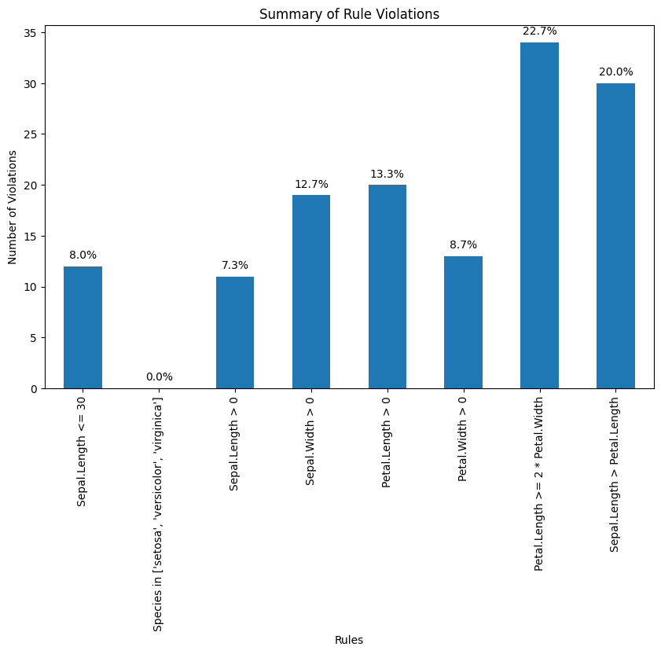
    


Find out which observations have too long sepals using the result of violations.


```python
# Check for rule violations
violations = {rule: ~result for rule, result in rules.items()}
# Combine violations into a DataFrame
violated_df = pd.DataFrame(violations)
violated_rows = dirty_iris[violated_df["Sepal.Length <= 30"]]
print(violated_rows)
```

         Sepal.Length  Sepal.Width  Petal.Length  Petal.Width     Species
    14            NaN          3.9          1.70          0.4      setosa
    18            NaN          4.0           NaN          0.2      setosa
    24            NaN          3.0          5.90          2.1   virginica
    27           73.0         29.0         63.00          NaN   virginica
    29            NaN          2.8          0.82          1.3  versicolor
    57            NaN          2.9          4.50          1.5  versicolor
    67            NaN          3.2          5.70          2.3   virginica
    113           NaN          3.3          5.70          2.1   virginica
    118           NaN          3.0          5.50          2.1   virginica
    119           NaN          2.8          4.70          1.2  versicolor
    124          49.0         30.0         14.00          2.0      setosa
    137           NaN          3.0          4.90          1.8   virginica
    

Find outliers in sepal length using boxplot approach. Retrieve the corresponding observations and look at the other values. Any ideas what might have happened? Set the outliers to NA (or a value that you find more appropiate)


```python
# Boxplot for Sepal.Length
plt.figure(figsize=(10, 6))
plt.boxplot(dirty_iris['Sepal.Length'].dropna())
plt.title('Boxplot of Sepal Length')
plt.ylabel('Sepal Length')
plt.show()
```


    
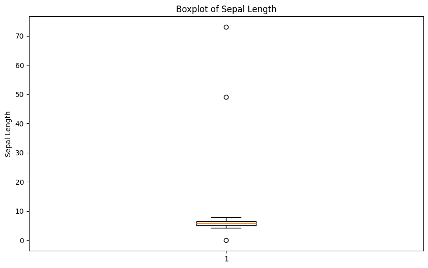
    


```python
# Find outliers in Sepal.Length
outliers = dirty_iris['Sepal.Length'][np.abs(dirty_iris['Sepal.Length'] - dirty_iris['Sepal.Length'].mean()) > (1.5 * dirty_iris['Sepal.Length'].std())]
outliers_idx = dirty_iris.index[dirty_iris['Sepal.Length'].isin(outliers)]

# Print the rows with outliers
print("Outliers:")
print(dirty_iris.loc[outliers_idx])
```

    Outliers:
         Sepal.Length  Sepal.Width  Petal.Length  Petal.Width    Species
    27           73.0         29.0          63.0          NaN  virginica
    124          49.0         30.0          14.0          2.0     setosa
    

They all seem to be too big... may they were measured in mm i.o cm?


```python
# Adjust the outliers (assuming they were measured in mm instead of cm)
dirty_iris.loc[outliers_idx, ['Sepal.Length', 'Sepal.Width', 'Petal.Length', 'Petal.Width']] /= 10

# Summary of the adjusted data
print("Summary of adjusted data:")
print(dirty_iris.describe())
```

    Summary of adjusted data:
           Sepal.Length  Sepal.Width  Petal.Length  Petal.Width
    count    140.000000   133.000000    131.000000   137.000000
    mean       5.775000     2.991729      3.920954     1.194161
    std        0.969842     0.708075      2.455417     0.766463
    min        0.000000    -3.000000      0.000000     0.100000
    25%        5.100000     2.800000      1.600000     0.300000
    50%        5.700000     3.000000      4.400000     1.300000
    75%        6.400000     3.300000      5.100000     1.800000
    max        7.900000     4.200000     23.000000     2.500000
    


Note that simple boxplot shows an extra outlier!


```python
import seaborn as sns
plt.figure(figsize=(10, 6))
sns.boxplot(x='Species', y='Sepal.Length', data=dirty_iris)
plt.title('Boxplot of Sepal Length by Species')
plt.xlabel('Species')
plt.ylabel('Sepal Length')
plt.show()
```


    

    


## Correcting

Replace non positive values from Sepal.Width with NA:


```python
# Define the correction rule
def correct_sepal_width(df):
    df.loc[(~df['Sepal.Width'].isna()) & (df['Sepal.Width'] <= 0), 'Sepal.Width'] = np.nan
    return df

# Apply the correction rule to the dataframe
mydata_corrected = correct_sepal_width(dirty_iris)

# Print the corrected dataframe
print(mydata_corrected)
```

         Sepal.Length  Sepal.Width  Petal.Length  Petal.Width     Species
    0             6.4          3.2           4.5          1.5  versicolor
    1             6.3          3.3           6.0          2.5   virginica
    2             6.2          NaN           5.4          2.3   virginica
    3             5.0          3.4           1.6          0.4      setosa
    4             5.7          2.6           3.5          1.0  versicolor
    ..            ...          ...           ...          ...         ...
    145           6.7          3.1           5.6          2.4   virginica
    146           5.6          3.0           4.5          1.5  versicolor
    147           5.2          3.5           1.5          0.2      setosa
    148           6.4          3.1           NaN          1.8   virginica
    149           5.8          2.6           4.0          NaN  versicolor
    
    [150 rows x 5 columns]
    

Replace all erroneous values with NA using (the result of) localizeErrors:


```python
# Apply the rules to the dataframe
rules = check_rules(dirty_iris)
violations = {rule: ~result for rule, result in rules.items()}
violated_df = pd.DataFrame(violations)

# Localize errors and set them to NA
for col in violated_df.columns:
    dirty_iris.loc[violated_df[col], col.split()[0]] = np.nan
```

## NA's pattern detection

Here we are going to use **missingno** library to diagnose the missingness pattern for the 'dirty_iris' dataset.


```python
import missingno as msno
```

### Matrix Plot (msno.matrix):

This visualization shows which values are missing in each column. Each bar represents a column, and white spaces in the bars indicate missing values.

If you see many white spaces in one column, it means that column has a lot of missing data.
If the white spaces are randomly scattered, the missing data might be random. 
If they are clustered in specific areas, it might indicate a pattern.


```python
msno.matrix(dirty_iris)
```


    <Axes: >


    
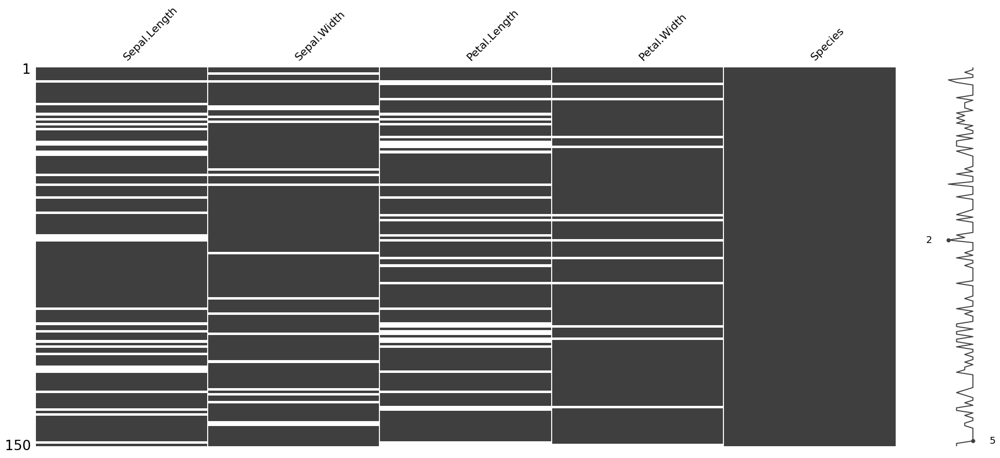
    


### Heatmap Plot (msno.heatmap):

This visualization shows the correlations between missing values in different columns.
If two columns have a high correlation (dark colors), it means that if one column has missing values, the other column is also likely to have missing values.

Low correlations (light colors) indicate that missing values in one column are not related to missing values in another column.


```python
msno.heatmap(dirty_iris)
```


    <Axes: >


    
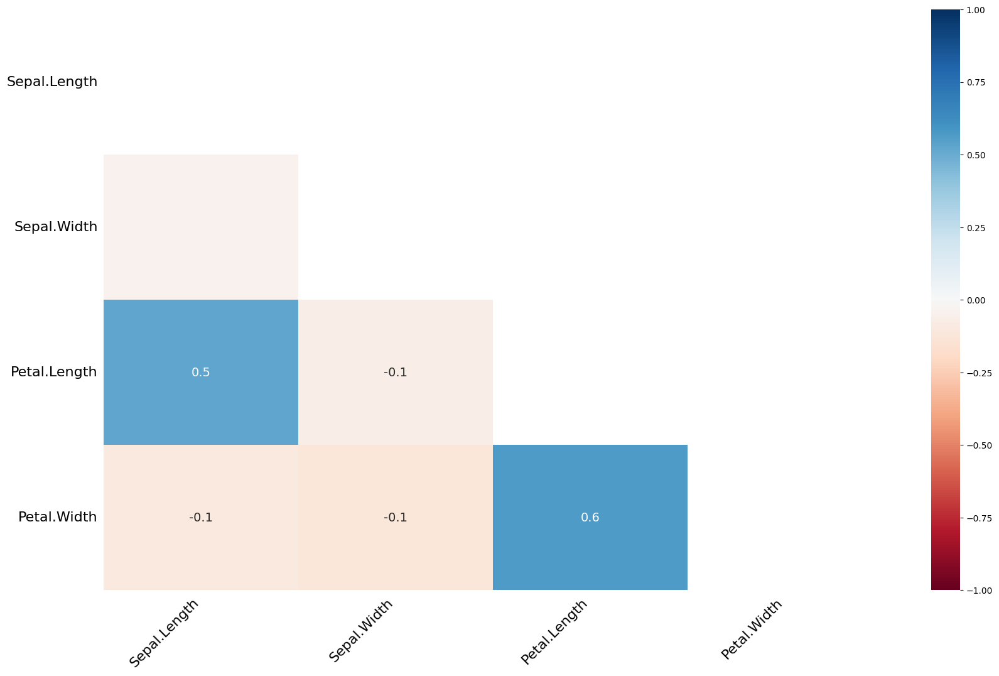
    


### Dendrogram Plot (msno.dendrogram):

This visualization groups columns based on the similarity of their missing data patterns.
Columns that are close to each other in the dendrogram have similar patterns of missing data.

This can help identify groups of columns that have similar issues with missing data.

Based on these visualizations, we can identify which columns have the most missing data, whether the missing data is random or patterned, and which columns have similar patterns of missing data.


```python
msno.dendrogram(dirty_iris)
```


    <Axes: >


    
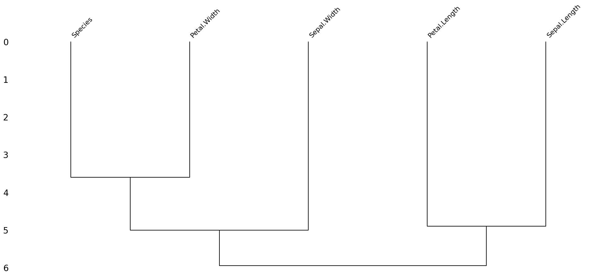
    


*Based on the dendrogram plot, we can interpret the pattern of missing data in the "dirty iris" dataset as follows:*

**Grouping of Columns:**

The dendrogram shows that the columns "Species" and "Petal.Width" are grouped together, indicating that they have similar patterns of missing data.

Similarly, "Sepal.Width" and "Petal.Length" are grouped together, suggesting they also share a similar pattern of missing data.

"Sepal.Length" is somewhat separate from the other groups, indicating it has a different pattern of missing data compared to the other columns.

**Pattern of Missing Data:**

The grouping suggests that missing data in "Species" is likely to be associated with missing data in "Petal.Width".

Similarly, missing data in "Sepal.Width" is likely to be associated with missing data in "Petal.Length".

"Sepal.Length" appears to have a distinct pattern of missing data that is not strongly associated with the other columns.

*From this dendrogram, we can infer that the missing data is not completely random. Instead, there are specific patterns where certain columns tend to have missing data together. This indicates a systematic pattern of missing data rather than a purely random one.*

## Imputing NA's

Imputation is the process of estimating or deriving values for fields where data is missing. There is a vast body of literature on imputation methods and it goes beyond the scope of this tutorial to discuss all of them.

There is no one single best imputation method that works in all cases. The imputation model of choice depends on what auxiliary information is available and whether there are (multivariate) edit restrictions on the data to be imputed. The availability of R software for imputation under edit restrictions is, to our best knowledge, limited. However, a viable strategy for imputing numerical data is to first impute missing values without restrictions, and then minimally adjust the imputed values so that the restrictions are obeyed. Separately, these methods are available in R.

We can mention several approaches to imputation:

1.  For the **quantitative** variables:

-   imputing by **mean**/**median**/**mode**

-   **KNN** -- K-nearest-neighbors approach

-   **RPART** -- random forests multivariate approach

-   **mice** - Multivariate Imputation by Chained Equations approach

2.  For the **qualitative** variables:

-   imputing by **mode**

-   **RPART** -- random forests multivariate approach

-   **mice** - Multivariate Imputation by Chained Equations approach

    ... and many others. Please read the theoretical background if you are interested in those techniques.


***Exercise 1.*** Use ***kNN*** imputation ('sklearn' package) to impute all missing values. The KNNImputer from sklearn requires all data to be numeric. Since our dataset contains categorical data (e.g., the Species column), you need to handle these columns separately. One approach is to use one-hot encoding for categorical variables before applying the imputer.


```python
from sklearn.impute import KNNImputer
from sklearn.preprocessing import OneHotEncoder
# Replace infinite values with NaN
dirty_iris.replace([np.inf, -np.inf], np.nan, inplace=True)

# Separate numeric and categorical columns
numeric_cols = dirty_iris.select_dtypes(include=[np.number]).columns
categorical_cols = dirty_iris.select_dtypes(exclude=[np.number]).columns
# One-hot encode categorical columns
encoder = OneHotEncoder(sparse_output=False, handle_unknown='ignore')

encoded_categorical = pd.DataFrame(encoder.fit_transform(dirty_iris[categorical_cols]), columns=encoder.get_feature_names_out(categorical_cols))

# Combine numeric and encoded categorical columns
combined_data = pd.concat([dirty_iris[numeric_cols], encoded_categorical], axis=1)

# Initialize the KNNImputer
imputer = KNNImputer(n_neighbors=3) #cos waznego tu

# Perform kNN imputation
imputed_data = imputer.fit_transform(combined_data)

# Convert the imputed data back to a DataFrame
imputed_df = pd.DataFrame(imputed_data, columns=combined_data.columns)

# Decode the one-hot encoded columns back to original categorical columns
decoded_categorical = pd.DataFrame(encoder.inverse_transform(imputed_df[encoded_categorical.columns]), columns=categorical_cols)

# Combine numeric and decoded categorical columns
final_imputed_data = pd.concat([imputed_df[numeric_cols], decoded_categorical], axis=1)

# Print the imputed data
print(final_imputed_data.head(20).round(2))
```

        Sepal.Length  Sepal.Width  Petal.Length  Petal.Width     Species
    0           6.40         3.20          4.50         1.50  versicolor
    1           6.30         3.30          6.00         2.50   virginica
    2           6.20         3.03          5.40         2.30   virginica
    3           5.00         3.40          1.60         0.40      setosa
    4           5.70         2.60          3.50         1.00  versicolor
    5           4.83         3.43          1.37         0.20      setosa
    6           6.40         2.70          5.23         1.80   virginica
    7           5.90         3.00          5.10         1.80   virginica
    8           5.80         2.70          4.10         1.00  versicolor
    9           4.80         3.10          1.60         0.20      setosa
    10          5.00         3.50          1.60         0.60      setosa
    11          6.00         2.70          5.10         1.60  versicolor
    12          6.00         3.00          5.43         2.17   virginica
    13          6.80         2.80          4.80         1.40  versicolor
    14          5.30         3.90          1.70         0.40      setosa
    15          5.00         2.57          3.50         1.00  versicolor
    16          5.50         2.67          4.00         1.30  versicolor
    17          4.70         3.20          1.30         0.20      setosa
    18          4.93         4.00          1.50         0.20      setosa
    19          5.60         2.83          4.20         1.30  versicolor
    

## Transformations

Finally, we sometimes encounter the situation where we have problems with skewed distributions or we just want to transform, recode or perform discretization. Let's review some of the most popular transformation methods.

First, standardization (also known as normalization):

-   **Z-score** approach - standardization procedure, using the formula: $z=\frac{x-\mu}{\sigma}$ where $\mu$ = mean and $\sigma$ = standard deviation. Z-scores are also known as standardized scores; they are scores (or data values) that have been given a common *standard*. This standard is a mean of zero and a standard deviation of 1.

-   **minmax** approach - An alternative approach to Z-score normalization (or standardization) is the so-called MinMax scaling (often also simply called "normalization" - a common cause for ambiguities). In this approach, the data is scaled to a fixed range - usually 0 to 1. The cost of having this bounded range - in contrast to standardization - is that we will end up with smaller standard deviations, which can suppress the effect of outliers. If you would like to perform MinMax scaling - simply substract minimum value and divide it by range:$(x-min)/(max-min)$

In order to solve problems with very skewed distributions we can also use several types of simple transformations:

-   log
-   log+1
-   sqrt
-   x\^2
-   x\^3

***Exercise 2.*** Standardize incomes and present the transformed distribution of incomes on boxplot.

Z-score approach:


```python
standardized_income = (carseats['Income'] - carseats['Income'].mean()) / carseats['Income'].std()
plt.boxplot(standardized_income.dropna())
plt.title('Standardized Income')
plt.ylabel('Income z-score')
plt.show()
```


    
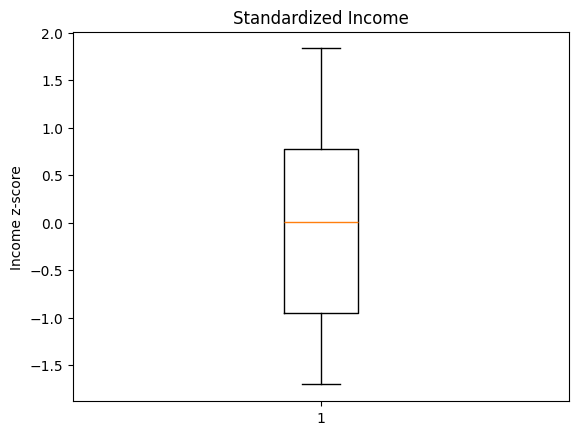
    


Min-Max approach:


```python
import pandas as pd
import matplotlib.pyplot as plt

max1 = carseats['Income'].max()
min1 = carseats['Income'].min()
d = max1 - min1
# Standardize the 'Income' column
carseats['Standardized_Incomes'] = (carseats['Income'] - min1) / d

# Display the first few rows to verify
print(carseats[['Income', 'Standardized_Incomes']].head(5))

plt.figure(figsize=(8, 6))
plt.boxplot(carseats['Standardized_Incomes'].dropna(), vert=False, patch_artist=True, boxprops=dict(facecolor='lightblue'))
plt.title('Boxplot of Standardized Incomes (Carseats Dataset)')
plt.xlabel('Standardized Income')
plt.show()
```

       Income  Standardized_Incomes
    0    73.0              0.525253
    1    48.0              0.272727
    2    35.0              0.141414
    3   100.0              0.797980
    4    64.0              0.434343
    


    
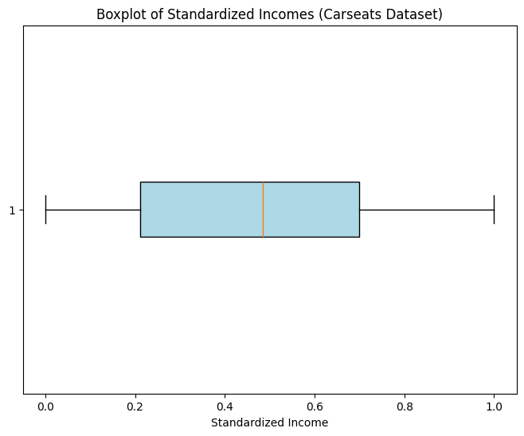
    


## Binning

Sometimes we just would like to perform so called 'binning' procedure to be able to analyze our categorical data, to compare several categorical variables, to construct statistical models etc. Thanks to the 'binning' function we can transform quantitative variables into categorical using several methods:

-   **quantile** - automatic binning by quantile of its distribution

-   **equal** - binning to achieve fixed length of intervals

-   **pretty** - a compromise between the 2 mentioned above

-   **kmeans** - categorization using the K-Means algorithm

-   **bclust** - categorization using the bagged clustering algorithm

**Exercise 3.** Using quantile approach perform binning of the variable 'Income'.


```python
carseats['IncomeBins'] = pd.qcut(carseats['Income'], q=4, labels=['Low', 'Medium', 'High', 'Very High'])

# Display first few rows to check
print(carseats[['Income', 'IncomeBins']].head(15))
highincome = carseats[carseats['IncomeBins'] == 'Very High']
highincome.head(10)
```

        Income IncomeBins
    0     73.0       High
    1     48.0     Medium
    2     35.0        Low
    3    100.0  Very High
    4     64.0     Medium
    5    113.0  Very High
    6    105.0  Very High
    7     81.0       High
    8    110.0  Very High
    9      NaN        NaN
    10    78.0       High
    11    94.0  Very High
    12    35.0        Low
    13    28.0        Low
    14   117.0  Very High
    


<div>
<style scoped>
    .dataframe tbody tr th:only-of-type {
        vertical-align: middle;
    }

    .dataframe tbody tr th {
        vertical-align: top;
    }

    .dataframe thead th {
        text-align: right;
    }
</style>
<table border="1" class="dataframe">
  <thead>
    <tr style="text-align: right;">
      <th></th>
      <th>Sales</th>
      <th>CompPrice</th>
      <th>Income</th>
      <th>Advertising</th>
      <th>Population</th>
      <th>Price</th>
      <th>ShelveLoc</th>
      <th>Age</th>
      <th>Education</th>
      <th>Urban</th>
      <th>US</th>
      <th>Standardized_Incomes</th>
      <th>IncomeBins</th>
    </tr>
  </thead>
  <tbody>
    <tr>
      <th>3</th>
      <td>7.40</td>
      <td>117</td>
      <td>100.0</td>
      <td>4</td>
      <td>466</td>
      <td>97</td>
      <td>Medium</td>
      <td>55</td>
      <td>14</td>
      <td>Yes</td>
      <td>Yes</td>
      <td>0.797980</td>
      <td>Very High</td>
    </tr>
    <tr>
      <th>5</th>
      <td>10.81</td>
      <td>124</td>
      <td>113.0</td>
      <td>13</td>
      <td>501</td>
      <td>72</td>
      <td>Bad</td>
      <td>78</td>
      <td>16</td>
      <td>No</td>
      <td>Yes</td>
      <td>0.929293</td>
      <td>Very High</td>
    </tr>
    <tr>
      <th>6</th>
      <td>6.63</td>
      <td>115</td>
      <td>105.0</td>
      <td>0</td>
      <td>45</td>
      <td>108</td>
      <td>Medium</td>
      <td>71</td>
      <td>15</td>
      <td>Yes</td>
      <td>No</td>
      <td>0.848485</td>
      <td>Very High</td>
    </tr>
    <tr>
      <th>8</th>
      <td>6.54</td>
      <td>132</td>
      <td>110.0</td>
      <td>0</td>
      <td>108</td>
      <td>124</td>
      <td>Medium</td>
      <td>76</td>
      <td>10</td>
      <td>No</td>
      <td>No</td>
      <td>0.898990</td>
      <td>Very High</td>
    </tr>
    <tr>
      <th>11</th>
      <td>11.96</td>
      <td>117</td>
      <td>94.0</td>
      <td>4</td>
      <td>503</td>
      <td>94</td>
      <td>Good</td>
      <td>50</td>
      <td>13</td>
      <td>Yes</td>
      <td>Yes</td>
      <td>0.737374</td>
      <td>Very High</td>
    </tr>
    <tr>
      <th>14</th>
      <td>11.17</td>
      <td>107</td>
      <td>117.0</td>
      <td>11</td>
      <td>148</td>
      <td>118</td>
      <td>Good</td>
      <td>52</td>
      <td>18</td>
      <td>Yes</td>
      <td>Yes</td>
      <td>0.969697</td>
      <td>Very High</td>
    </tr>
    <tr>
      <th>15</th>
      <td>8.71</td>
      <td>149</td>
      <td>95.0</td>
      <td>5</td>
      <td>400</td>
      <td>144</td>
      <td>Medium</td>
      <td>76</td>
      <td>18</td>
      <td>No</td>
      <td>No</td>
      <td>0.747475</td>
      <td>Very High</td>
    </tr>
    <tr>
      <th>18</th>
      <td>13.91</td>
      <td>110</td>
      <td>110.0</td>
      <td>0</td>
      <td>408</td>
      <td>68</td>
      <td>Good</td>
      <td>46</td>
      <td>17</td>
      <td>NaN</td>
      <td>Yes</td>
      <td>0.898990</td>
      <td>Very High</td>
    </tr>
    <tr>
      <th>24</th>
      <td>10.14</td>
      <td>145</td>
      <td>119.0</td>
      <td>16</td>
      <td>294</td>
      <td>113</td>
      <td>Bad</td>
      <td>42</td>
      <td>12</td>
      <td>Yes</td>
      <td>Yes</td>
      <td>0.989899</td>
      <td>Very High</td>
    </tr>
    <tr>
      <th>26</th>
      <td>8.33</td>
      <td>107</td>
      <td>115.0</td>
      <td>11</td>
      <td>496</td>
      <td>131</td>
      <td>Good</td>
      <td>50</td>
      <td>11</td>
      <td>No</td>
      <td>Yes</td>
      <td>0.949495</td>
      <td>Very High</td>
    </tr>
  </tbody>
</table>
</div>


**Exercise 4.** Recode the original distribution of incomes using fixed length of intervals and assign them labels.


```python
intervals = [0, 30, 90, 120]  # Custom bin edges
labeltab = ['Low', 'medium', 'High']

carseats['IncomeBinsfixed'] = pd.cut(carseats['Income'], bins=intervals, labels=labeltab)

print(carseats[['Income', 'IncomeBinsfixed']].head(15))
```

        Income IncomeBinsfixed
    0     73.0          medium
    1     48.0          medium
    2     35.0          medium
    3    100.0            High
    4     64.0          medium
    5    113.0            High
    6    105.0            High
    7     81.0          medium
    8    110.0            High
    9      NaN             NaN
    10    78.0          medium
    11    94.0            High
    12    35.0          medium
    13    28.0             Low
    14   117.0            High
    

In case of statistical modeling (i.e. credit scoring purposes) - we need to be aware of the fact, that the ***optimal*** discretization of the original distribution must be achieved. The '*binning_by*' function comes with some help here.

## Optimal binning with binary target

**Exercise 5.** Perform discretization of the variable 'Advertising' using optimal binning.


```python
from optbinning import OptimalBinning
from sklearn.datasets import load_breast_cancer

data = load_breast_cancer()

df = pd.DataFrame(data.data, columns=data.feature_names)
#df.iloc[20:25, 10:20]
```

    load c:\Users\kacpe\AppData\Local\Programs\Python\Python313\Lib\site-packages\ortools\.libs\zlib1.dll...
    load c:\Users\kacpe\AppData\Local\Programs\Python\Python313\Lib\site-packages\ortools\.libs\abseil_dll.dll...
    load c:\Users\kacpe\AppData\Local\Programs\Python\Python313\Lib\site-packages\ortools\.libs\utf8_validity.dll...
    load c:\Users\kacpe\AppData\Local\Programs\Python\Python313\Lib\site-packages\ortools\.libs\re2.dll...
    load c:\Users\kacpe\AppData\Local\Programs\Python\Python313\Lib\site-packages\ortools\.libs\libprotobuf.dll...
    load c:\Users\kacpe\AppData\Local\Programs\Python\Python313\Lib\site-packages\ortools\.libs\highs.dll...
    load c:\Users\kacpe\AppData\Local\Programs\Python\Python313\Lib\site-packages\ortools\.libs\ortools.dll...
    (CVXPY) Apr 14 09:22:39 PM: Encountered unexpected exception importing solver GLOP:
    RuntimeError('Unrecognized new version of ortools (9.12.4544). Expected < 9.12.0. Please open a feature request on cvxpy to enable support for this version.')
    (CVXPY) Apr 14 09:22:39 PM: Encountered unexpected exception importing solver PDLP:
    RuntimeError('Unrecognized new version of ortools (9.12.4544). Expected < 9.12.0. Please open a feature request on cvxpy to enable support for this version.')
    

We choose a variable to discretize and the binary target.


```python
variable = "mean radius"
x = df[variable].values
y = data.target
x[0:23], y[0:23]
```


    (array([17.99 , 20.57 , 19.69 , 11.42 , 20.29 , 12.45 , 18.25 , 13.71 ,
            13.   , 12.46 , 16.02 , 15.78 , 19.17 , 15.85 , 13.73 , 14.54 ,
            14.68 , 16.13 , 19.81 , 13.54 , 13.08 ,  9.504, 15.34 ]),
     array([0, 0, 0, 0, 0, 0, 0, 0, 0, 0, 0, 0, 0, 0, 0, 0, 0, 0, 0, 1, 1, 1,
            0]))


Import and instantiate an OptimalBinning object class. We pass the variable name, its data type, and a solver, in this case, we choose the constraint programming solver.


```python
optb = OptimalBinning(name=variable, dtype="numerical", solver="cp")
```

We fit the optimal binning object with arrays x and y.


```python
optb.fit(x, y)
```


<style>#sk-container-id-1 {
  /* Definition of color scheme common for light and dark mode */
  --sklearn-color-text: #000;
  --sklearn-color-text-muted: #666;
  --sklearn-color-line: gray;
  /* Definition of color scheme for unfitted estimators */
  --sklearn-color-unfitted-level-0: #fff5e6;
  --sklearn-color-unfitted-level-1: #f6e4d2;
  --sklearn-color-unfitted-level-2: #ffe0b3;
  --sklearn-color-unfitted-level-3: chocolate;
  /* Definition of color scheme for fitted estimators */
  --sklearn-color-fitted-level-0: #f0f8ff;
  --sklearn-color-fitted-level-1: #d4ebff;
  --sklearn-color-fitted-level-2: #b3dbfd;
  --sklearn-color-fitted-level-3: cornflowerblue;

  /* Specific color for light theme */
  --sklearn-color-text-on-default-background: var(--sg-text-color, var(--theme-code-foreground, var(--jp-content-font-color1, black)));
  --sklearn-color-background: var(--sg-background-color, var(--theme-background, var(--jp-layout-color0, white)));
  --sklearn-color-border-box: var(--sg-text-color, var(--theme-code-foreground, var(--jp-content-font-color1, black)));
  --sklearn-color-icon: #696969;

  @media (prefers-color-scheme: dark) {
    /* Redefinition of color scheme for dark theme */
    --sklearn-color-text-on-default-background: var(--sg-text-color, var(--theme-code-foreground, var(--jp-content-font-color1, white)));
    --sklearn-color-background: var(--sg-background-color, var(--theme-background, var(--jp-layout-color0, #111)));
    --sklearn-color-border-box: var(--sg-text-color, var(--theme-code-foreground, var(--jp-content-font-color1, white)));
    --sklearn-color-icon: #878787;
  }
}

#sk-container-id-1 {
  color: var(--sklearn-color-text);
}

#sk-container-id-1 pre {
  padding: 0;
}

#sk-container-id-1 input.sk-hidden--visually {
  border: 0;
  clip: rect(1px 1px 1px 1px);
  clip: rect(1px, 1px, 1px, 1px);
  height: 1px;
  margin: -1px;
  overflow: hidden;
  padding: 0;
  position: absolute;
  width: 1px;
}

#sk-container-id-1 div.sk-dashed-wrapped {
  border: 1px dashed var(--sklearn-color-line);
  margin: 0 0.4em 0.5em 0.4em;
  box-sizing: border-box;
  padding-bottom: 0.4em;
  background-color: var(--sklearn-color-background);
}

#sk-container-id-1 div.sk-container {
  /* jupyter's `normalize.less` sets `[hidden] { display: none; }`
     but bootstrap.min.css set `[hidden] { display: none !important; }`
     so we also need the `!important` here to be able to override the
     default hidden behavior on the sphinx rendered scikit-learn.org.
     See: https://github.com/scikit-learn/scikit-learn/issues/21755 */
  display: inline-block !important;
  position: relative;
}

#sk-container-id-1 div.sk-text-repr-fallback {
  display: none;
}

div.sk-parallel-item,
div.sk-serial,
div.sk-item {
  /* draw centered vertical line to link estimators */
  background-image: linear-gradient(var(--sklearn-color-text-on-default-background), var(--sklearn-color-text-on-default-background));
  background-size: 2px 100%;
  background-repeat: no-repeat;
  background-position: center center;
}

/* Parallel-specific style estimator block */

#sk-container-id-1 div.sk-parallel-item::after {
  content: "";
  width: 100%;
  border-bottom: 2px solid var(--sklearn-color-text-on-default-background);
  flex-grow: 1;
}

#sk-container-id-1 div.sk-parallel {
  display: flex;
  align-items: stretch;
  justify-content: center;
  background-color: var(--sklearn-color-background);
  position: relative;
}

#sk-container-id-1 div.sk-parallel-item {
  display: flex;
  flex-direction: column;
}

#sk-container-id-1 div.sk-parallel-item:first-child::after {
  align-self: flex-end;
  width: 50%;
}

#sk-container-id-1 div.sk-parallel-item:last-child::after {
  align-self: flex-start;
  width: 50%;
}

#sk-container-id-1 div.sk-parallel-item:only-child::after {
  width: 0;
}

/* Serial-specific style estimator block */

#sk-container-id-1 div.sk-serial {
  display: flex;
  flex-direction: column;
  align-items: center;
  background-color: var(--sklearn-color-background);
  padding-right: 1em;
  padding-left: 1em;
}


/* Toggleable style: style used for estimator/Pipeline/ColumnTransformer box that is
clickable and can be expanded/collapsed.
- Pipeline and ColumnTransformer use this feature and define the default style
- Estimators will overwrite some part of the style using the `sk-estimator` class
*/

/* Pipeline and ColumnTransformer style (default) */

#sk-container-id-1 div.sk-toggleable {
  /* Default theme specific background. It is overwritten whether we have a
  specific estimator or a Pipeline/ColumnTransformer */
  background-color: var(--sklearn-color-background);
}

/* Toggleable label */
#sk-container-id-1 label.sk-toggleable__label {
  cursor: pointer;
  display: flex;
  width: 100%;
  margin-bottom: 0;
  padding: 0.5em;
  box-sizing: border-box;
  text-align: center;
  align-items: start;
  justify-content: space-between;
  gap: 0.5em;
}

#sk-container-id-1 label.sk-toggleable__label .caption {
  font-size: 0.6rem;
  font-weight: lighter;
  color: var(--sklearn-color-text-muted);
}

#sk-container-id-1 label.sk-toggleable__label-arrow:before {
  /* Arrow on the left of the label */
  content: "▸";
  float: left;
  margin-right: 0.25em;
  color: var(--sklearn-color-icon);
}

#sk-container-id-1 label.sk-toggleable__label-arrow:hover:before {
  color: var(--sklearn-color-text);
}

/* Toggleable content - dropdown */

#sk-container-id-1 div.sk-toggleable__content {
  max-height: 0;
  max-width: 0;
  overflow: hidden;
  text-align: left;
  /* unfitted */
  background-color: var(--sklearn-color-unfitted-level-0);
}

#sk-container-id-1 div.sk-toggleable__content.fitted {
  /* fitted */
  background-color: var(--sklearn-color-fitted-level-0);
}

#sk-container-id-1 div.sk-toggleable__content pre {
  margin: 0.2em;
  border-radius: 0.25em;
  color: var(--sklearn-color-text);
  /* unfitted */
  background-color: var(--sklearn-color-unfitted-level-0);
}

#sk-container-id-1 div.sk-toggleable__content.fitted pre {
  /* unfitted */
  background-color: var(--sklearn-color-fitted-level-0);
}

#sk-container-id-1 input.sk-toggleable__control:checked~div.sk-toggleable__content {
  /* Expand drop-down */
  max-height: 200px;
  max-width: 100%;
  overflow: auto;
}

#sk-container-id-1 input.sk-toggleable__control:checked~label.sk-toggleable__label-arrow:before {
  content: "▾";
}

/* Pipeline/ColumnTransformer-specific style */

#sk-container-id-1 div.sk-label input.sk-toggleable__control:checked~label.sk-toggleable__label {
  color: var(--sklearn-color-text);
  background-color: var(--sklearn-color-unfitted-level-2);
}

#sk-container-id-1 div.sk-label.fitted input.sk-toggleable__control:checked~label.sk-toggleable__label {
  background-color: var(--sklearn-color-fitted-level-2);
}

/* Estimator-specific style */

/* Colorize estimator box */
#sk-container-id-1 div.sk-estimator input.sk-toggleable__control:checked~label.sk-toggleable__label {
  /* unfitted */
  background-color: var(--sklearn-color-unfitted-level-2);
}

#sk-container-id-1 div.sk-estimator.fitted input.sk-toggleable__control:checked~label.sk-toggleable__label {
  /* fitted */
  background-color: var(--sklearn-color-fitted-level-2);
}

#sk-container-id-1 div.sk-label label.sk-toggleable__label,
#sk-container-id-1 div.sk-label label {
  /* The background is the default theme color */
  color: var(--sklearn-color-text-on-default-background);
}

/* On hover, darken the color of the background */
#sk-container-id-1 div.sk-label:hover label.sk-toggleable__label {
  color: var(--sklearn-color-text);
  background-color: var(--sklearn-color-unfitted-level-2);
}

/* Label box, darken color on hover, fitted */
#sk-container-id-1 div.sk-label.fitted:hover label.sk-toggleable__label.fitted {
  color: var(--sklearn-color-text);
  background-color: var(--sklearn-color-fitted-level-2);
}

/* Estimator label */

#sk-container-id-1 div.sk-label label {
  font-family: monospace;
  font-weight: bold;
  display: inline-block;
  line-height: 1.2em;
}

#sk-container-id-1 div.sk-label-container {
  text-align: center;
}

/* Estimator-specific */
#sk-container-id-1 div.sk-estimator {
  font-family: monospace;
  border: 1px dotted var(--sklearn-color-border-box);
  border-radius: 0.25em;
  box-sizing: border-box;
  margin-bottom: 0.5em;
  /* unfitted */
  background-color: var(--sklearn-color-unfitted-level-0);
}

#sk-container-id-1 div.sk-estimator.fitted {
  /* fitted */
  background-color: var(--sklearn-color-fitted-level-0);
}

/* on hover */
#sk-container-id-1 div.sk-estimator:hover {
  /* unfitted */
  background-color: var(--sklearn-color-unfitted-level-2);
}

#sk-container-id-1 div.sk-estimator.fitted:hover {
  /* fitted */
  background-color: var(--sklearn-color-fitted-level-2);
}

/* Specification for estimator info (e.g. "i" and "?") */

/* Common style for "i" and "?" */

.sk-estimator-doc-link,
a:link.sk-estimator-doc-link,
a:visited.sk-estimator-doc-link {
  float: right;
  font-size: smaller;
  line-height: 1em;
  font-family: monospace;
  background-color: var(--sklearn-color-background);
  border-radius: 1em;
  height: 1em;
  width: 1em;
  text-decoration: none !important;
  margin-left: 0.5em;
  text-align: center;
  /* unfitted */
  border: var(--sklearn-color-unfitted-level-1) 1pt solid;
  color: var(--sklearn-color-unfitted-level-1);
}

.sk-estimator-doc-link.fitted,
a:link.sk-estimator-doc-link.fitted,
a:visited.sk-estimator-doc-link.fitted {
  /* fitted */
  border: var(--sklearn-color-fitted-level-1) 1pt solid;
  color: var(--sklearn-color-fitted-level-1);
}

/* On hover */
div.sk-estimator:hover .sk-estimator-doc-link:hover,
.sk-estimator-doc-link:hover,
div.sk-label-container:hover .sk-estimator-doc-link:hover,
.sk-estimator-doc-link:hover {
  /* unfitted */
  background-color: var(--sklearn-color-unfitted-level-3);
  color: var(--sklearn-color-background);
  text-decoration: none;
}

div.sk-estimator.fitted:hover .sk-estimator-doc-link.fitted:hover,
.sk-estimator-doc-link.fitted:hover,
div.sk-label-container:hover .sk-estimator-doc-link.fitted:hover,
.sk-estimator-doc-link.fitted:hover {
  /* fitted */
  background-color: var(--sklearn-color-fitted-level-3);
  color: var(--sklearn-color-background);
  text-decoration: none;
}

/* Span, style for the box shown on hovering the info icon */
.sk-estimator-doc-link span {
  display: none;
  z-index: 9999;
  position: relative;
  font-weight: normal;
  right: .2ex;
  padding: .5ex;
  margin: .5ex;
  width: min-content;
  min-width: 20ex;
  max-width: 50ex;
  color: var(--sklearn-color-text);
  box-shadow: 2pt 2pt 4pt #999;
  /* unfitted */
  background: var(--sklearn-color-unfitted-level-0);
  border: .5pt solid var(--sklearn-color-unfitted-level-3);
}

.sk-estimator-doc-link.fitted span {
  /* fitted */
  background: var(--sklearn-color-fitted-level-0);
  border: var(--sklearn-color-fitted-level-3);
}

.sk-estimator-doc-link:hover span {
  display: block;
}

/* "?"-specific style due to the `<a>` HTML tag */

#sk-container-id-1 a.estimator_doc_link {
  float: right;
  font-size: 1rem;
  line-height: 1em;
  font-family: monospace;
  background-color: var(--sklearn-color-background);
  border-radius: 1rem;
  height: 1rem;
  width: 1rem;
  text-decoration: none;
  /* unfitted */
  color: var(--sklearn-color-unfitted-level-1);
  border: var(--sklearn-color-unfitted-level-1) 1pt solid;
}

#sk-container-id-1 a.estimator_doc_link.fitted {
  /* fitted */
  border: var(--sklearn-color-fitted-level-1) 1pt solid;
  color: var(--sklearn-color-fitted-level-1);
}

/* On hover */
#sk-container-id-1 a.estimator_doc_link:hover {
  /* unfitted */
  background-color: var(--sklearn-color-unfitted-level-3);
  color: var(--sklearn-color-background);
  text-decoration: none;
}

#sk-container-id-1 a.estimator_doc_link.fitted:hover {
  /* fitted */
  background-color: var(--sklearn-color-fitted-level-3);
}
</style><div id="sk-container-id-1" class="sk-top-container"><div class="sk-text-repr-fallback"><pre>OptimalBinning(name=&#x27;mean radius&#x27;)</pre><b>In a Jupyter environment, please rerun this cell to show the HTML representation or trust the notebook. <br />On GitHub, the HTML representation is unable to render, please try loading this page with nbviewer.org.</b></div><div class="sk-container" hidden><div class="sk-item"><div class="sk-estimator  sk-toggleable"><input class="sk-toggleable__control sk-hidden--visually" id="sk-estimator-id-1" type="checkbox" checked><label for="sk-estimator-id-1" class="sk-toggleable__label  sk-toggleable__label-arrow"><div><div>OptimalBinning</div></div><div><span class="sk-estimator-doc-link ">i<span>Not fitted</span></span></div></label><div class="sk-toggleable__content "><pre>OptimalBinning(name=&#x27;mean radius&#x27;)</pre></div> </div></div></div></div>


You can check if an optimal solution has been found via the status attribute:


```python
optb.status
```


    'OPTIMAL'


You can also retrieve the optimal split points via the splits attribute:


```python
optb.splits
```


    array([11.42500019, 12.32999992, 13.09499979, 13.70499992, 15.04500008,
           16.92500019])


The binning table

The optimal binning algorithms return a binning table; a binning table displays the binned data and several metrics for each bin. Class OptimalBinning returns an object BinningTable via the binning_table attribute.


```python
binning_table = optb.binning_table

type(binning_table)
```


    optbinning.binning.binning_statistics.BinningTable


The binning_table is instantiated, but not built. Therefore, the first step is to call the method build, which returns a pandas.DataFrame.


```python
binning_table.build()
```


<div>
<style scoped>
    .dataframe tbody tr th:only-of-type {
        vertical-align: middle;
    }

    .dataframe tbody tr th {
        vertical-align: top;
    }

    .dataframe thead th {
        text-align: right;
    }
</style>
<table border="1" class="dataframe">
  <thead>
    <tr style="text-align: right;">
      <th></th>
      <th>Bin</th>
      <th>Count</th>
      <th>Count (%)</th>
      <th>Non-event</th>
      <th>Event</th>
      <th>Event rate</th>
      <th>WoE</th>
      <th>IV</th>
      <th>JS</th>
    </tr>
  </thead>
  <tbody>
    <tr>
      <th>0</th>
      <td>(-inf, 11.43)</td>
      <td>118</td>
      <td>0.207381</td>
      <td>3</td>
      <td>115</td>
      <td>0.974576</td>
      <td>-3.12517</td>
      <td>0.962483</td>
      <td>0.087205</td>
    </tr>
    <tr>
      <th>1</th>
      <td>[11.43, 12.33)</td>
      <td>79</td>
      <td>0.138840</td>
      <td>3</td>
      <td>76</td>
      <td>0.962025</td>
      <td>-2.710972</td>
      <td>0.538763</td>
      <td>0.052198</td>
    </tr>
    <tr>
      <th>2</th>
      <td>[12.33, 13.09)</td>
      <td>68</td>
      <td>0.119508</td>
      <td>7</td>
      <td>61</td>
      <td>0.897059</td>
      <td>-1.643814</td>
      <td>0.226599</td>
      <td>0.025513</td>
    </tr>
    <tr>
      <th>3</th>
      <td>[13.09, 13.70)</td>
      <td>49</td>
      <td>0.086116</td>
      <td>10</td>
      <td>39</td>
      <td>0.795918</td>
      <td>-0.839827</td>
      <td>0.052131</td>
      <td>0.006331</td>
    </tr>
    <tr>
      <th>4</th>
      <td>[13.70, 15.05)</td>
      <td>83</td>
      <td>0.145870</td>
      <td>28</td>
      <td>55</td>
      <td>0.662651</td>
      <td>-0.153979</td>
      <td>0.003385</td>
      <td>0.000423</td>
    </tr>
    <tr>
      <th>5</th>
      <td>[15.05, 16.93)</td>
      <td>54</td>
      <td>0.094903</td>
      <td>44</td>
      <td>10</td>
      <td>0.185185</td>
      <td>2.002754</td>
      <td>0.359566</td>
      <td>0.038678</td>
    </tr>
    <tr>
      <th>6</th>
      <td>[16.93, inf)</td>
      <td>118</td>
      <td>0.207381</td>
      <td>117</td>
      <td>1</td>
      <td>0.008475</td>
      <td>5.283323</td>
      <td>2.900997</td>
      <td>0.183436</td>
    </tr>
    <tr>
      <th>7</th>
      <td>Special</td>
      <td>0</td>
      <td>0.000000</td>
      <td>0</td>
      <td>0</td>
      <td>0.000000</td>
      <td>0.0</td>
      <td>0.000000</td>
      <td>0.000000</td>
    </tr>
    <tr>
      <th>8</th>
      <td>Missing</td>
      <td>0</td>
      <td>0.000000</td>
      <td>0</td>
      <td>0</td>
      <td>0.000000</td>
      <td>0.0</td>
      <td>0.000000</td>
      <td>0.000000</td>
    </tr>
    <tr>
      <th>Totals</th>
      <td></td>
      <td>569</td>
      <td>1.000000</td>
      <td>212</td>
      <td>357</td>
      <td>0.627417</td>
      <td></td>
      <td>5.043925</td>
      <td>0.393784</td>
    </tr>
  </tbody>
</table>
</div>


Let’s describe the columns of this binning table:

Bin: the intervals delimited by the optimal split points.  
Count: the number of records for each bin.  
Count (%): the percentage of records for each bin.  
Non-event: the number of non-event records (𝑦=0) for each bin.  
Event: the number of event records (𝑦=1) for each bin.  
Event rate: the percentage of event records for each bin.  
WoE: the Weight-of-Evidence for each bin.  
IV: the Information Value (also known as Jeffrey’s divergence) for each bin.  
JS: the Jensen-Shannon divergence for each bin.  
The last row shows the total number of records, non-event records, event records, and IV and JS.    

You can use the method plot to visualize the histogram and WoE or event rate curve. Note that the Bin ID corresponds to the binning table index.


```python
binning_table.plot(metric="woe")
```


    
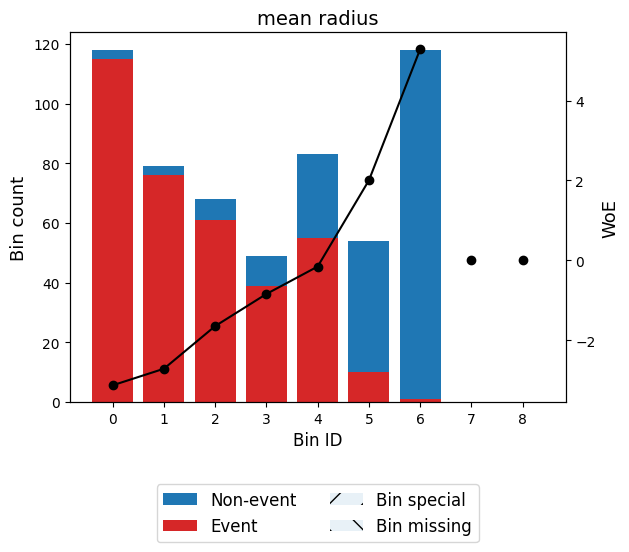
    


```python
binning_table.plot(metric="event_rate")
```


    
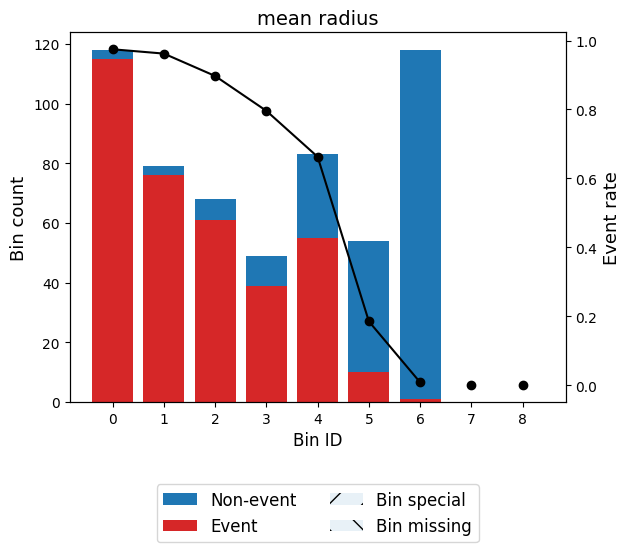
    


Note that WoE is inversely related to the event rate, i.e., a monotonically ascending event rate ensures a monotonically descending WoE and vice-versa. We will see more monotonic trend options in the advanced tutorial.

Read more here: [https://gnpalencia.org/optbinning/tutorials/tutorial_binary.html](https://gnpalencia.org/optbinning/tutorials/tutorial_binary.html)

## Working with 'missingno' library

<iframe width="560" height="315" src="https://www.youtube.com/embed/Wdvwer7h-8w?si=pVqCbOXb4CaCsmnJ" title="YouTube video player" frameborder="0" allow="accelerometer; autoplay; clipboard-write; encrypted-media; gyroscope; picture-in-picture; web-share" referrerpolicy="strict-origin-when-cross-origin" allowfullscreen></iframe>

**Exercise 6.** Your turn! 

Work with the 'carseats' dataset, find the best way to perform full diagnostic (dirty data, outliers, missing values). Fix problems.


```python
# Drop unused columns
carseats.drop(columns=['Standardized_Incomes', 'IncomeBins', 'IncomeBinsfixed'], inplace=True)

carseats.head()
```


<div>
<style scoped>
    .dataframe tbody tr th:only-of-type {
        vertical-align: middle;
    }

    .dataframe tbody tr th {
        vertical-align: top;
    }

    .dataframe thead th {
        text-align: right;
    }
</style>
<table border="1" class="dataframe">
  <thead>
    <tr style="text-align: right;">
      <th></th>
      <th>Sales</th>
      <th>CompPrice</th>
      <th>Income</th>
      <th>Advertising</th>
      <th>Population</th>
      <th>Price</th>
      <th>ShelveLoc</th>
      <th>Age</th>
      <th>Education</th>
      <th>Urban</th>
      <th>US</th>
    </tr>
  </thead>
  <tbody>
    <tr>
      <th>0</th>
      <td>9.50</td>
      <td>138</td>
      <td>73.0</td>
      <td>11</td>
      <td>276</td>
      <td>120</td>
      <td>Bad</td>
      <td>42</td>
      <td>17</td>
      <td>Yes</td>
      <td>Yes</td>
    </tr>
    <tr>
      <th>1</th>
      <td>11.22</td>
      <td>111</td>
      <td>48.0</td>
      <td>16</td>
      <td>260</td>
      <td>83</td>
      <td>Good</td>
      <td>65</td>
      <td>10</td>
      <td>Yes</td>
      <td>Yes</td>
    </tr>
    <tr>
      <th>2</th>
      <td>10.06</td>
      <td>113</td>
      <td>35.0</td>
      <td>10</td>
      <td>269</td>
      <td>80</td>
      <td>Medium</td>
      <td>59</td>
      <td>12</td>
      <td>Yes</td>
      <td>Yes</td>
    </tr>
    <tr>
      <th>3</th>
      <td>7.40</td>
      <td>117</td>
      <td>100.0</td>
      <td>4</td>
      <td>466</td>
      <td>97</td>
      <td>Medium</td>
      <td>55</td>
      <td>14</td>
      <td>Yes</td>
      <td>Yes</td>
    </tr>
    <tr>
      <th>4</th>
      <td>4.15</td>
      <td>141</td>
      <td>64.0</td>
      <td>3</td>
      <td>340</td>
      <td>128</td>
      <td>Bad</td>
      <td>38</td>
      <td>13</td>
      <td>Yes</td>
      <td>No</td>
    </tr>
  </tbody>
</table>
</div>


Let's explore missingness.


```python
import missingno as msno
msno.matrix(carseats)
```


    <Axes: >


    
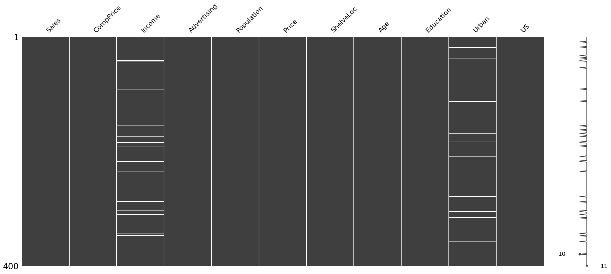
    


```python
# number of missing values

nr = carseats.shape[0] #number of rows
nc = carseats.shape[1] #number of colums
finerows = carseats.dropna().shape[0]
print("number of rows without missing data", finerows, sep=": ")
print("% of rows without missing data", finerows/nr*100, sep=": ")

# number of missing values in each column
missing_values = carseats.isnull().sum()
print(missing_values[missing_values > 0])
incomex = carseats.columns.get_loc('Income')
urbanx = carseats.columns.get_loc('Urban')
```

    number of rows without missing data: 370
    % of rows without missing data: 92.5
    Income    20
    Urban     10
    dtype: int64
    

Missingness of this data is definetly **not MCAR**, because it only misses values from two columns (and columns derived from them).


```python
#written rows mith missing data
dcarseats = carseats[['Income', 'Urban']]
ccarseats = carseats.dropna()
missdat = []
missdat1 = []
missdat2 = []
for i in range(nr):
    if pd.isna(carseats.iloc[i, incomex]) or pd.isna(carseats.iloc[i, urbanx]):
        missdat.append(carseats.iloc[i, :])

for i in range(nr):
    if pd.isna(carseats.iloc[i, incomex]):
        missdat1.append(carseats.iloc[i, :])

for i in range(nr):
    if pd.isna(carseats.iloc[i, urbanx]):
        missdat2.append(carseats.iloc[i, :])

dfm = pd.DataFrame(missdat, columns=carseats.columns)
dfm1 = pd.DataFrame(missdat1, columns=carseats.columns)
dfm2 = pd.DataFrame(missdat2, columns=carseats.columns)
ccarseats.describe().round(2)
```


<div>
<style scoped>
    .dataframe tbody tr th:only-of-type {
        vertical-align: middle;
    }

    .dataframe tbody tr th {
        vertical-align: top;
    }

    .dataframe thead th {
        text-align: right;
    }
</style>
<table border="1" class="dataframe">
  <thead>
    <tr style="text-align: right;">
      <th></th>
      <th>Sales</th>
      <th>CompPrice</th>
      <th>Income</th>
      <th>Advertising</th>
      <th>Population</th>
      <th>Price</th>
      <th>Age</th>
      <th>Education</th>
    </tr>
  </thead>
  <tbody>
    <tr>
      <th>count</th>
      <td>370.00</td>
      <td>370.00</td>
      <td>370.00</td>
      <td>370.00</td>
      <td>370.00</td>
      <td>370.00</td>
      <td>370.00</td>
      <td>370.00</td>
    </tr>
    <tr>
      <th>mean</th>
      <td>7.50</td>
      <td>125.27</td>
      <td>68.33</td>
      <td>6.74</td>
      <td>265.40</td>
      <td>116.00</td>
      <td>53.17</td>
      <td>13.87</td>
    </tr>
    <tr>
      <th>std</th>
      <td>2.85</td>
      <td>15.10</td>
      <td>27.86</td>
      <td>6.73</td>
      <td>147.27</td>
      <td>22.89</td>
      <td>16.20</td>
      <td>2.61</td>
    </tr>
    <tr>
      <th>min</th>
      <td>0.00</td>
      <td>85.00</td>
      <td>21.00</td>
      <td>0.00</td>
      <td>10.00</td>
      <td>49.00</td>
      <td>25.00</td>
      <td>10.00</td>
    </tr>
    <tr>
      <th>25%</th>
      <td>5.40</td>
      <td>115.00</td>
      <td>42.00</td>
      <td>0.00</td>
      <td>140.50</td>
      <td>100.00</td>
      <td>39.00</td>
      <td>12.00</td>
    </tr>
    <tr>
      <th>50%</th>
      <td>7.50</td>
      <td>125.00</td>
      <td>69.00</td>
      <td>5.00</td>
      <td>272.00</td>
      <td>117.00</td>
      <td>54.50</td>
      <td>14.00</td>
    </tr>
    <tr>
      <th>75%</th>
      <td>9.32</td>
      <td>135.00</td>
      <td>90.00</td>
      <td>12.00</td>
      <td>393.75</td>
      <td>131.00</td>
      <td>65.00</td>
      <td>16.00</td>
    </tr>
    <tr>
      <th>max</th>
      <td>16.27</td>
      <td>175.00</td>
      <td>120.00</td>
      <td>29.00</td>
      <td>509.00</td>
      <td>191.00</td>
      <td>80.00</td>
      <td>18.00</td>
    </tr>
  </tbody>
</table>
</div>


```python
dlt = (265 - 220) / 265 
dfm1.describe().round(2)
```


<div>
<style scoped>
    .dataframe tbody tr th:only-of-type {
        vertical-align: middle;
    }

    .dataframe tbody tr th {
        vertical-align: top;
    }

    .dataframe thead th {
        text-align: right;
    }
</style>
<table border="1" class="dataframe">
  <thead>
    <tr style="text-align: right;">
      <th></th>
      <th>Sales</th>
      <th>CompPrice</th>
      <th>Income</th>
      <th>Advertising</th>
      <th>Population</th>
      <th>Price</th>
      <th>Age</th>
      <th>Education</th>
    </tr>
  </thead>
  <tbody>
    <tr>
      <th>count</th>
      <td>20.00</td>
      <td>20.00</td>
      <td>0.0</td>
      <td>20.00</td>
      <td>20.00</td>
      <td>20.00</td>
      <td>20.00</td>
      <td>20.00</td>
    </tr>
    <tr>
      <th>mean</th>
      <td>7.42</td>
      <td>122.55</td>
      <td>NaN</td>
      <td>6.10</td>
      <td>220.25</td>
      <td>109.60</td>
      <td>58.35</td>
      <td>14.90</td>
    </tr>
    <tr>
      <th>std</th>
      <td>2.26</td>
      <td>19.37</td>
      <td>NaN</td>
      <td>6.06</td>
      <td>146.93</td>
      <td>30.26</td>
      <td>15.12</td>
      <td>2.57</td>
    </tr>
    <tr>
      <th>min</th>
      <td>3.63</td>
      <td>77.00</td>
      <td>NaN</td>
      <td>0.00</td>
      <td>25.00</td>
      <td>24.00</td>
      <td>33.00</td>
      <td>10.00</td>
    </tr>
    <tr>
      <th>25%</th>
      <td>5.52</td>
      <td>112.00</td>
      <td>NaN</td>
      <td>0.00</td>
      <td>93.50</td>
      <td>98.50</td>
      <td>48.50</td>
      <td>13.00</td>
    </tr>
    <tr>
      <th>50%</th>
      <td>7.76</td>
      <td>131.50</td>
      <td>NaN</td>
      <td>4.50</td>
      <td>225.50</td>
      <td>118.50</td>
      <td>59.00</td>
      <td>16.00</td>
    </tr>
    <tr>
      <th>75%</th>
      <td>9.09</td>
      <td>133.25</td>
      <td>NaN</td>
      <td>13.00</td>
      <td>302.00</td>
      <td>128.00</td>
      <td>70.25</td>
      <td>17.00</td>
    </tr>
    <tr>
      <th>max</th>
      <td>11.18</td>
      <td>157.00</td>
      <td>NaN</td>
      <td>16.00</td>
      <td>481.00</td>
      <td>149.00</td>
      <td>80.00</td>
      <td>18.00</td>
    </tr>
  </tbody>
</table>
</div>


Mean, std, max, min of quantitative attributes of missing `Income` rows is very similar to the clean rows, except for the mean of the `Population`. The difference is about 17% less for those with missing values.


```python
dlt2 = (330 - 265) / 265
print("missing data in Income column", dlt*100, "%")
dfm2.describe().round(2)
```

    missing data in Income column 16.9811320754717 %
    


<div>
<style scoped>
    .dataframe tbody tr th:only-of-type {
        vertical-align: middle;
    }

    .dataframe tbody tr th {
        vertical-align: top;
    }

    .dataframe thead th {
        text-align: right;
    }
</style>
<table border="1" class="dataframe">
  <thead>
    <tr style="text-align: right;">
      <th></th>
      <th>Sales</th>
      <th>CompPrice</th>
      <th>Income</th>
      <th>Advertising</th>
      <th>Population</th>
      <th>Price</th>
      <th>Age</th>
      <th>Education</th>
      <th>Urban</th>
    </tr>
  </thead>
  <tbody>
    <tr>
      <th>count</th>
      <td>10.00</td>
      <td>10.0</td>
      <td>10.00</td>
      <td>10.00</td>
      <td>10.00</td>
      <td>10.00</td>
      <td>10.00</td>
      <td>10.00</td>
      <td>0.0</td>
    </tr>
    <tr>
      <th>mean</th>
      <td>7.50</td>
      <td>119.0</td>
      <td>80.80</td>
      <td>3.80</td>
      <td>333.40</td>
      <td>120.60</td>
      <td>49.00</td>
      <td>13.00</td>
      <td>NaN</td>
    </tr>
    <tr>
      <th>std</th>
      <td>3.15</td>
      <td>14.9</td>
      <td>32.15</td>
      <td>4.13</td>
      <td>135.97</td>
      <td>36.50</td>
      <td>17.78</td>
      <td>2.91</td>
      <td>NaN</td>
    </tr>
    <tr>
      <th>min</th>
      <td>3.58</td>
      <td>86.0</td>
      <td>21.00</td>
      <td>0.00</td>
      <td>111.00</td>
      <td>64.00</td>
      <td>29.00</td>
      <td>10.00</td>
      <td>NaN</td>
    </tr>
    <tr>
      <th>25%</th>
      <td>5.59</td>
      <td>114.5</td>
      <td>59.00</td>
      <td>0.00</td>
      <td>239.50</td>
      <td>104.00</td>
      <td>34.75</td>
      <td>10.50</td>
      <td>NaN</td>
    </tr>
    <tr>
      <th>50%</th>
      <td>6.94</td>
      <td>119.5</td>
      <td>93.50</td>
      <td>3.50</td>
      <td>408.00</td>
      <td>121.00</td>
      <td>45.50</td>
      <td>12.00</td>
      <td>NaN</td>
    </tr>
    <tr>
      <th>75%</th>
      <td>7.66</td>
      <td>127.5</td>
      <td>106.50</td>
      <td>5.75</td>
      <td>421.75</td>
      <td>146.75</td>
      <td>60.00</td>
      <td>14.75</td>
      <td>NaN</td>
    </tr>
    <tr>
      <th>max</th>
      <td>13.91</td>
      <td>142.0</td>
      <td>113.00</td>
      <td>12.00</td>
      <td>497.00</td>
      <td>171.00</td>
      <td>80.00</td>
      <td>18.00</td>
      <td>NaN</td>
    </tr>
  </tbody>
</table>
</div>


Mean, std, max, min of quantitative attributes of missing rows is very similar to the clean rows, except for (again) `Population`. It tends to be 25% more for those with missing data.


```python
# missing data in Income column
UScp11 = dfm1['US'].value_counts(normalize=True) * 100
SHcp11 = dfm1['ShelveLoc'].value_counts(normalize=True) * 100

print("US" , UScp11.round(1).to_dict(), "%", sep=" ")
print("Shelveloc", SHcp11.round(1).to_dict(), "%", sep=" ")
```

    US {'Yes': 65.0, 'No': 35.0} %
    Shelveloc {'Medium': 75.0, 'Bad': 15.0, 'Good': 10.0} %
    


```python
# missing data in Urban column
UScp12 = dfm2['US'].value_counts(normalize=True) * 100
SHcp12 = dfm2['ShelveLoc'].value_counts(normalize=True) * 100

print("US" , UScp12.round(1).to_dict(), "%", sep=" ")
print("Shelveloc", SHcp12.round(1).to_dict(), "%", sep=" ")
```

    US {'Yes': 70.0, 'No': 30.0} %
    Shelveloc {'Good': 60.0, 'Medium': 30.0, 'Bad': 10.0} %
    


```python
# healthy data
carseats.describe().head(2).round(2)
UScp2 = ccarseats['US'].value_counts(normalize=True) * 100
SHcp2 = ccarseats['ShelveLoc'].value_counts(normalize=True) * 100
print("US" , UScp2.round(1).to_dict(), "%", sep=" ")
print("Shelveloc", SHcp2.round(1).to_dict(), "%", sep=" ")
```

    US {'Yes': 64.3, 'No': 35.7} %
    Shelveloc {'Medium': 54.3, 'Bad': 24.9, 'Good': 20.8} %
    

In columns with missing `Urban` data, the `ShelveLoc` is 3 times more likely to be 'Good' than in healthy data. It is still only for 10 values.


```python
healthy_data = carseats.dropna()
missing_data = carseats[carseats.isnull().any(axis=1)]

plt.figure(figsize=(10, 6))
plt.hist(ccarseats['Population'], bins=12, alpha=0.5,  label='Healthy Data', color='green')

plt.hist(dfm1['Population'], bins=12, alpha=0.8, label='Missing Income', color='red')

plt.hist(dfm2['Population'], bins=12, alpha=0.8, label='Missing Urban', color='blue')

plt.xlabel('Population')
plt.ylabel('Frequency')
plt.title('Population Distribution: Healthy Data vs Missing Data')
plt.legend()
plt.show()
```


    
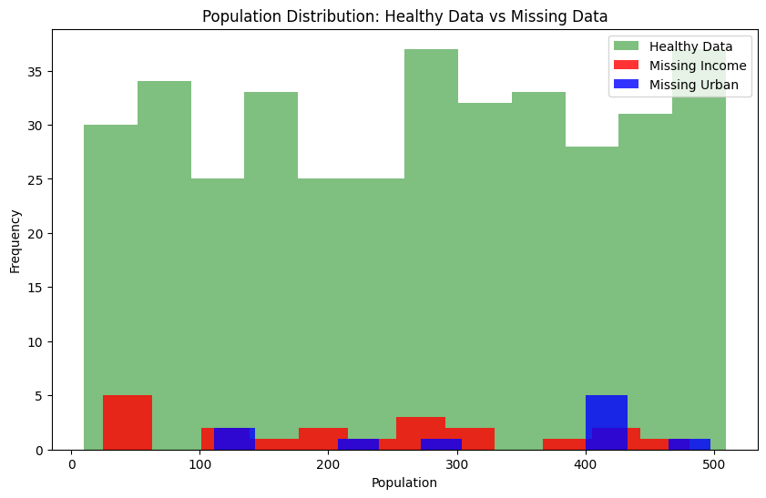
    


```python
healthy_data = carseats.dropna()
missing_data = carseats[carseats.isnull().any(axis=1)]

plt.figure(figsize=(10, 6))
plt.hist(ccarseats['Education'], bins=10, alpha=0.5,  label='Healthy Data', color='green')

plt.hist(dfm1['Education'], bins=10, alpha=0.8, label='Missing Income', color='red')

plt.hist(dfm2['Education'], bins=10, alpha=0, label='Missing Urban', color='blue')

plt.xlabel('Education')
plt.ylabel('Frequency')
plt.title('Education Distribution: Healthy Data vs Missing Data')
plt.legend()
plt.show()
```


    
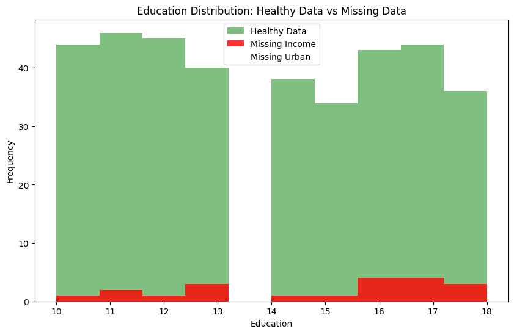
    


```python
msno.bar(carseats)
```


    <Axes: >


    
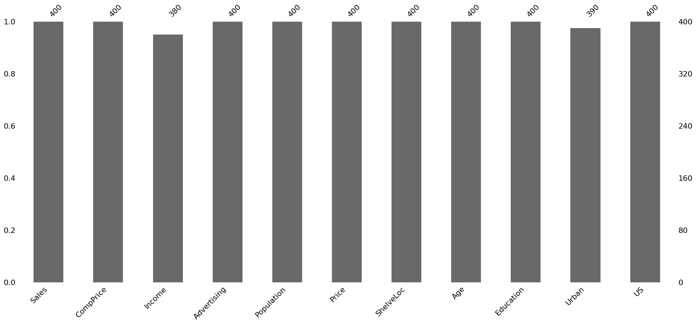
    


```python
msno.dendrogram(carseats)
```


    <Axes: >


    
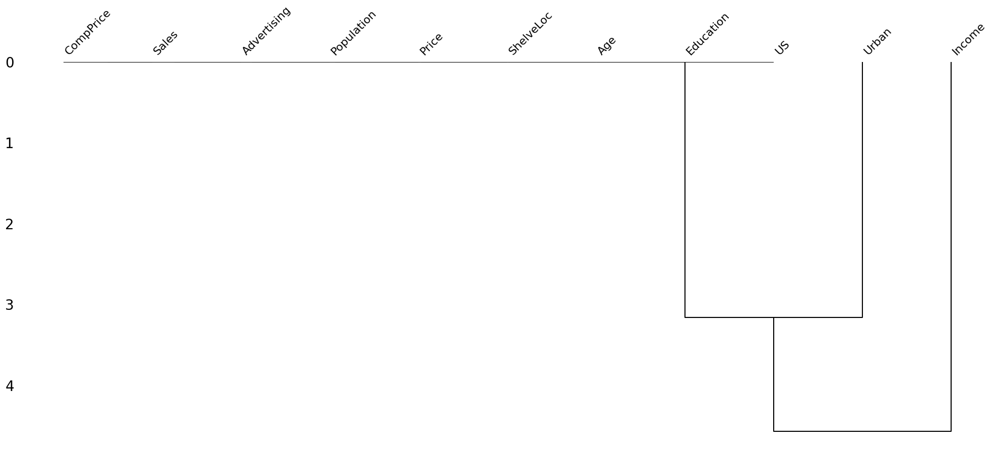
    


The dendrogram might suggest that missingness in `Urban` is correlated to `Education` column.


```python
msno.heatmap(carseats)
```


    <Axes: >


    
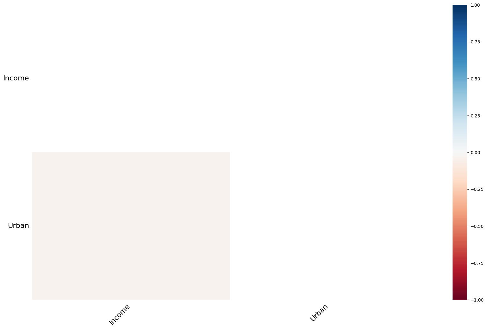
    


```python
sns.boxplot(x=carseats['Urban'], y=carseats['Population'], hue=carseats['Urban'].isna())
plt.title('Boxplot of Population by Urban Status')
```


    Text(0.5, 1.0, 'Boxplot of Population by Urban Status')


    
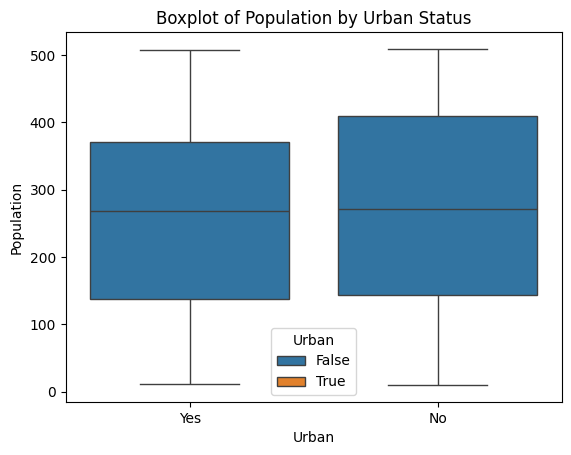
    


```python
plt.figure(figsize=(10, 6))
sns.boxplot(x=carseats['Urban'], y=carseats['Education'], hue=carseats['Income'].isnull())
plt.xticks(ticks=[0, 1], labels=['Urban Area', 'Non-Urban Area'])
plt.xlabel('Urban')
plt.ylabel('Education')
plt.title('Boxplot of Education by Urban Status and Missing Income')
plt.legend(title='Income Missing')
plt.show()
```


    
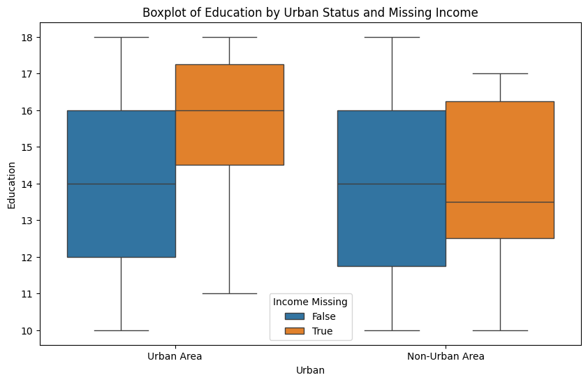
    


Now this is interesting, in urban areas `Income` missingness is more common for educated people - this **might be MNAR**. 


```python
fdfm1 = dfm1[dfm1['Urban'] == "Yes"]
ccar2seats = ccarseats[ccarseats['Urban'] == "Yes"]
print("Urban: Yes")
print("Median for education in clean data", ccar2seats[['Education']].median())
print("Mean for education in clean data", ccar2seats[['Education']].mean())
fdfm1[['Income', 'Urban', 'Education']]
```

    Urban: Yes
    Median for education in clean data Education    14.0
    dtype: float64
    Mean for education in clean data Education    13.812977
    dtype: float64
    


<div>
<style scoped>
    .dataframe tbody tr th:only-of-type {
        vertical-align: middle;
    }

    .dataframe tbody tr th {
        vertical-align: top;
    }

    .dataframe thead th {
        text-align: right;
    }
</style>
<table border="1" class="dataframe">
  <thead>
    <tr style="text-align: right;">
      <th></th>
      <th>Income</th>
      <th>Urban</th>
      <th>Education</th>
    </tr>
  </thead>
  <tbody>
    <tr>
      <th>33</th>
      <td>NaN</td>
      <td>Yes</td>
      <td>16</td>
    </tr>
    <tr>
      <th>41</th>
      <td>NaN</td>
      <td>Yes</td>
      <td>16</td>
    </tr>
    <tr>
      <th>42</th>
      <td>NaN</td>
      <td>Yes</td>
      <td>18</td>
    </tr>
    <tr>
      <th>91</th>
      <td>NaN</td>
      <td>Yes</td>
      <td>15</td>
    </tr>
    <tr>
      <th>155</th>
      <td>NaN</td>
      <td>Yes</td>
      <td>16</td>
    </tr>
    <tr>
      <th>162</th>
      <td>NaN</td>
      <td>Yes</td>
      <td>13</td>
    </tr>
    <tr>
      <th>173</th>
      <td>NaN</td>
      <td>Yes</td>
      <td>18</td>
    </tr>
    <tr>
      <th>216</th>
      <td>NaN</td>
      <td>Yes</td>
      <td>17</td>
    </tr>
    <tr>
      <th>287</th>
      <td>NaN</td>
      <td>Yes</td>
      <td>17</td>
    </tr>
    <tr>
      <th>303</th>
      <td>NaN</td>
      <td>Yes</td>
      <td>11</td>
    </tr>
    <tr>
      <th>309</th>
      <td>NaN</td>
      <td>Yes</td>
      <td>18</td>
    </tr>
    <tr>
      <th>378</th>
      <td>NaN</td>
      <td>Yes</td>
      <td>12</td>
    </tr>
  </tbody>
</table>
</div>


```python
fdfm2 = dfm1[dfm1['Urban'] == "No"]
ccar3seats = ccarseats[ccarseats['Urban'] == "No"]
print("Urban: No")
print("Median for education in clean data", ccar3seats[['Education']].median())
print("Mean for education in clean data", ccar3seats[['Education']].mean())
fdfm2[['Income', 'Urban', 'Education']]
```

    Urban: No
    Median for education in clean data Education    14.0
    dtype: float64
    Mean for education in clean data Education    14.009259
    dtype: float64
    


<div>
<style scoped>
    .dataframe tbody tr th:only-of-type {
        vertical-align: middle;
    }

    .dataframe tbody tr th {
        vertical-align: top;
    }

    .dataframe thead th {
        text-align: right;
    }
</style>
<table border="1" class="dataframe">
  <thead>
    <tr style="text-align: right;">
      <th></th>
      <th>Income</th>
      <th>Urban</th>
      <th>Education</th>
    </tr>
  </thead>
  <tbody>
    <tr>
      <th>9</th>
      <td>NaN</td>
      <td>No</td>
      <td>17</td>
    </tr>
    <tr>
      <th>54</th>
      <td>NaN</td>
      <td>No</td>
      <td>17</td>
    </tr>
    <tr>
      <th>184</th>
      <td>NaN</td>
      <td>No</td>
      <td>11</td>
    </tr>
    <tr>
      <th>190</th>
      <td>NaN</td>
      <td>No</td>
      <td>13</td>
    </tr>
    <tr>
      <th>217</th>
      <td>NaN</td>
      <td>No</td>
      <td>14</td>
    </tr>
    <tr>
      <th>234</th>
      <td>NaN</td>
      <td>No</td>
      <td>16</td>
    </tr>
    <tr>
      <th>342</th>
      <td>NaN</td>
      <td>No</td>
      <td>10</td>
    </tr>
    <tr>
      <th>346</th>
      <td>NaN</td>
      <td>No</td>
      <td>13</td>
    </tr>
  </tbody>
</table>
</div>


```python
ccarseats[ccarseats['Urban'] == "No"]
```


<div>
<style scoped>
    .dataframe tbody tr th:only-of-type {
        vertical-align: middle;
    }

    .dataframe tbody tr th {
        vertical-align: top;
    }

    .dataframe thead th {
        text-align: right;
    }
</style>
<table border="1" class="dataframe">
  <thead>
    <tr style="text-align: right;">
      <th></th>
      <th>Sales</th>
      <th>CompPrice</th>
      <th>Income</th>
      <th>Advertising</th>
      <th>Population</th>
      <th>Price</th>
      <th>ShelveLoc</th>
      <th>Age</th>
      <th>Education</th>
      <th>Urban</th>
      <th>US</th>
    </tr>
  </thead>
  <tbody>
    <tr>
      <th>5</th>
      <td>10.81</td>
      <td>124</td>
      <td>113.0</td>
      <td>13</td>
      <td>501</td>
      <td>72</td>
      <td>Bad</td>
      <td>78</td>
      <td>16</td>
      <td>No</td>
      <td>Yes</td>
    </tr>
    <tr>
      <th>8</th>
      <td>6.54</td>
      <td>132</td>
      <td>110.0</td>
      <td>0</td>
      <td>108</td>
      <td>124</td>
      <td>Medium</td>
      <td>76</td>
      <td>10</td>
      <td>No</td>
      <td>No</td>
    </tr>
    <tr>
      <th>10</th>
      <td>9.01</td>
      <td>121</td>
      <td>78.0</td>
      <td>9</td>
      <td>150</td>
      <td>100</td>
      <td>Bad</td>
      <td>26</td>
      <td>10</td>
      <td>No</td>
      <td>Yes</td>
    </tr>
    <tr>
      <th>15</th>
      <td>8.71</td>
      <td>149</td>
      <td>95.0</td>
      <td>5</td>
      <td>400</td>
      <td>144</td>
      <td>Medium</td>
      <td>76</td>
      <td>18</td>
      <td>No</td>
      <td>No</td>
    </tr>
    <tr>
      <th>21</th>
      <td>12.13</td>
      <td>134</td>
      <td>29.0</td>
      <td>12</td>
      <td>239</td>
      <td>109</td>
      <td>Good</td>
      <td>62</td>
      <td>18</td>
      <td>No</td>
      <td>Yes</td>
    </tr>
    <tr>
      <th>...</th>
      <td>...</td>
      <td>...</td>
      <td>...</td>
      <td>...</td>
      <td>...</td>
      <td>...</td>
      <td>...</td>
      <td>...</td>
      <td>...</td>
      <td>...</td>
      <td>...</td>
    </tr>
    <tr>
      <th>372</th>
      <td>7.80</td>
      <td>121</td>
      <td>50.0</td>
      <td>0</td>
      <td>508</td>
      <td>98</td>
      <td>Medium</td>
      <td>65</td>
      <td>11</td>
      <td>No</td>
      <td>No</td>
    </tr>
    <tr>
      <th>377</th>
      <td>6.81</td>
      <td>132</td>
      <td>61.0</td>
      <td>0</td>
      <td>263</td>
      <td>125</td>
      <td>Medium</td>
      <td>41</td>
      <td>12</td>
      <td>No</td>
      <td>No</td>
    </tr>
    <tr>
      <th>387</th>
      <td>8.67</td>
      <td>142</td>
      <td>73.0</td>
      <td>14</td>
      <td>238</td>
      <td>115</td>
      <td>Medium</td>
      <td>73</td>
      <td>14</td>
      <td>No</td>
      <td>Yes</td>
    </tr>
    <tr>
      <th>393</th>
      <td>5.57</td>
      <td>109</td>
      <td>51.0</td>
      <td>10</td>
      <td>26</td>
      <td>120</td>
      <td>Medium</td>
      <td>30</td>
      <td>17</td>
      <td>No</td>
      <td>Yes</td>
    </tr>
    <tr>
      <th>396</th>
      <td>6.14</td>
      <td>139</td>
      <td>23.0</td>
      <td>3</td>
      <td>37</td>
      <td>120</td>
      <td>Medium</td>
      <td>55</td>
      <td>11</td>
      <td>No</td>
      <td>Yes</td>
    </tr>
  </tbody>
</table>
<p>108 rows × 11 columns</p>
</div>


However, it is absolutely not the case for non-urban observations. Now lets take a last look at `Urban` column missigness, I indicated that it might have some correlation with `ShelveLoc` and `Population`.


```python
dfm2[['Urban', 'ShelveLoc', 'Population', 'Education']]
```


<div>
<style scoped>
    .dataframe tbody tr th:only-of-type {
        vertical-align: middle;
    }

    .dataframe tbody tr th {
        vertical-align: top;
    }

    .dataframe thead th {
        text-align: right;
    }
</style>
<table border="1" class="dataframe">
  <thead>
    <tr style="text-align: right;">
      <th></th>
      <th>Urban</th>
      <th>ShelveLoc</th>
      <th>Population</th>
      <th>Education</th>
    </tr>
  </thead>
  <tbody>
    <tr>
      <th>18</th>
      <td>NaN</td>
      <td>Good</td>
      <td>408</td>
      <td>17</td>
    </tr>
    <tr>
      <th>37</th>
      <td>NaN</td>
      <td>Medium</td>
      <td>412</td>
      <td>10</td>
    </tr>
    <tr>
      <th>112</th>
      <td>NaN</td>
      <td>Good</td>
      <td>298</td>
      <td>12</td>
    </tr>
    <tr>
      <th>168</th>
      <td>NaN</td>
      <td>Medium</td>
      <td>425</td>
      <td>10</td>
    </tr>
    <tr>
      <th>183</th>
      <td>NaN</td>
      <td>Medium</td>
      <td>426</td>
      <td>18</td>
    </tr>
    <tr>
      <th>208</th>
      <td>NaN</td>
      <td>Bad</td>
      <td>497</td>
      <td>12</td>
    </tr>
    <tr>
      <th>278</th>
      <td>NaN</td>
      <td>Good</td>
      <td>129</td>
      <td>15</td>
    </tr>
    <tr>
      <th>304</th>
      <td>NaN</td>
      <td>Good</td>
      <td>408</td>
      <td>10</td>
    </tr>
    <tr>
      <th>315</th>
      <td>NaN</td>
      <td>Good</td>
      <td>220</td>
      <td>14</td>
    </tr>
    <tr>
      <th>356</th>
      <td>NaN</td>
      <td>Good</td>
      <td>111</td>
      <td>12</td>
    </tr>
  </tbody>
</table>
</div>


Okay, we can see that a lot of missingness in `Urban` column might tend to occur when `ShelveLoc` is 'Good' or when `Population` is very high. However, it is possible that `Urban` column is directly correlated to `Population`, since more urbanized areas usually have more residents. Let's check it. 


```python
urbanyes = carseats[carseats['Urban'] == "Yes"]
urbanno = carseats[carseats['Urban'] == "No"]
print("Mean population in urban locations", urbanyes[['Population']].mean())
print("Mean population in non-urban locations", urbanno[['Population']].mean())
```

    Mean population in urban locations Population    257.266423
    dtype: float64
    Mean population in non-urban locations Population    276.818966
    dtype: float64
    

Okay, our assumption was completely wrong, let's look at the `ShelveLoc` column.


```python
urbanyes.describe().round(2)
```


<div>
<style scoped>
    .dataframe tbody tr th:only-of-type {
        vertical-align: middle;
    }

    .dataframe tbody tr th {
        vertical-align: top;
    }

    .dataframe thead th {
        text-align: right;
    }
</style>
<table border="1" class="dataframe">
  <thead>
    <tr style="text-align: right;">
      <th></th>
      <th>Sales</th>
      <th>CompPrice</th>
      <th>Income</th>
      <th>Advertising</th>
      <th>Population</th>
      <th>Price</th>
      <th>Age</th>
      <th>Education</th>
    </tr>
  </thead>
  <tbody>
    <tr>
      <th>count</th>
      <td>274.00</td>
      <td>274.00</td>
      <td>262.00</td>
      <td>274.00</td>
      <td>274.00</td>
      <td>274.00</td>
      <td>274.00</td>
      <td>274.00</td>
    </tr>
    <tr>
      <th>mean</th>
      <td>7.49</td>
      <td>125.78</td>
      <td>69.46</td>
      <td>6.88</td>
      <td>257.27</td>
      <td>116.31</td>
      <td>53.71</td>
      <td>13.89</td>
    </tr>
    <tr>
      <th>std</th>
      <td>2.85</td>
      <td>15.69</td>
      <td>27.35</td>
      <td>6.78</td>
      <td>144.41</td>
      <td>23.63</td>
      <td>15.89</td>
      <td>2.61</td>
    </tr>
    <tr>
      <th>min</th>
      <td>0.37</td>
      <td>77.00</td>
      <td>21.00</td>
      <td>0.00</td>
      <td>12.00</td>
      <td>24.00</td>
      <td>25.00</td>
      <td>10.00</td>
    </tr>
    <tr>
      <th>25%</th>
      <td>5.43</td>
      <td>116.00</td>
      <td>44.00</td>
      <td>0.00</td>
      <td>137.50</td>
      <td>101.00</td>
      <td>41.00</td>
      <td>12.00</td>
    </tr>
    <tr>
      <th>50%</th>
      <td>7.44</td>
      <td>125.00</td>
      <td>70.00</td>
      <td>5.00</td>
      <td>268.00</td>
      <td>118.00</td>
      <td>55.00</td>
      <td>14.00</td>
    </tr>
    <tr>
      <th>75%</th>
      <td>9.32</td>
      <td>136.00</td>
      <td>91.00</td>
      <td>12.00</td>
      <td>370.50</td>
      <td>131.00</td>
      <td>65.75</td>
      <td>16.00</td>
    </tr>
    <tr>
      <th>max</th>
      <td>16.27</td>
      <td>175.00</td>
      <td>120.00</td>
      <td>29.00</td>
      <td>508.00</td>
      <td>191.00</td>
      <td>80.00</td>
      <td>18.00</td>
    </tr>
  </tbody>
</table>
</div>


```python
urbanno.describe().round(2)
```


<div>
<style scoped>
    .dataframe tbody tr th:only-of-type {
        vertical-align: middle;
    }

    .dataframe tbody tr th {
        vertical-align: top;
    }

    .dataframe thead th {
        text-align: right;
    }
</style>
<table border="1" class="dataframe">
  <thead>
    <tr style="text-align: right;">
      <th></th>
      <th>Sales</th>
      <th>CompPrice</th>
      <th>Income</th>
      <th>Advertising</th>
      <th>Population</th>
      <th>Price</th>
      <th>Age</th>
      <th>Education</th>
    </tr>
  </thead>
  <tbody>
    <tr>
      <th>count</th>
      <td>116.00</td>
      <td>116.00</td>
      <td>108.00</td>
      <td>116.00</td>
      <td>116.00</td>
      <td>116.00</td>
      <td>116.00</td>
      <td>116.00</td>
    </tr>
    <tr>
      <th>mean</th>
      <td>7.51</td>
      <td>123.59</td>
      <td>65.59</td>
      <td>6.29</td>
      <td>276.82</td>
      <td>114.16</td>
      <td>52.78</td>
      <td>14.00</td>
    </tr>
    <tr>
      <th>std</th>
      <td>2.77</td>
      <td>14.40</td>
      <td>29.01</td>
      <td>6.49</td>
      <td>153.99</td>
      <td>22.57</td>
      <td>16.85</td>
      <td>2.63</td>
    </tr>
    <tr>
      <th>min</th>
      <td>0.00</td>
      <td>88.00</td>
      <td>21.00</td>
      <td>0.00</td>
      <td>10.00</td>
      <td>49.00</td>
      <td>25.00</td>
      <td>10.00</td>
    </tr>
    <tr>
      <th>25%</th>
      <td>5.39</td>
      <td>113.75</td>
      <td>40.00</td>
      <td>0.00</td>
      <td>144.00</td>
      <td>97.00</td>
      <td>38.75</td>
      <td>11.75</td>
    </tr>
    <tr>
      <th>50%</th>
      <td>7.67</td>
      <td>123.50</td>
      <td>67.00</td>
      <td>5.00</td>
      <td>271.00</td>
      <td>112.50</td>
      <td>54.00</td>
      <td>14.00</td>
    </tr>
    <tr>
      <th>75%</th>
      <td>9.32</td>
      <td>134.00</td>
      <td>84.50</td>
      <td>11.00</td>
      <td>409.25</td>
      <td>128.00</td>
      <td>67.00</td>
      <td>16.00</td>
    </tr>
    <tr>
      <th>max</th>
      <td>14.90</td>
      <td>154.00</td>
      <td>120.00</td>
      <td>24.00</td>
      <td>509.00</td>
      <td>185.00</td>
      <td>80.00</td>
      <td>18.00</td>
    </tr>
  </tbody>
</table>
</div>


```python
urbanyes = carseats[carseats['Urban'] == "Yes"]
urbanno = carseats[carseats['Urban'] == "No"]

shelveloc_yes_counts = urbanyes['ShelveLoc'].value_counts()
shelveloc_no_counts = urbanno['ShelveLoc'].value_counts()

shelveloc_data = pd.DataFrame({
    'Urban=Yes': shelveloc_yes_counts,
    'Urban=No': shelveloc_no_counts
}).fillna(0)  

shelveloc_data.plot(kind='bar', figsize=(10, 6), color=['green', 'red'])

plt.xlabel('ShelveLoc')
plt.ylabel('Count')
plt.title('ShelveLoc Distribution for Urban = Yes and Urban = No')
plt.legend(title='Urban')
plt.show()
```


    
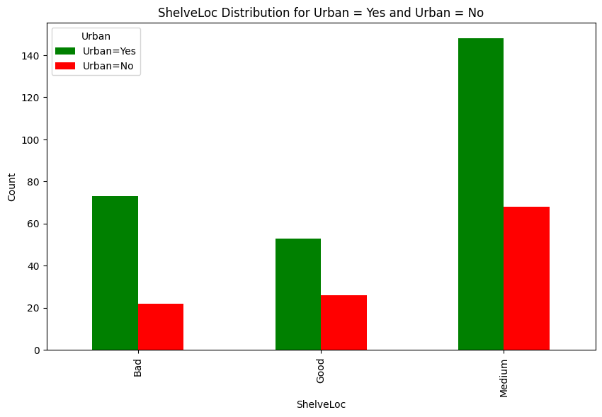
    


It looks like for 'Bad' `ShelveLoc` it is more often urban, it does not tell us much. But we can see that there are more urban areas. The sample of missing `Urban` values is very small, so we think that it is just **MAR**. We will impute it with Urban = Yes.


```python
carseats['Urban'].fillna("Yes", inplace=True)
```

Let's come back to `Income` missingness, for non-urban cases we will just impute the mean of non-urban incomes.


```python
unm = urbanno['Income'].mean().round(2)
carseats.loc[(carseats['Urban'] == "No") & (carseats['Income'].isnull()), 'Income'] = unm
```


```python
plt.figure(figsize=(10, 6))
plt.hist(urbanyes['Income'].dropna(), bins=10, color='skyblue', edgecolor='black', alpha=0.7)
plt.title('Histogram of Income for Urban = Yes')
plt.xlabel('Income')
plt.ylabel('Frequency')
plt.grid(axis='y', linestyle='--', alpha=0.7)
plt.show()
```


    
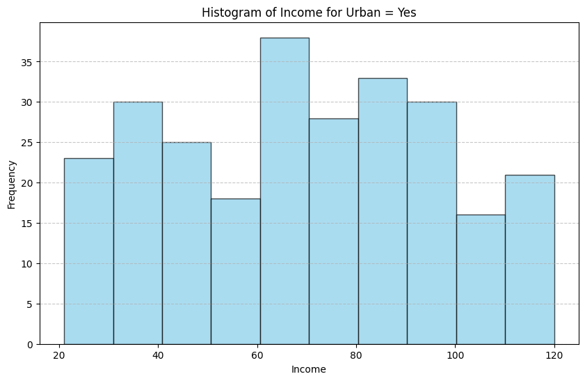
    


```python
plt.figure(figsize=(10, 6))
plt.scatter(urbanyes['Education'], urbanyes['Income'], color='blue', alpha=0.7, edgecolor='black')
plt.title('Scatterplot of Education vs Income for non missing values')
plt.xlabel('Education')
plt.ylabel('Income')
plt.grid(alpha=0.3)
plt.show()
```


    
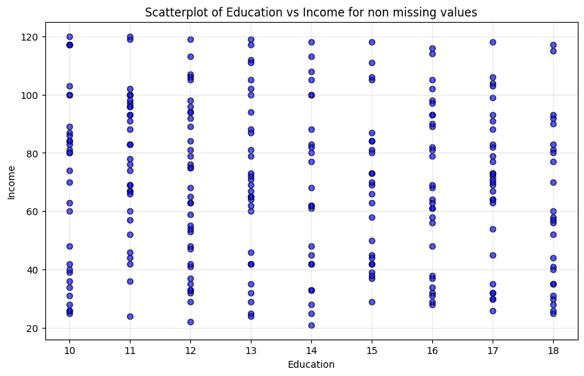
    


We can see on a scatterplot that educated people in urban areas do not have higher (given) income.


```python
mean_income_by_education = carseats.groupby('Education')['Income'].mean()
print("Mean Income by Education Level:")
print(mean_income_by_education)
```

    Mean Income by Education Level:
    Education
    10    72.783125
    11    72.629574
    12    67.166667
    13    69.575714
    14    61.989750
    15    68.571429
    16    70.695227
    17    68.131489
    18    64.054054
    Name: Income, dtype: float64
    

It is interesting, this table states that in urbanised locations with higher `Education` level people tend to have slightly less income than uneducated people. So are the people with higher income or lower income more likely to avoid answering? I did some research and my best guess would be that some of the high-income individuals want to skip writing about it because of:
- privacy reasons
- tax concerns
- social concerns

By this assumption, we will use the formula:

*Imputed value for each education level = (max value + median value) / 2*


```python
inpval = urbanyes.groupby('Education')['Income'].agg(lambda x: (x.max() + x.median()) / 2)

print(inpval)
```

    Education
    10    100.00
    11    100.25
    12     92.75
    13     94.50
    14     91.50
    15     93.50
    16     92.00
    17     94.75
    18     87.00
    Name: Income, dtype: float64
    


```python
# Impute missing Income values for Urban = "Yes" using values from the formula
for edulev, value in inpval.items():
    carseats.loc[
        (carseats['Urban'] == "Yes") & (carseats['Income'].isnull()) & (carseats['Education'] == edulev),
        'Income'
    ] = value
```


```python
missing_count = carseats[carseats['Income'].isnull() | carseats['Urban'].isnull()].shape[0]

print("Number of missing values after imputation:", missing_count)
```

    Number of missing values after imputation: 0
    

### Final conclusions

For missing `Urban`:
- After many searches we concluded that there are no actual patterns for missingness in this column and we used the mode. The number of missing values was small, so we imputed all Urban values with Yes, because the majority of them were Urban = Yes.

For missing `Income`:
- For non-urban areas we just imputed the mean value of income for all missing values.
- For urban areas we identified MNAR, so we created a formula to obtain results which approximate our expected missing values.
