# Exercise 5.

# Data visualization in Python (`pyplot`)

## Looking ahead: April, Weeks 1-2

- In April, weeks 1-2, we'll dive deep into **data visualization**.  
  - How do we make visualizations in Python?
  - What principles should we keep in mind?

## Goals of this exercise

- What *is* data visualization and why is it important?
- Introducing `matplotlib`.
- Univariate plot types:
  - **Histograms** (univariate).
  - **Scatterplots** (bivariate).
  - **Bar plots** (bivariate).

## Introduction: data visualization

### What is data visualization?

[Data visualization](https://en.wikipedia.org/wiki/Data_visualization) refers to the process (and result) of representing data graphically.

For our purposes today, we'll be talking mostly about common methods of **plotting** data, including:

- Histograms  
- Scatterplots  
- Line plots
- Bar plots

### Why is data visualization important?

- Exploratory data analysis
- Communicating insights
- Impacting the world

### Exploratory Data Analysis: Checking your assumptions 

[Anscombe's Quartet](https://en.wikipedia.org/wiki/Anscombe%27s_quartet)


### Communicating Insights

[Reference: Full Stack Economics](https://fullstackeconomics.com/18-charts-that-explain-the-american-economy/)


### Impacting the world

[Florence Nightingale](https://en.wikipedia.org/wiki/Florence_Nightingale) (1820-1910) was a social reformer, statistician, and founder of modern nursing.


### Impacting the world (pt. 2)

[John Snow](https://en.wikipedia.org/wiki/John_Snow) (1813-1858) was a physician whose visualization of cholera outbreaks helped identify the source and spreading mechanism (water supply). 


## Introducing `matplotlib`

### Loading packages

Here, we load the core packages we'll be using. 

We also add some lines of code that make sure our visualizations will plot "inline" with our code, and that they'll have nice, crisp quality.


```python
import numpy as np 
import pandas as pd
import matplotlib.pyplot as plt
import scipy.stats as ss
```


```python
%matplotlib inline 
%config InlineBackend.figure_format = 'retina'
```

### What is `matplotlib`?

> [`matplotlib`](https://matplotlib.org/) is a **plotting library** for Python.

- Many [tutorials](https://matplotlib.org/stable/tutorials/index.html) available online.  
- Also many [examples](https://matplotlib.org/stable/gallery/index) of `matplotlib` in use.

Note that [`seaborn`](https://seaborn.pydata.org/) (which we'll cover soon) uses `matplotlib` "under the hood".

### What is `pyplot`?

> [`pyplot`](https://matplotlib.org/stable/tutorials/introductory/pyplot.html) is a collection of functions *within* `matplotlib` that make it really easy to plot data.

With `pyplot`, we can easily plot things like:

- Histograms (`plt.hist`)
- Scatterplots (`plt.scatter`)
- Line plots (`plt.plot`) 
- Bar plots (`plt.bar`)

### Example dataset

Let's load our familiar Pokemon dataset, which can be found in `data/pokemon.csv`.


```python
df_pokemon = pd.read_csv("pokemon.csv")
df_pokemon.head(10)
```


<div>
<style scoped>
    .dataframe tbody tr th:only-of-type {
        vertical-align: middle;
    }

    .dataframe tbody tr th {
        vertical-align: top;
    }

    .dataframe thead th {
        text-align: right;
    }
</style>
<table border="1" class="dataframe">
  <thead>
    <tr style="text-align: right;">
      <th></th>
      <th>#</th>
      <th>Name</th>
      <th>Type 1</th>
      <th>Type 2</th>
      <th>Total</th>
      <th>HP</th>
      <th>Attack</th>
      <th>Defense</th>
      <th>Sp. Atk</th>
      <th>Sp. Def</th>
      <th>Speed</th>
      <th>Generation</th>
      <th>Legendary</th>
    </tr>
  </thead>
  <tbody>
    <tr>
      <th>0</th>
      <td>1</td>
      <td>Bulbasaur</td>
      <td>Grass</td>
      <td>Poison</td>
      <td>318</td>
      <td>45</td>
      <td>49</td>
      <td>49</td>
      <td>65</td>
      <td>65</td>
      <td>45</td>
      <td>1</td>
      <td>False</td>
    </tr>
    <tr>
      <th>1</th>
      <td>2</td>
      <td>Ivysaur</td>
      <td>Grass</td>
      <td>Poison</td>
      <td>405</td>
      <td>60</td>
      <td>62</td>
      <td>63</td>
      <td>80</td>
      <td>80</td>
      <td>60</td>
      <td>1</td>
      <td>False</td>
    </tr>
    <tr>
      <th>2</th>
      <td>3</td>
      <td>Venusaur</td>
      <td>Grass</td>
      <td>Poison</td>
      <td>525</td>
      <td>80</td>
      <td>82</td>
      <td>83</td>
      <td>100</td>
      <td>100</td>
      <td>80</td>
      <td>1</td>
      <td>False</td>
    </tr>
    <tr>
      <th>3</th>
      <td>3</td>
      <td>VenusaurMega Venusaur</td>
      <td>Grass</td>
      <td>Poison</td>
      <td>625</td>
      <td>80</td>
      <td>100</td>
      <td>123</td>
      <td>122</td>
      <td>120</td>
      <td>80</td>
      <td>1</td>
      <td>False</td>
    </tr>
    <tr>
      <th>4</th>
      <td>4</td>
      <td>Charmander</td>
      <td>Fire</td>
      <td>NaN</td>
      <td>309</td>
      <td>39</td>
      <td>52</td>
      <td>43</td>
      <td>60</td>
      <td>50</td>
      <td>65</td>
      <td>1</td>
      <td>False</td>
    </tr>
    <tr>
      <th>5</th>
      <td>5</td>
      <td>Charmeleon</td>
      <td>Fire</td>
      <td>NaN</td>
      <td>405</td>
      <td>58</td>
      <td>64</td>
      <td>58</td>
      <td>80</td>
      <td>65</td>
      <td>80</td>
      <td>1</td>
      <td>False</td>
    </tr>
    <tr>
      <th>6</th>
      <td>6</td>
      <td>Charizard</td>
      <td>Fire</td>
      <td>Flying</td>
      <td>534</td>
      <td>78</td>
      <td>84</td>
      <td>78</td>
      <td>109</td>
      <td>85</td>
      <td>100</td>
      <td>1</td>
      <td>False</td>
    </tr>
    <tr>
      <th>7</th>
      <td>6</td>
      <td>CharizardMega Charizard X</td>
      <td>Fire</td>
      <td>Dragon</td>
      <td>634</td>
      <td>78</td>
      <td>130</td>
      <td>111</td>
      <td>130</td>
      <td>85</td>
      <td>100</td>
      <td>1</td>
      <td>False</td>
    </tr>
    <tr>
      <th>8</th>
      <td>6</td>
      <td>CharizardMega Charizard Y</td>
      <td>Fire</td>
      <td>Flying</td>
      <td>634</td>
      <td>78</td>
      <td>104</td>
      <td>78</td>
      <td>159</td>
      <td>115</td>
      <td>100</td>
      <td>1</td>
      <td>False</td>
    </tr>
    <tr>
      <th>9</th>
      <td>7</td>
      <td>Squirtle</td>
      <td>Water</td>
      <td>NaN</td>
      <td>314</td>
      <td>44</td>
      <td>48</td>
      <td>65</td>
      <td>50</td>
      <td>64</td>
      <td>43</td>
      <td>1</td>
      <td>False</td>
    </tr>
  </tbody>
</table>
</div>


## Histograms

### What are histograms?

> A **histogram** is a visualization of a single continuous, quantitative variable (e.g., income or temperature). 

- Histograms are useful for looking at how a variable **distributes**.  
- Can be used to determine whether a distribution is **normal**, **skewed**, or **bimodal**.

A histogram is a **univariate** plot, i.e., it displays only a single variable.

### Histograms in `matplotlib`

To create a histogram, call `plt.hist` with a **single column** of a `DataFrame` (or a `numpy.ndarray`).

**Check-in**: What is this graph telling us?


```python
p = plt.hist(df_pokemon['Attack'])
```


    
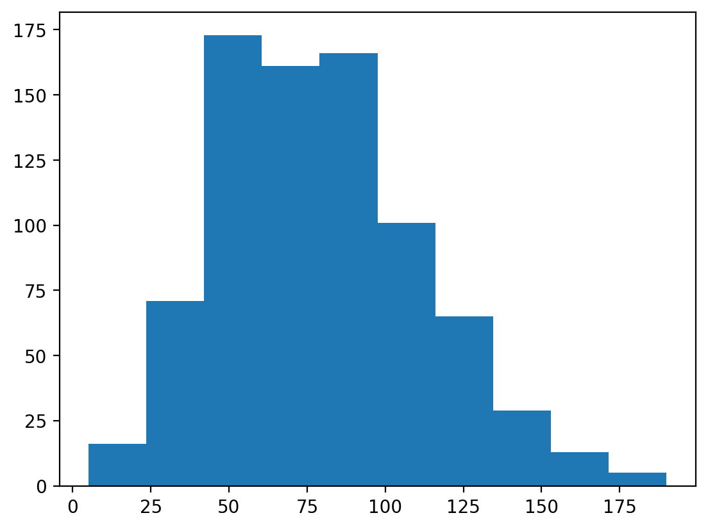
    


#### Changing the number of bins

A histogram puts your continuous data into **bins** (e.g., 1-10, 11-20, etc.).

- The height of each bin reflects the number of observations within that interval.  
- Increasing or decreasing the number of bins gives you more or less granularity in your distribution.


```python
### This has lots of bins
p = plt.hist(df_pokemon['Attack'], bins = 30)
```


    
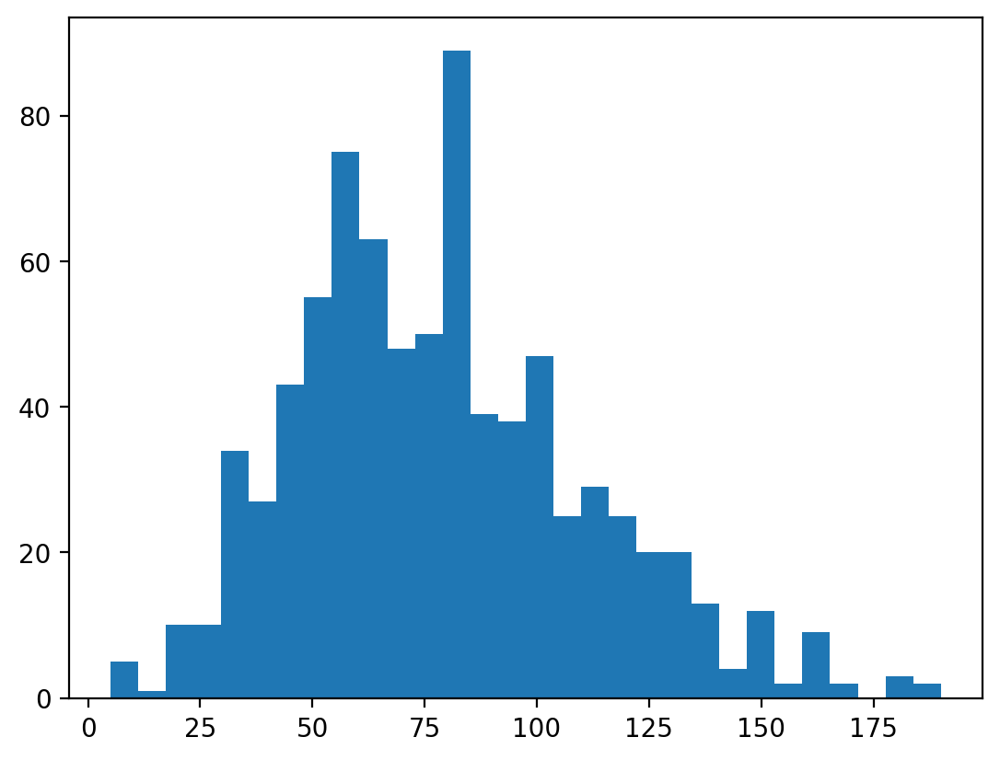
    


```python
### This has fewer bins
p = plt.hist(df_pokemon['Attack'], bins = 5)
```


    
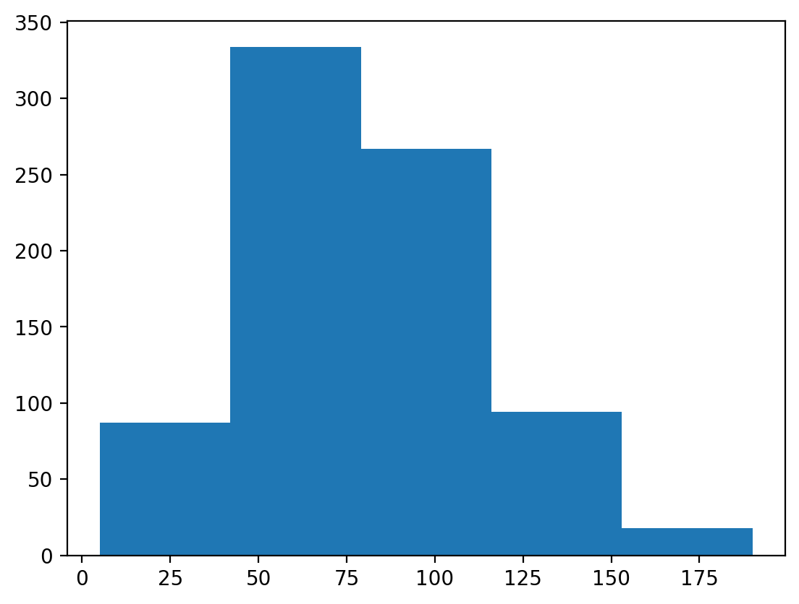
    


#### Changing the `alpha` level

The `alpha` level changes the **transparency** of your figure.


```python
### This has fewer bins
p = plt.hist(df_pokemon['Attack'], alpha = .6)
```


    

    


#### Check-in:

How would you make a histogram of the scores for `Defense`?


```python
### Your code here
p = plt.hist(df_pokemon['Defense'], alpha = .6)
```


    
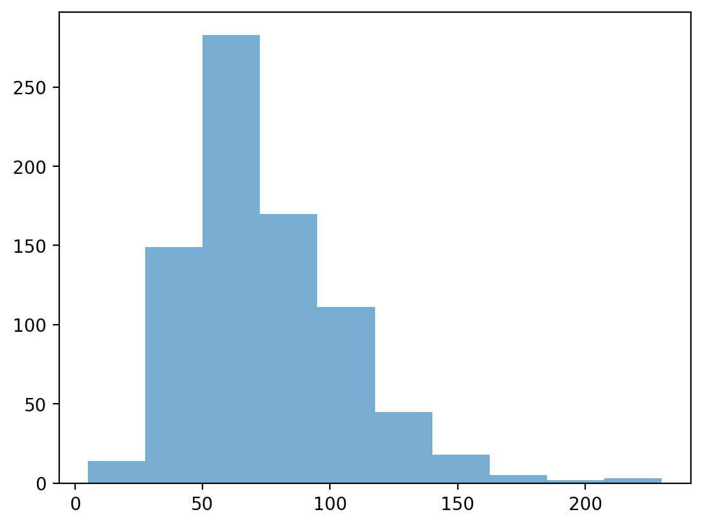
    


#### Check-in:

Could you make a histogram of the scores for `Type 1`?


```python
### Your code here
df_pokemon['Type 2'].dtypes
```


    dtype('O')


We cannot create a histogram of `Type 1` because it's a **qualitative** variable.

### Learning from histograms

Histograms are incredibly useful for learning about the **shape** of our distribution. We can ask questions like:

- Is this distribution relatively [normal](https://en.wikipedia.org/wiki/Normal_distribution)?
- Is the distribution [skewed](https://en.wikipedia.org/wiki/Skewness)?
- Are there [outliers](https://en.wikipedia.org/wiki/Outlier)?

#### Normally distributed data

We can use the `numpy.random.normal` function to create a **normal distribution**, then plot it.

A normal distribution has the following characteristics:

- Classic "bell" shape (**symmetric**).  
- Mean, median, and mode are all identical.


```python
norm = np.random.normal(loc = 10, scale = 1, size = 1000)
p = plt.hist(norm, alpha = .6)
```


    
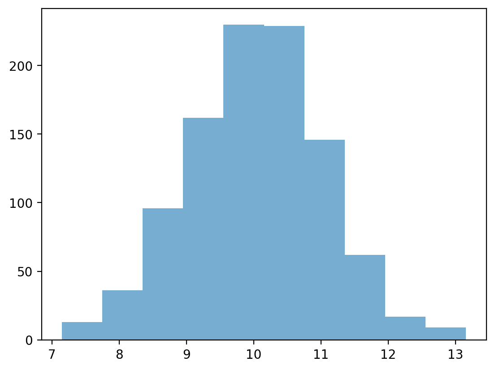
    


#### Skewed data

> **Skew** means there are values *elongating* one of the "tails" of a distribution.

- Positive/right skew: the tail is pointing to the right.  
- Negative/left skew: the tail is pointing to the left.


```python
rskew = ss.skewnorm.rvs(20, size = 1000) # make right-skewed data
lskew = ss.skewnorm.rvs(-20, size = 1000) # make left-skewed data
fig, axes = plt.subplots(1, 2)
axes[0].hist(rskew)
axes[0].set_title("Right-skewed")
axes[1].hist(lskew)
axes[1].set_title("Left-skewed")
```


    Text(0.5, 1.0, 'Left-skewed')


    
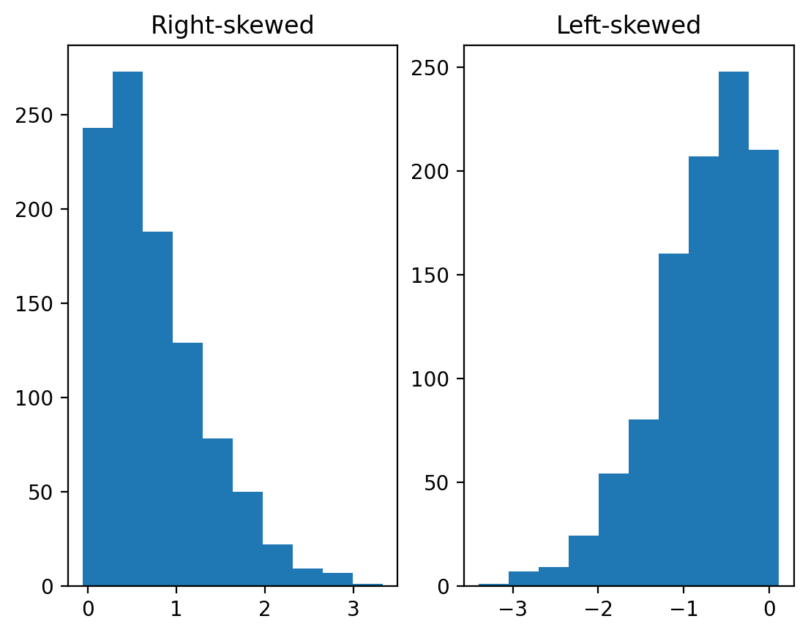
    


#### Outliers

> **Outliers** are data points that differ significantly from other points in a distribution.

- Unlike skewed data, outliers are generally **discontinuous** with the rest of the distribution.
- Next week, we'll talk about more ways to **identify** outliers; for now, we can rely on histograms.


```python
norm = np.random.normal(loc = 10, scale = 1, size = 1000)
upper_outliers = np.array([21, 21, 21, 21]) ## some random outliers
data = np.concatenate((norm, upper_outliers))
p = plt.hist(data, alpha = .6)
plt.arrow(20, 100, dx = 0, dy = -50, width = .3, head_length = 10, facecolor = "red")
```


    <matplotlib.patches.FancyArrow at 0x17560d49450>


    
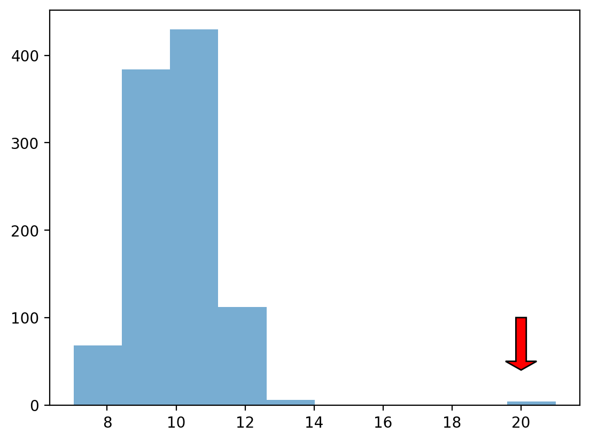
    


#### Check-in

How would you describe the following distribution?

- Normal vs. skewed?  
- With or without outliers?

- There are a few outliers with the value of 21.
- The distribution is normal, we can see it more clearly with a larger number of bins:


```python
### Your code here
p = plt.hist(data, bins = 30, alpha = .6)
```


    
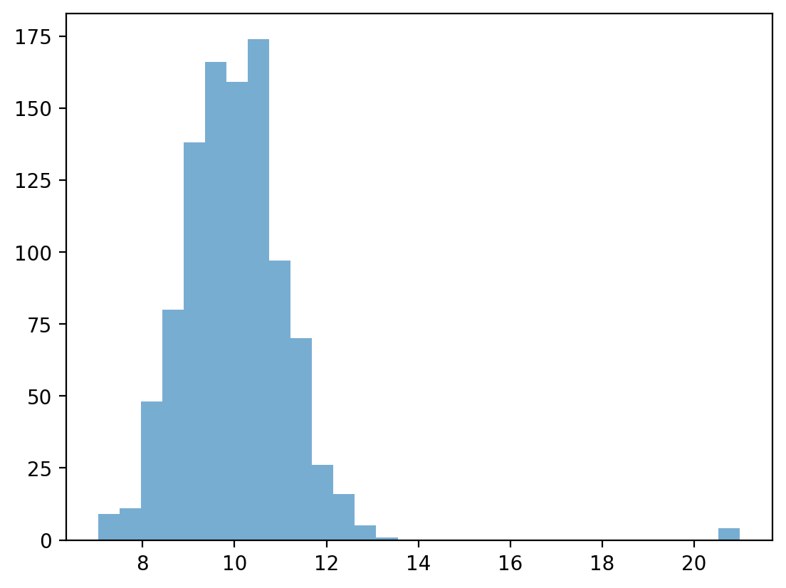
    


#### Check-in

In a somewhat **right-skewed distribution** (like below), what's larger––the `mean` or the `median`?


```python
mean1=np.mean(data)
median1=np.median(data)
print(mean1)
print(median1) # 50/50 percent of data = middle point
# in right skewed data mean > median
```

    10.012092287028294
    10.006119370611536
    

In a right-skewed distribution, the mean is larger than the median.

### Modifying our plot

- A good data visualization should also make it *clear* what's being plotted.
   - Clearly labeled `x` and `y` axes, title.
- Sometimes, we may also want to add **overlays**. 
   - E.g., a dashed vertical line representing the `mean`.

#### Adding axis labels


```python
p = plt.hist(df_pokemon['Attack'], alpha = .6)
plt.xlabel("Attack")
plt.ylabel("Count")
plt.title("Distribution of Attack Scores")
```


    Text(0.5, 1.0, 'Distribution of Attack Scores')


    

    


#### Adding a vertical line

The `plt.axvline` function allows us to draw a vertical line at a particular position, e.g., the `mean` of the `Attack` column.


```python
p = plt.hist(df_pokemon['Attack'], alpha = .6)
plt.xlabel("Attack")
plt.ylabel("Count")
plt.title("Distribution of Attack Scores")
plt.axvline(df_pokemon['Attack'].mean(), linestyle = "dotted")
plt.axvline(df_pokemon['Attack'].median())
```


    <matplotlib.lines.Line2D at 0x1755fa35f90>


    
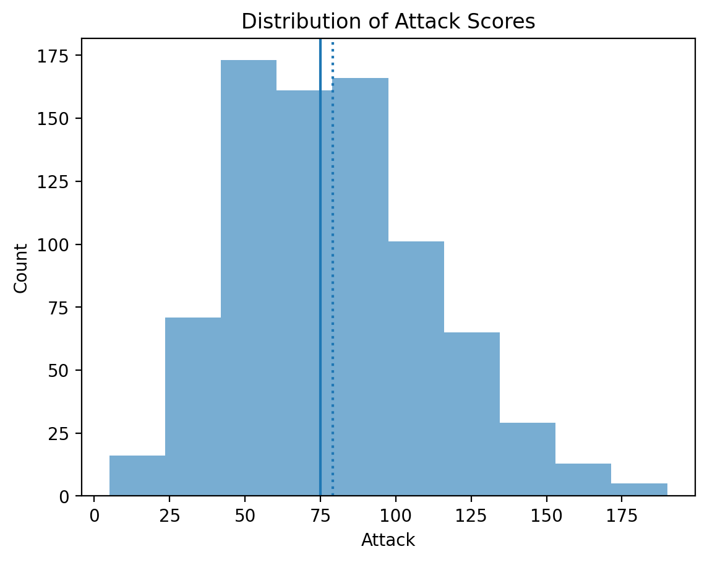
    


## Faceting for histograms

Let's try to group by our no. of Attacks by Pokemon Types looking at many histograms at a time:


```python
import plotly.express as px
fig = px.histogram(df_pokemon, x='Attack', facet_col='Generation')
fig.show()
```


## Scatterplots

### What are scatterplots?

> A **scatterplot** is a visualization of how two different continuous distributions relate to each other.

- Each individual point represents an observation.
- Very useful for **exploratory data analysis**.
   - Are these variables positively or negatively correlated?
   
A scatterplot is a **bivariate** plot, i.e., it displays at least two variables.

### Scatterplots with `matplotlib`

We can create a scatterplot using `plt.scatter(x, y)`, where `x` and `y` are the two variables we want to visualize.


```python
x = np.arange(1, 10)
y = np.arange(11, 20)
p = plt.scatter(x, y)
```


    
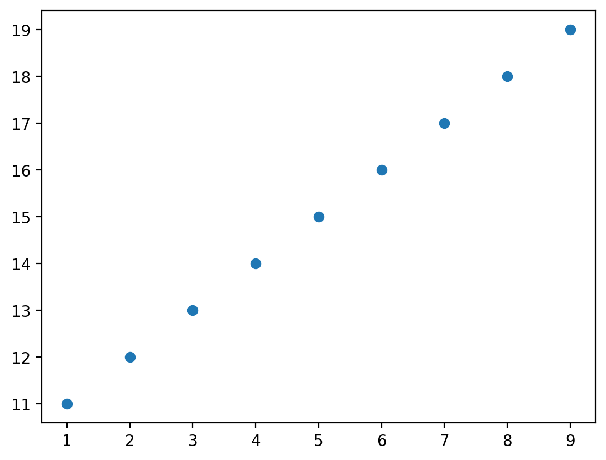
    


#### Check-in

Are these variables related? If so, how?


```python
x = np.random.normal(loc = 10, scale = 1, size = 100)
y = x * 2 + np.random.normal(loc = 0, scale = 2, size = 100)
plt.scatter(x, y, alpha = .6)
```


    <matplotlib.collections.PathCollection at 0x1755d31cb90>


    
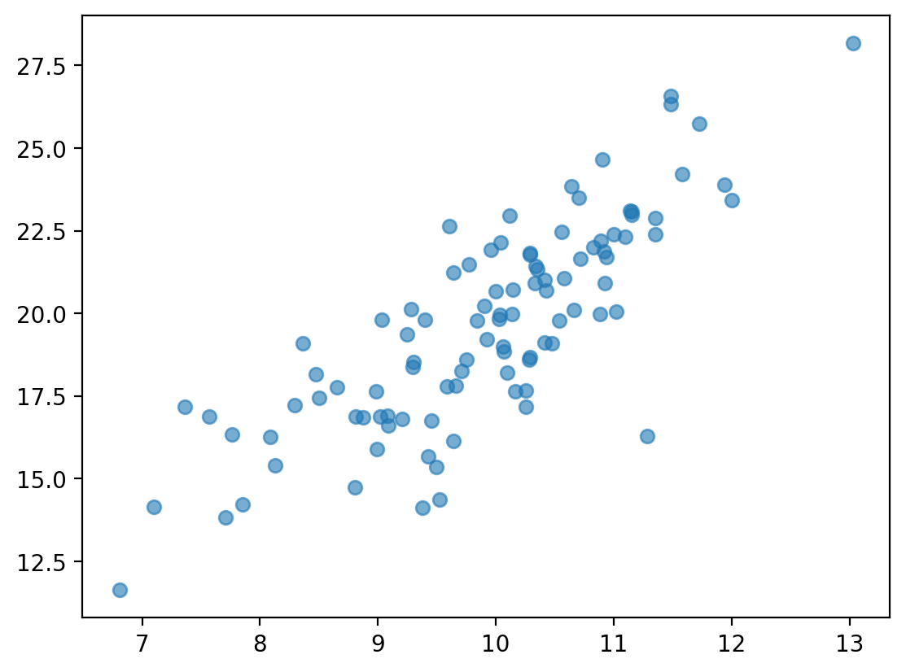
    


We can clearly see that larger values of **x** tend to be associated with larger values of **y**, so there is a **positive correlation**. We can calculate the correlation coefficient to confirm this:


```python
corr = np.corrcoef(x, y)[0, 1]
print(corr) 

slope, intercept = np.polyfit(x, y, 1)

plt.scatter(x, y, alpha = .6)
plt.plot(x, slope * x + intercept, color="red", label= "best fit")
plt.plot(x, 2*x, color="green", label= "y = 2x")
plt.legend(loc='upper left')
plt.show()
```

    0.8081598709966437
    


    
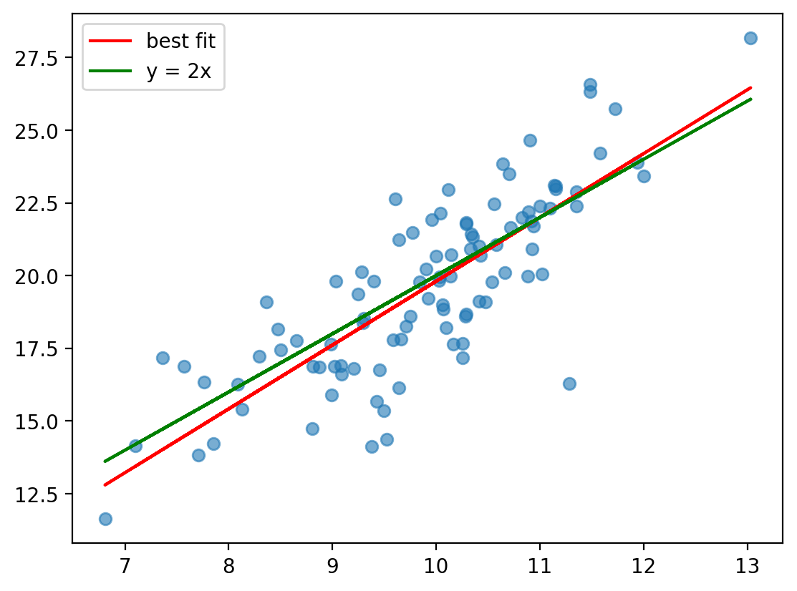
    


#### Check-in

Are these variables related? If so, how?


```python
x = np.random.normal(loc = 10, scale = 1, size = 100)
y = -x * 2 + np.random.normal(loc = 0, scale = 2, size = 100)
plt.scatter(x, y, alpha = .6)
```


    <matplotlib.collections.PathCollection at 0x1755853ccd0>


    
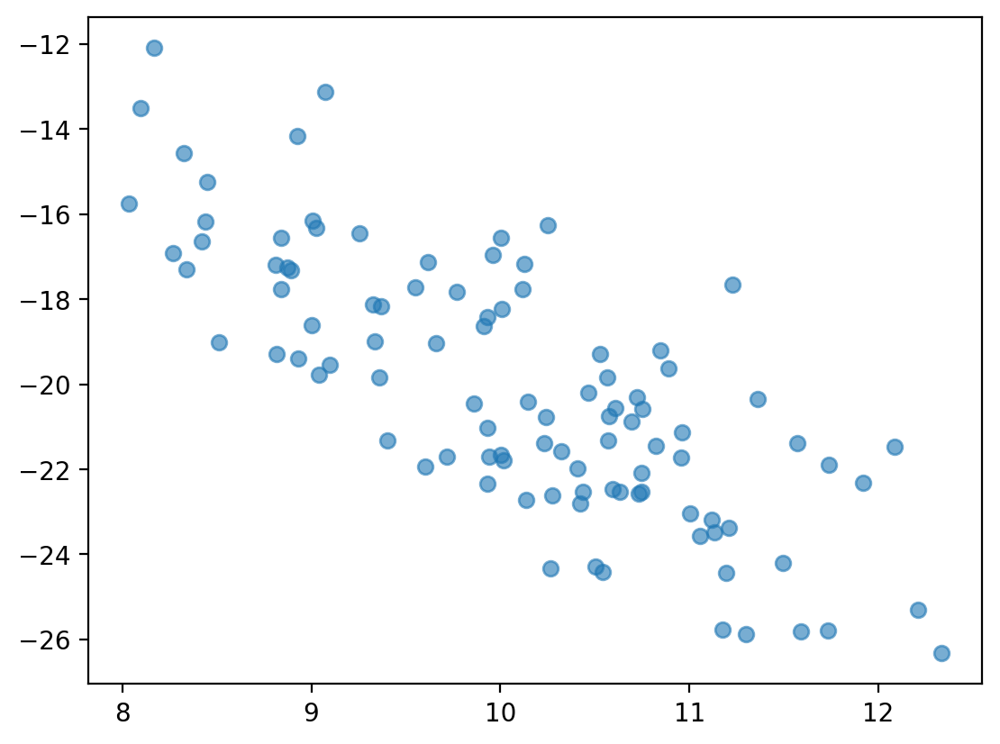
    


In this case, larger values of **x** tend to be associated with smaller values of **y**. There is a **negative correlation**.


```python
corr = np.corrcoef(x, y)[0, 1]
print(corr) 

slope, intercept = np.polyfit(x, y, 1)

plt.scatter(x, y, alpha = .6)
plt.plot(x, slope * x + intercept, color="red", label= "best fit")
plt.plot(x, x * -2, color="green", label= "y = -2x")
plt.legend(loc='upper left')
plt.show()
```

    -0.7766984789790002
    


    
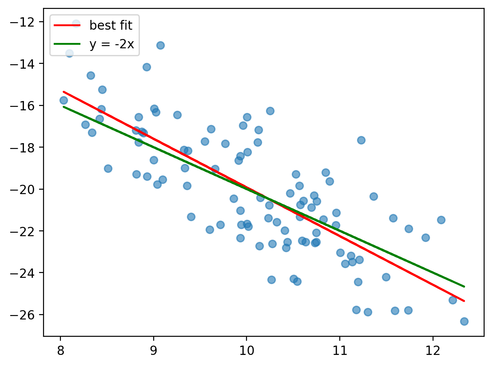
    


#### Scatterplots are useful for detecting non-linear relationships


```python
x = np.random.normal(loc = 10, scale = 1, size = 100)
y = np.sin(x)
plt.scatter(x, y, alpha = .6)
```


    <matplotlib.collections.PathCollection at 0x175557542d0>


    
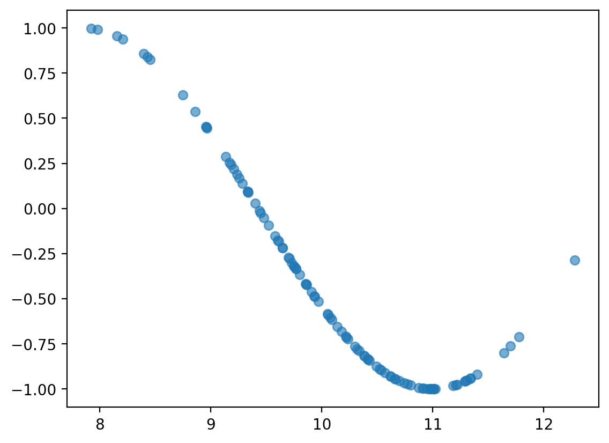
    


#### Check-in

How would we visualize the relationship between `Attack` and `Speed` in our Pokemon dataset?


```python
x = df_pokemon["Attack"]
y = df_pokemon["Speed"]
plt.xlabel("Attack")
plt.ylabel("Speed")
plt.title("Speed vs Attack Scores")
plt.scatter(x, y, alpha = .6)
```


    <matplotlib.collections.PathCollection at 0x1755d121d10>


    
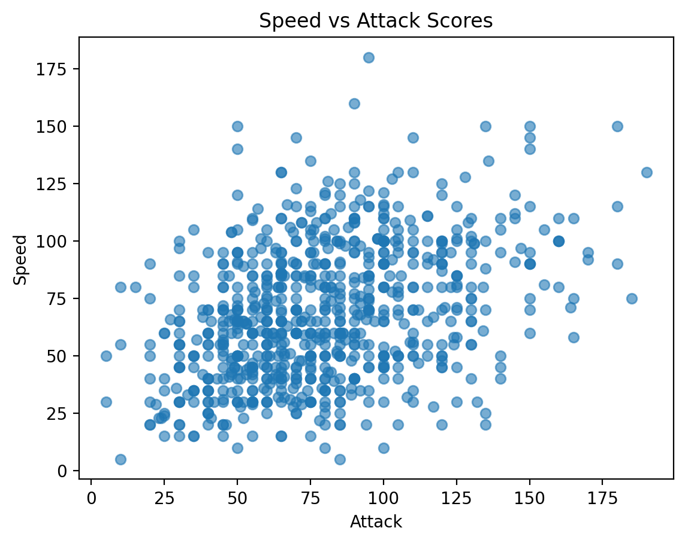
    


```python
corr = np.corrcoef(x, y)[0, 1]
print("correlation coefficient: ", corr.round(2)) 

slope, intercept = np.polyfit(x, y, 1)

plt.scatter(x, y, alpha = .6)
plt.plot(x, slope * x + intercept, color="red", label= "best fit")

plt.legend()
plt.show()
```

    correlation coefficient:  0.38
    


    
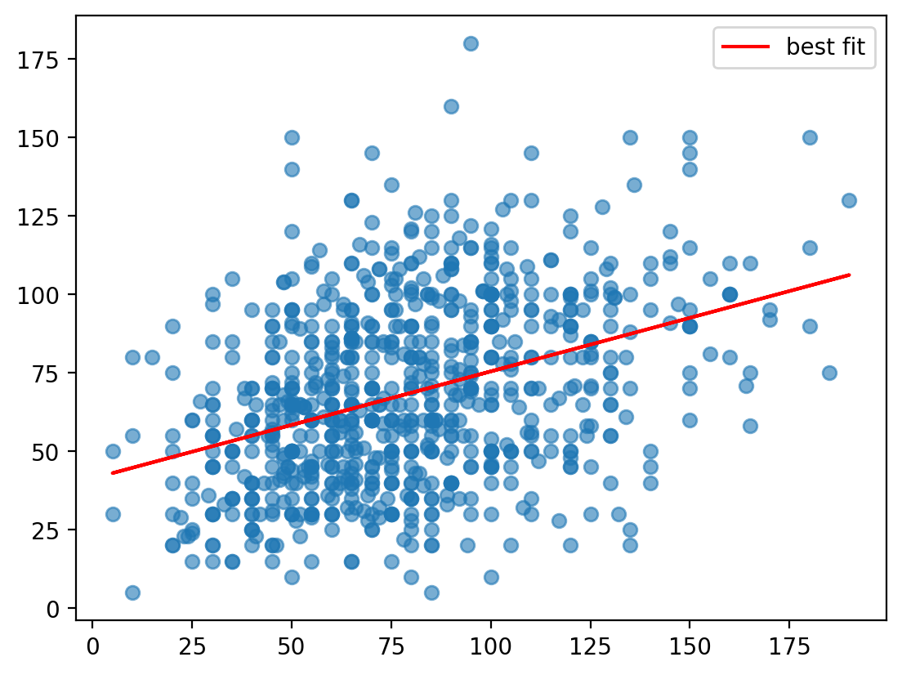
    


The correlation coefficient is 0.38, it indicates a weak positive correlation. It may be the case that in some observations high speed = high strength, but it is not a rule.

## Scatterplots with `pyplot express`

With pyplot express we can play with scatterplots even further - we can create `bubble plots`!


```python
bubble = px.scatter(df_pokemon, x='Attack', y='Speed', color='Type 1', size='HP')
bubble.show()
```


## Barplots

### What is a barplot?

> A **barplot** visualizes the relationship between one *continuous* variable and a *categorical* variable.

- The *height* of each bar generally indicates the mean of the continuous variable.
- Each bar represents a different *level* of the categorical variable.

A barplot is a **bivariate** plot, i.e., it displays at least two variables.

### Barplots with `matplotlib`

`plt.bar` can be used to create a **barplot** of our data.

- E.g., average `Attack` by `Legendary` status.
- However, we first need to use `groupby` to calculate the mean `Attack` per level.

#### Step 1: Using `groupby`


```python
summary = df_pokemon[['Legendary', 'Attack']].groupby("Legendary").mean().reset_index()
summary
```


<div>
<style scoped>
    .dataframe tbody tr th:only-of-type {
        vertical-align: middle;
    }

    .dataframe tbody tr th {
        vertical-align: top;
    }

    .dataframe thead th {
        text-align: right;
    }
</style>
<table border="1" class="dataframe">
  <thead>
    <tr style="text-align: right;">
      <th></th>
      <th>Legendary</th>
      <th>Attack</th>
    </tr>
  </thead>
  <tbody>
    <tr>
      <th>0</th>
      <td>False</td>
      <td>75.669388</td>
    </tr>
    <tr>
      <th>1</th>
      <td>True</td>
      <td>116.676923</td>
    </tr>
  </tbody>
</table>
</div>


```python
### Turn Legendary into a str
summary['Legendary'] = summary['Legendary'].apply(lambda x: str(x))
summary
```


<div>
<style scoped>
    .dataframe tbody tr th:only-of-type {
        vertical-align: middle;
    }

    .dataframe tbody tr th {
        vertical-align: top;
    }

    .dataframe thead th {
        text-align: right;
    }
</style>
<table border="1" class="dataframe">
  <thead>
    <tr style="text-align: right;">
      <th></th>
      <th>Legendary</th>
      <th>Attack</th>
    </tr>
  </thead>
  <tbody>
    <tr>
      <th>0</th>
      <td>False</td>
      <td>75.669388</td>
    </tr>
    <tr>
      <th>1</th>
      <td>True</td>
      <td>116.676923</td>
    </tr>
  </tbody>
</table>
</div>


#### Step 2: Pass values into `plt.bar`

**Check-in**:

- What do we learn from this plot?  
- What is this plot missing?


```python
plt.bar(x = summary['Legendary'],height = summary['Attack'],alpha = .6);
plt.xlabel("Legendary status")
plt.ylabel("Attack")
plt.title("Average Attack by Legendary Status")
```


    
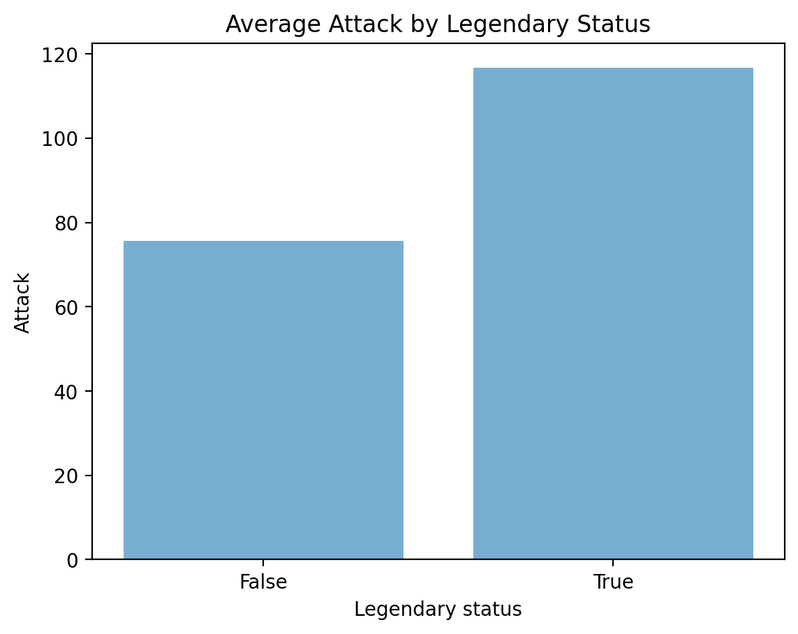
    


we can learn values of some unit of attack depending on if its legendary pokemon or not

this plot is missing a title, we don't know that it is a mean of attack (I added it)

## Barplots in `plotly.express`


```python
data_canada = px.data.gapminder().query("country == 'Canada'")
fig = px.bar(data_canada, x='year', y='pop')
fig.show()
```


```python
data_canada.head(3)
```


<div>
<style scoped>
    .dataframe tbody tr th:only-of-type {
        vertical-align: middle;
    }

    .dataframe tbody tr th {
        vertical-align: top;
    }

    .dataframe thead th {
        text-align: right;
    }
</style>
<table border="1" class="dataframe">
  <thead>
    <tr style="text-align: right;">
      <th></th>
      <th>country</th>
      <th>continent</th>
      <th>year</th>
      <th>lifeExp</th>
      <th>pop</th>
      <th>gdpPercap</th>
      <th>iso_alpha</th>
      <th>iso_num</th>
    </tr>
  </thead>
  <tbody>
    <tr>
      <th>240</th>
      <td>Canada</td>
      <td>Americas</td>
      <td>1952</td>
      <td>68.75</td>
      <td>14785584</td>
      <td>11367.16112</td>
      <td>CAN</td>
      <td>124</td>
    </tr>
    <tr>
      <th>241</th>
      <td>Canada</td>
      <td>Americas</td>
      <td>1957</td>
      <td>69.96</td>
      <td>17010154</td>
      <td>12489.95006</td>
      <td>CAN</td>
      <td>124</td>
    </tr>
    <tr>
      <th>242</th>
      <td>Canada</td>
      <td>Americas</td>
      <td>1962</td>
      <td>71.30</td>
      <td>18985849</td>
      <td>13462.48555</td>
      <td>CAN</td>
      <td>124</td>
    </tr>
  </tbody>
</table>
</div>


```python
long_df = px.data.medals_long()

fig = px.bar(long_df, x="nation", y="count", color="medal", title="Long format of data")
fig.show()

long_df.head(3)
```


<div>
<style scoped>
    .dataframe tbody tr th:only-of-type {
        vertical-align: middle;
    }

    .dataframe tbody tr th {
        vertical-align: top;
    }

    .dataframe thead th {
        text-align: right;
    }
</style>
<table border="1" class="dataframe">
  <thead>
    <tr style="text-align: right;">
      <th></th>
      <th>nation</th>
      <th>medal</th>
      <th>count</th>
    </tr>
  </thead>
  <tbody>
    <tr>
      <th>0</th>
      <td>South Korea</td>
      <td>gold</td>
      <td>24</td>
    </tr>
    <tr>
      <th>1</th>
      <td>China</td>
      <td>gold</td>
      <td>10</td>
    </tr>
    <tr>
      <th>2</th>
      <td>Canada</td>
      <td>gold</td>
      <td>9</td>
    </tr>
  </tbody>
</table>
</div>


```python
wide_df = px.data.medals_wide()

fig = px.bar(wide_df, x="nation", y=["gold", "silver", "bronze"], title="Wide format of data")
fig.show()

wide_df.head(3)
```


<div>
<style scoped>
    .dataframe tbody tr th:only-of-type {
        vertical-align: middle;
    }

    .dataframe tbody tr th {
        vertical-align: top;
    }

    .dataframe thead th {
        text-align: right;
    }
</style>
<table border="1" class="dataframe">
  <thead>
    <tr style="text-align: right;">
      <th></th>
      <th>nation</th>
      <th>gold</th>
      <th>silver</th>
      <th>bronze</th>
    </tr>
  </thead>
  <tbody>
    <tr>
      <th>0</th>
      <td>South Korea</td>
      <td>24</td>
      <td>13</td>
      <td>11</td>
    </tr>
    <tr>
      <th>1</th>
      <td>China</td>
      <td>10</td>
      <td>15</td>
      <td>8</td>
    </tr>
    <tr>
      <th>2</th>
      <td>Canada</td>
      <td>9</td>
      <td>12</td>
      <td>12</td>
    </tr>
  </tbody>
</table>
</div>


## Faceting barplots

Please use faceting for the Pokemon data with barplots:


```python
fig = px.bar(df_pokemon, x='Type 1', facet_row='Legendary')
fig.show()
```


For more information please go to the tutorial [Plotly Express Wide-Form Support in Python](https://plotly.com/python/wide-form/).

## Conclusion

This concludes our first introduction to **data visualization**:

- Working with `matplotlib.pyplot`.  
- Working with more convenient version of `pyplot.express`.
- Creating basic plots: histograms, scatterplots, and barplots.

Next time, we'll move onto discussing `seaborn`, another very useful package for data visualization.

# Exercise 6.

# Data visualization, pt. 2 (`seaborn`)

## Goals of this exercise

- Introducting `seaborn`. 
- Putting `seaborn` into practice:
  - **Univariate** plots (histograms).  
  - **Bivariate** continuous plots (scatterplots and line plots).
  - **Bivariate** categorical plots (bar plots, box plots, and strip plots).

## Introducing `seaborn`

### What is `seaborn`?

> [`seaborn`](https://seaborn.pydata.org/) is a data visualization library based on `matplotlib`.

- In general, it's easier to make nice-looking graphs with `seaborn`.
- The trade-off is that `matplotlib` offers more flexibility.


```python
import seaborn as sns ### importing seaborn
import pandas as pd
import matplotlib.pyplot as plt ## just in case we need it
import numpy as np
```


```python
%matplotlib inline 
%config InlineBackend.figure_format = 'retina'
```

### The `seaborn` hierarchy of plot types

We'll learn more about exactly what this hierarchy means today (and in next lecture).


### Example dataset

Today we'll work with a new dataset, from [Gapminder](https://www.gapminder.org/data/documentation/). 

- **Gapminder** is an independent Swedish foundation dedicated to publishing and analyzing data to correct misconceptions about the world.
- Between 1952-2007, has data about `life_exp`, `gdp_cap`, and `population`.


```python
df_gapminder = pd.read_csv("gapminder_full.csv")
```


```python
df_gapminder.head(2)
```


<div>
<style scoped>
    .dataframe tbody tr th:only-of-type {
        vertical-align: middle;
    }

    .dataframe tbody tr th {
        vertical-align: top;
    }

    .dataframe thead th {
        text-align: right;
    }
</style>
<table border="1" class="dataframe">
  <thead>
    <tr style="text-align: right;">
      <th></th>
      <th>country</th>
      <th>year</th>
      <th>population</th>
      <th>continent</th>
      <th>life_exp</th>
      <th>gdp_cap</th>
    </tr>
  </thead>
  <tbody>
    <tr>
      <th>0</th>
      <td>Afghanistan</td>
      <td>1952</td>
      <td>8425333</td>
      <td>Asia</td>
      <td>28.801</td>
      <td>779.445314</td>
    </tr>
    <tr>
      <th>1</th>
      <td>Afghanistan</td>
      <td>1957</td>
      <td>9240934</td>
      <td>Asia</td>
      <td>30.332</td>
      <td>820.853030</td>
    </tr>
  </tbody>
</table>
</div>


```python
df_gapminder.shape
```


    (1704, 6)


## Univariate plots

> A **univariate plot** is a visualization of only a *single* variable, i.e., a **distribution**.


### Histograms with `sns.histplot`

- We've produced histograms with `plt.hist`.  
- With `seaborn`, we can use `sns.histplot(...)`.

Rather than use `df['col_name']`, we can use the syntax:

```python
sns.histplot(data = df, x = col_name)
```

This will become even more useful when we start making **bivariate plots**.


```python
# Histogram of life expectancy
sns.histplot(df_gapminder['life_exp'])
```


    <Axes: xlabel='life_exp', ylabel='Count'>


    
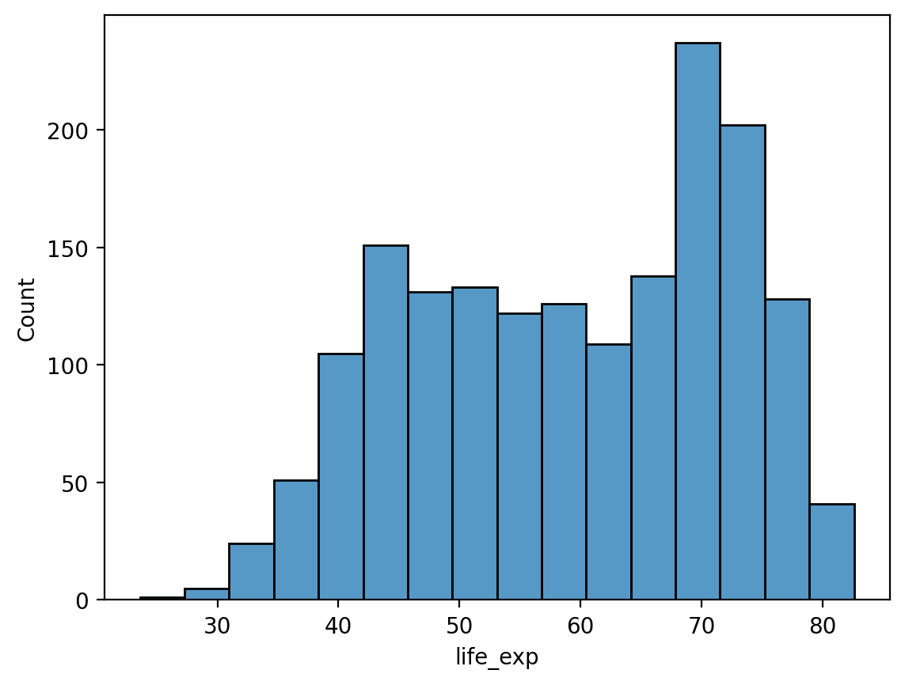
    


#### Modifying the number of bins

As with `plt.hist`, we can modify the number of *bins*.


```python
# Fewer bins
sns.histplot(data = df_gapminder, x = 'life_exp', bins = 10, alpha = .6)
```


    <Axes: xlabel='life_exp', ylabel='Count'>


    
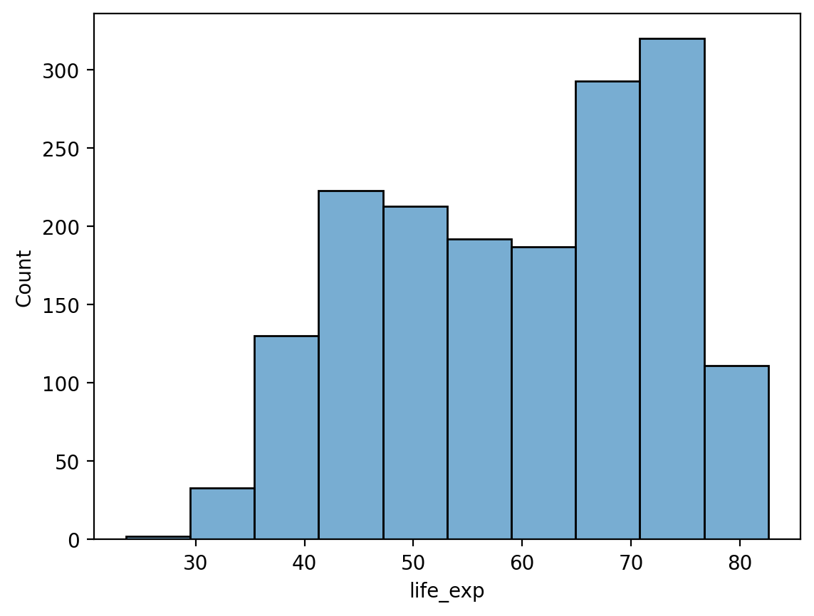
    


```python
# Many more bins!
sns.histplot(data = df_gapminder, x = 'life_exp', bins = 100, alpha = .6)
```


    <Axes: xlabel='life_exp', ylabel='Count'>


    
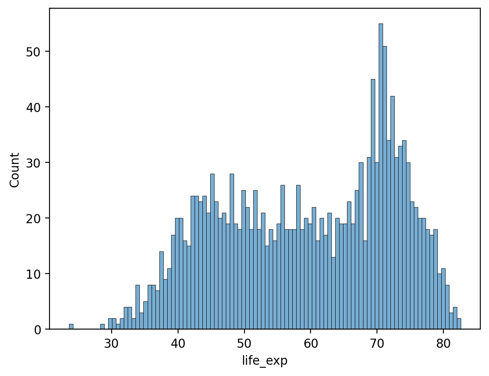
    


#### Modifying the y-axis with `stat`

By default, `sns.histplot` will plot the **count** in each bin. However, we can change this using the `stat` parameter:

- `probability`: normalize such that bar heights sum to `1`.
- `percent`: normalize such that bar heights sum to `100`.
- `density`: normalize such that total *area* sums to `1`.


```python
# Note the modified y-axis!
sns.histplot(data = df_gapminder, x = 'life_exp', stat = "percent", alpha = .6)
```


    <Axes: xlabel='life_exp', ylabel='Percent'>


    
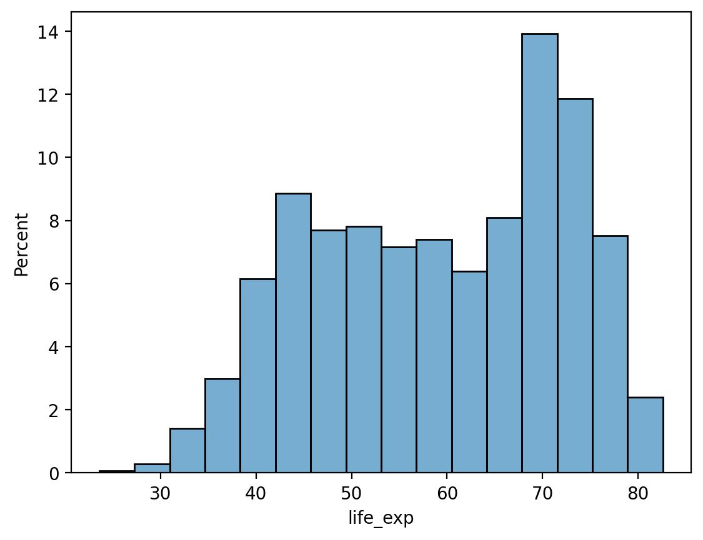
    


### Check-in

How would you make a histogram showing the distribution of `population` values in `2007` alone? 

- Bonus 1: Modify this graph to show `probability`, not `count`.
- Bonus 2: What do you notice about this graph, and how might you change it?


```python
### Your code here
gapminder2007 = df_gapminder[df_gapminder['year'] == 2007]
sns.histplot(data=gapminder2007, x='population')
plt.title('Population in 2007')
```


    Text(0.5, 1.0, 'Population in 2007')


    
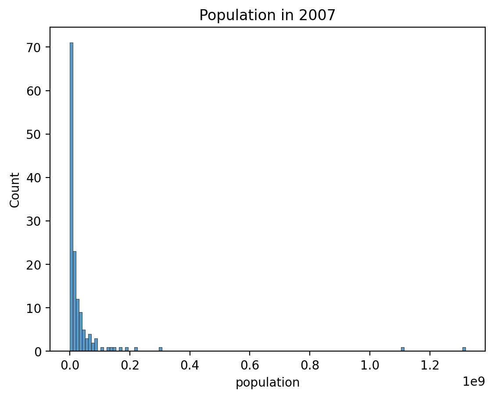
    


```python
sns.histplot(data=gapminder2007, x='population', stat='probability')
plt.title('Population in 2007 (probability)')
```


    Text(0.5, 1.0, 'Population in 2007 (probability)')


    
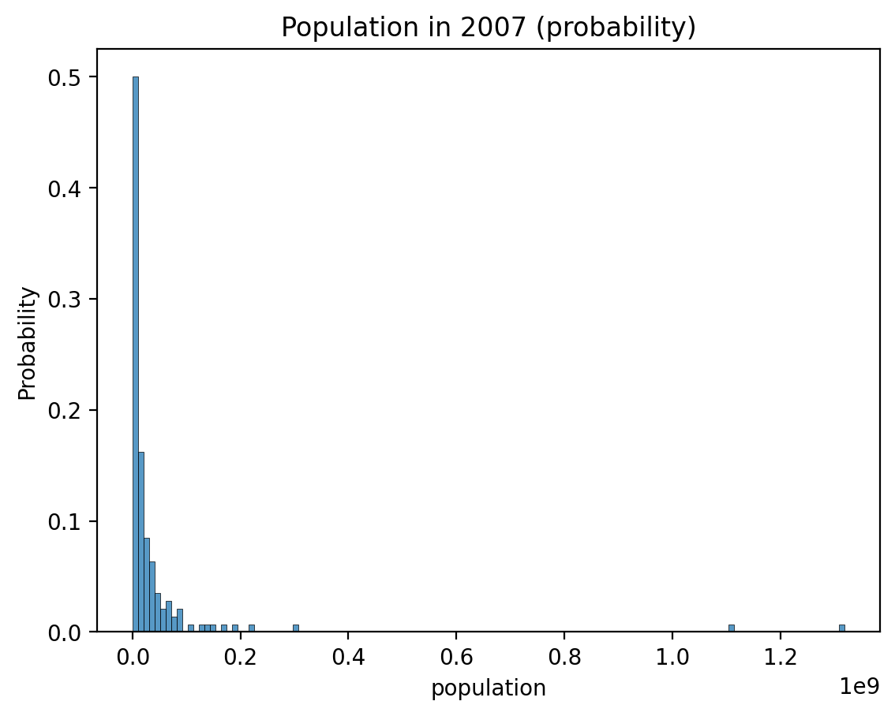
    


The distribution of `population` is highly right-skewed.

## Bivariate continuous plots

> A **bivariate continuous plot** visualizes the relationship between *two continuous variables*.


### Scatterplots with `sns.scatterplot`

> A **scatterplot** visualizes the relationship between two continuous variables.

- Each observation is plotted as a single dot/mark. 
- The position on the `(x, y)` axes reflects the value of those variables.

One way to make a scatterplot in `seaborn` is using `sns.scatterplot`.

#### Showing `gdp_cap` by `life_exp`

What do we notice about `gdp_cap`?


```python
sns.scatterplot(data = df_gapminder, x = 'gdp_cap', y = 'life_exp', alpha = .3)
```


    <Axes: xlabel='gdp_cap', ylabel='life_exp'>


    
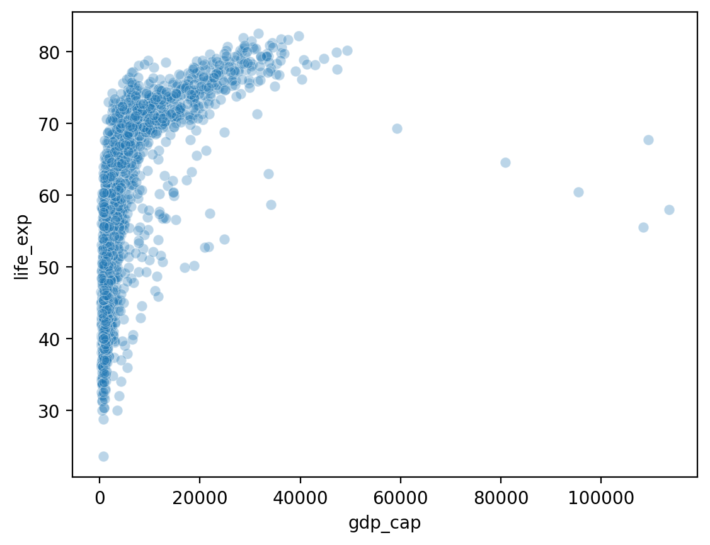
    


We can see that there is some **positive correlation** between `gdp_cap` and `life_exp`. We can apply log scale to see the relationship better.

#### Showing `gdp_cap_log` by `life_exp`


```python
## Log GDP
df_gapminder['gdp_cap_log'] = np.log10(df_gapminder['gdp_cap']) 
## Show log GDP by life exp
sns.scatterplot(data = df_gapminder, x = 'gdp_cap_log', y = 'life_exp', alpha = .3)
```


    <Axes: xlabel='gdp_cap_log', ylabel='life_exp'>


    
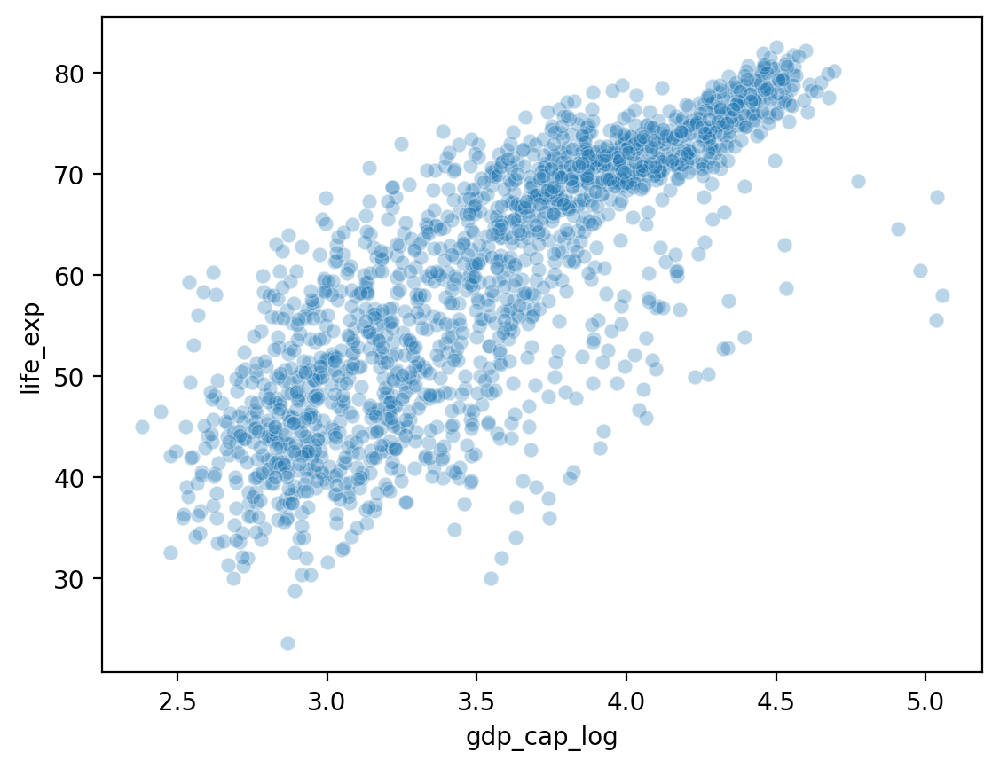
    


#### Adding a `hue`

- What if we want to add a *third* component that's categorical, like `continent`?
- `seaborn` allows us to do this with `hue`.


```python
## Log GDP
df_gapminder['gdp_cap_log'] = np.log10(df_gapminder['gdp_cap']) 
## Show log GDP by life exp
sns.scatterplot(data = df_gapminder[df_gapminder['year'] == 2007],
               x = 'gdp_cap_log', y = 'life_exp', hue = "continent", alpha = .7)
```


    <Axes: xlabel='gdp_cap_log', ylabel='life_exp'>


    
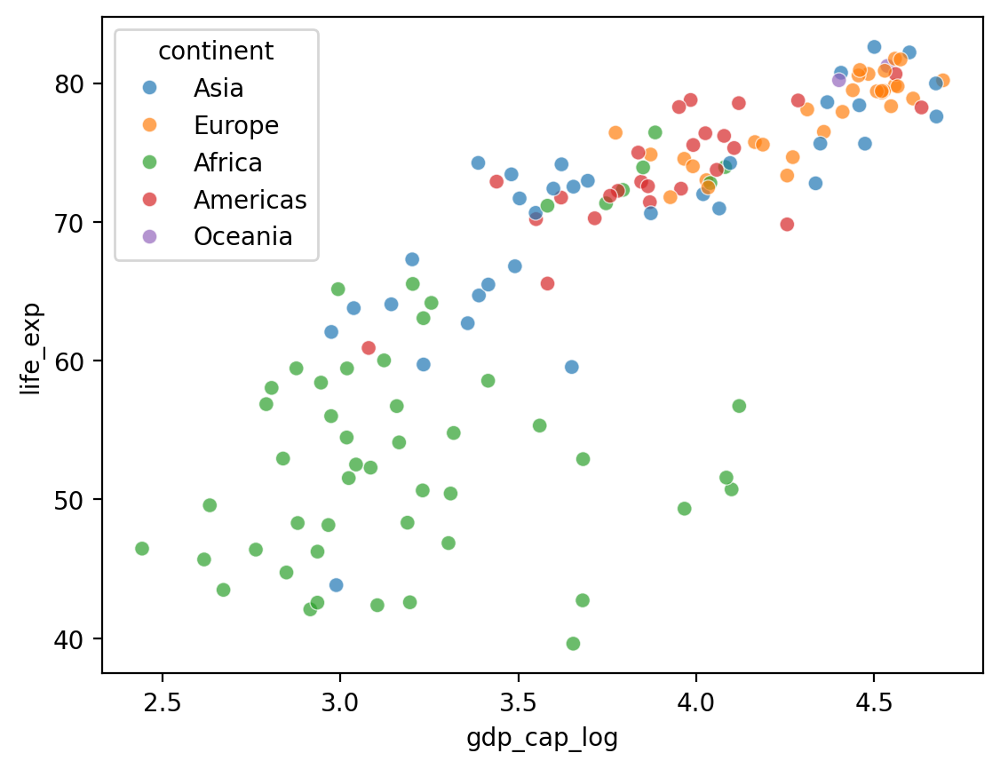
    


#### Adding a `size`

- What if we want to add a *fourth* component that's continuous, like `population`?
- `seaborn` allows us to do this with `size`.


```python
## Log GDP
df_gapminder['gdp_cap_log'] = np.log10(df_gapminder['gdp_cap']) 
## Show log GDP by life exp
sns.scatterplot(data = df_gapminder[df_gapminder['year'] == 2007],
               x = 'gdp_cap_log', y = 'life_exp',
                hue = "continent", size = 'population', alpha = .7)
```


    <Axes: xlabel='gdp_cap_log', ylabel='life_exp'>


    
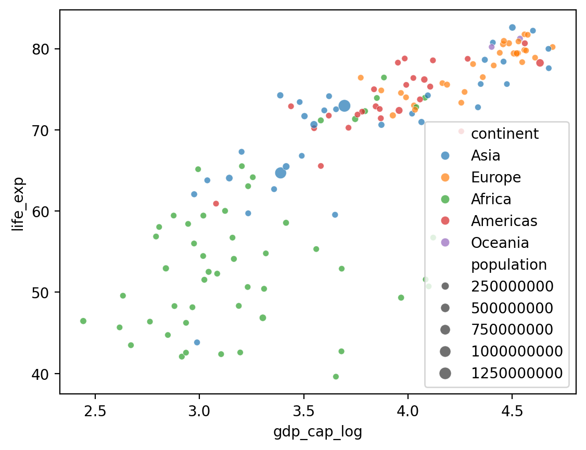
    


#### Changing the position of the legend


```python
## Show log GDP by life exp
sns.scatterplot(data = df_gapminder[df_gapminder['year'] == 2007],
               x = 'gdp_cap_log', y = 'life_exp',
                hue = "continent", size = 'population', alpha = .7)

plt.legend(bbox_to_anchor=(1.05, 1), loc='upper left', borderaxespad=0)
```


    <matplotlib.legend.Legend at 0x2436f5aca50>


    
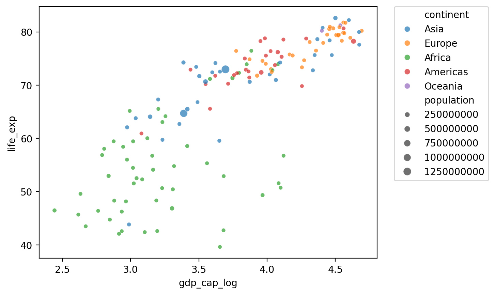
    


### Lineplots with `sns.lineplot`

> A **lineplot** also visualizes the relationship between two continuous variables.

- Typically, the position of the line on the `y` axis reflects the *mean* of the `y`-axis variable for that value of `x`.
- Often used for plotting **change over time**.

One way to make a lineplot in `seaborn` is using [`sns.lineplot`](https://seaborn.pydata.org/generated/seaborn.lineplot.html).

#### Showing `life_exp` by `year`

What general trend do we notice?


```python
sns.lineplot(data = df_gapminder,
             x = 'year',
             y = 'life_exp')
```


    <Axes: xlabel='year', ylabel='life_exp'>


    
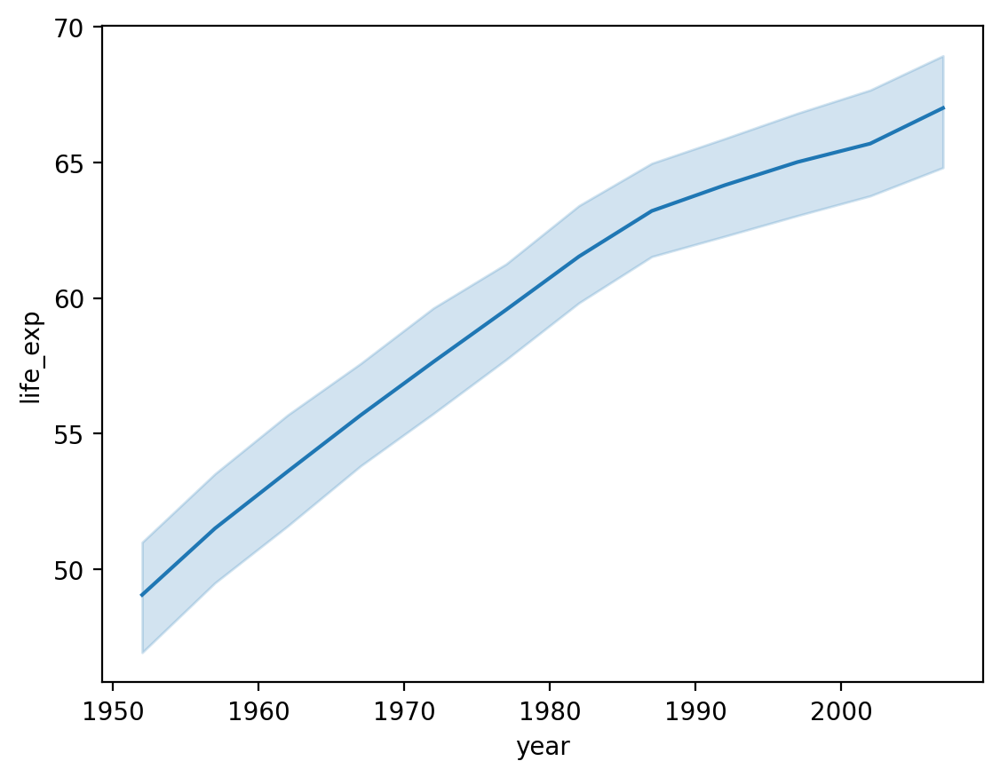
    


#### Modifying how error/uncertainty is displayed

- By default, `seaborn.lineplot` will draw **shading** around the line representing a confidence interval.
- We can change this with `errstyle`.


```python
sns.lineplot(data = df_gapminder,
             x = 'year',
             y = 'life_exp',
            err_style = "bars")
```


    <Axes: xlabel='year', ylabel='life_exp'>


    
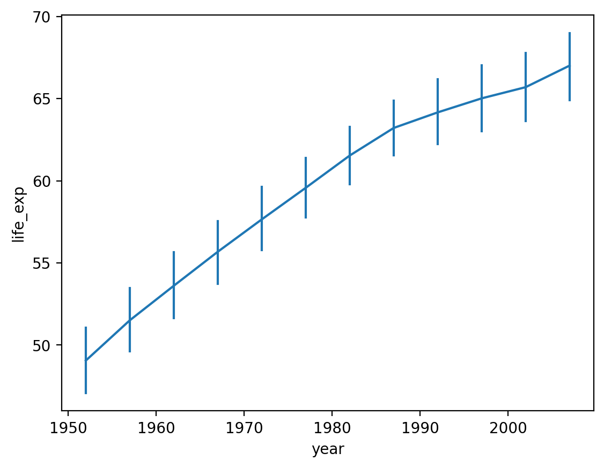
    


#### Adding a `hue`

- We could also show this by `continent`.  
- There's (fortunately) a positive trend line for each `continent`.


```python
sns.lineplot(data = df_gapminder,
             x = 'year',
             y = 'life_exp',
            hue = "continent")
plt.legend(bbox_to_anchor=(1.05, 1), loc='upper left', borderaxespad=0)
```


    <matplotlib.legend.Legend at 0x2436ff15f90>


    
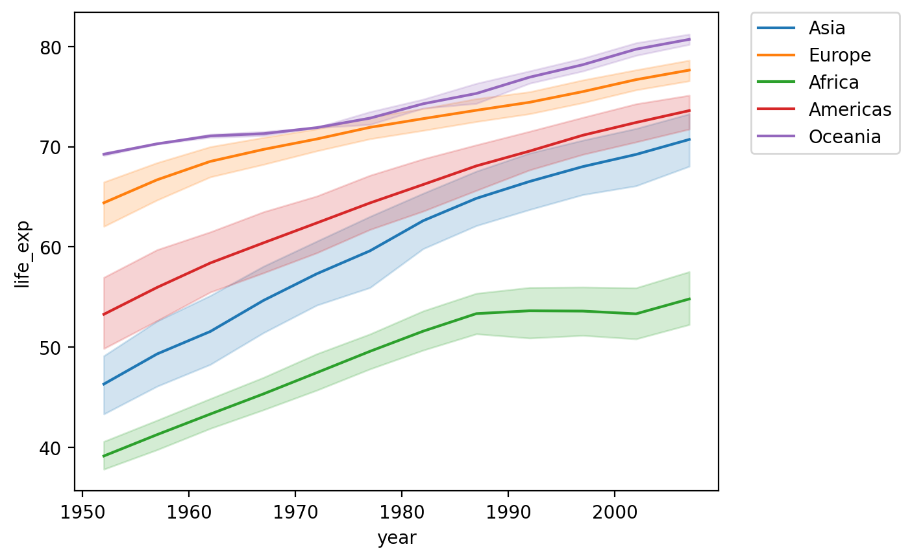
    


#### Check-in

How would you plot the relationship between `year` and `gdp_cap` for countries in the `Americas` only?


```python
### Your code here
gapminder_americas = df_gapminder[df_gapminder['continent'] == 'Americas']
plt.figure(figsize=(10, 8))
sns.lineplot(data=gapminder_americas, x='year', y='gdp_cap', hue='country')
plt.legend(bbox_to_anchor=(1.05, 1), loc='upper left')
plt.title('GDP per capita of countries in Americas')
```


    Text(0.5, 1.0, 'GDP per capita of countries in Americas')


    
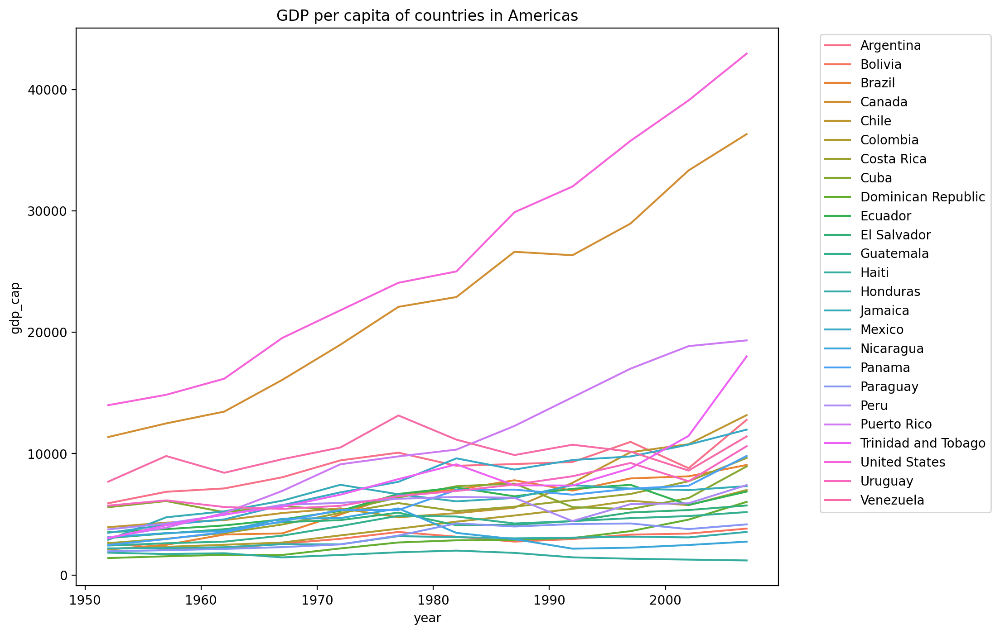
    


#### Heteroskedasticity in `gdp_cap` by `year`

- [**Heteroskedasticity**](https://en.wikipedia.org/wiki/Homoscedasticity_and_heteroscedasticity) is when the *variance* in one variable (e.g., `gdp_cap`) changes as a function of another variable (e.g., `year`).
- In this case, why do you think that is?

#### Plotting by country

- There are too many countries to clearly display in the `legend`. 
- But the top two lines are the `United States` and `Canada`.
   - I.e., two countries have gotten much wealthier per capita, while the others have not seen the same economic growth.


```python
sns.lineplot(data = df_gapminder[df_gapminder['continent']=="Americas"],
             x = 'year', y = 'gdp_cap', hue = "country", legend = None)
```


    <Axes: xlabel='year', ylabel='gdp_cap'>


    
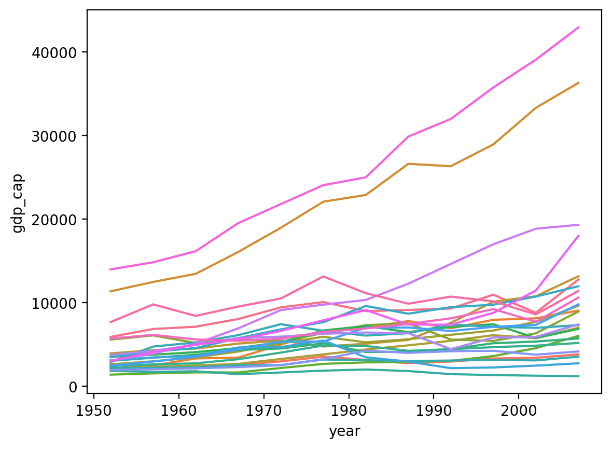
    


### Using `relplot`

- `relplot` allows you to plot either line plots or scatter plots using `kind`.
- `relplot` also makes it easier to `facet` (which we'll discuss momentarily).


```python
sns.relplot(data = df_gapminder, x = "year", y = "life_exp", kind = "line")
```


    <seaborn.axisgrid.FacetGrid at 0x24370d660d0>


    
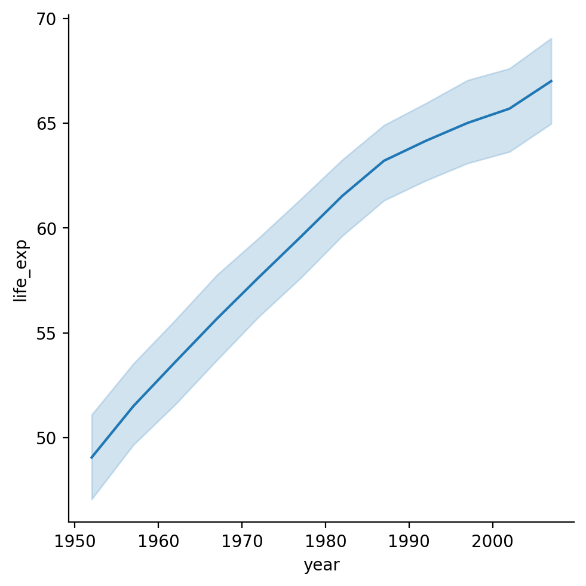
    


#### Faceting into `rows` and `cols`

We can also plot the same relationship across multiple "windows" or **facets** by adding a `rows`/`cols` parameter.


```python
sns.relplot(data = df_gapminder, x = "year", y = "life_exp", kind = "line", 
            col = "continent")
```


    <seaborn.axisgrid.FacetGrid at 0x24370ca6d50>


    
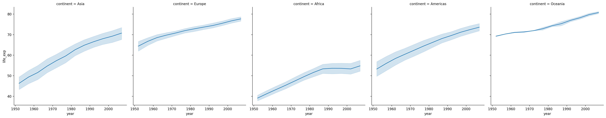
    


## Bivariate categorical plots

> A **bivariate categorical plot** visualizes the relationship between one categorical variable and one continuous variable.


### Example dataset

Here, we'll return to our Pokemon dataset, which has more examples of categorical variables.


```python
df_pokemon = pd.read_csv("pokemon.csv")
```

### Barplots with `sns.barplot`

> A **barplot** visualizes the relationship between one *continuous* variable and a *categorical* variable.

- The *height* of each bar generally indicates the mean of the continuous variable.
- Each bar represents a different *level* of the categorical variable.

With `seaborn`, we can use the function `sns.barplot`.

#### Average `Attack` by `Legendary` status


```python
sns.barplot(data = df_pokemon, x = "Legendary", y = "Attack")
```

    
    


    
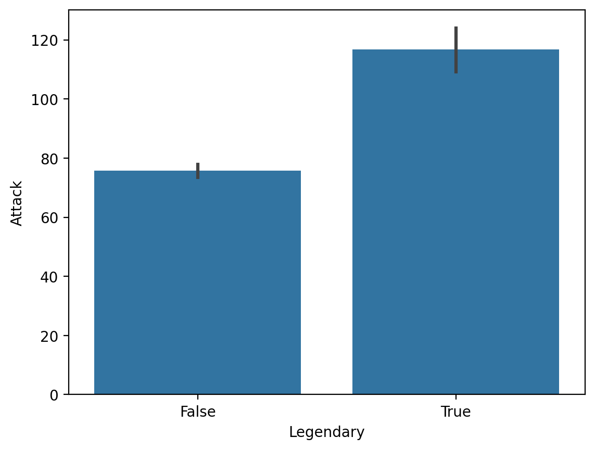
    


#### Average `Attack` by `Type 1`

Here, notice that I make the figure *bigger*, to make sure the labels all fit.


```python
plt.figure(figsize=(15,4))
sns.barplot(data = df_pokemon, x = "Type 1", y = "Attack")
```


    
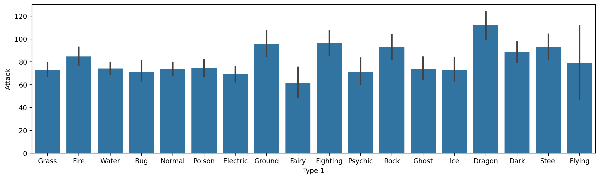
    


#### Check-in

How would you plot `HP` by `Type 1`?


```python
### Your code here
plt.figure(figsize=(15, 4))
sns.barplot(data=df_pokemon, x="Type 1", y="HP")
```


    <Axes: xlabel='Type 1', ylabel='HP'>


    
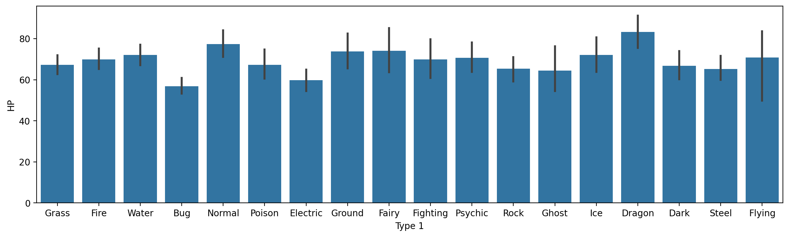
    


#### Modifying `hue`

As with `scatterplot` and `lineplot`, we can change the `hue` to give further granularity.

- E.g., `HP` by `Type 1`, further divided by `Legendary` status.


```python
plt.figure(figsize=(15,4))
sns.barplot(data = df_pokemon,
           x = "Type 1", y = "HP", hue = "Legendary")
```


    
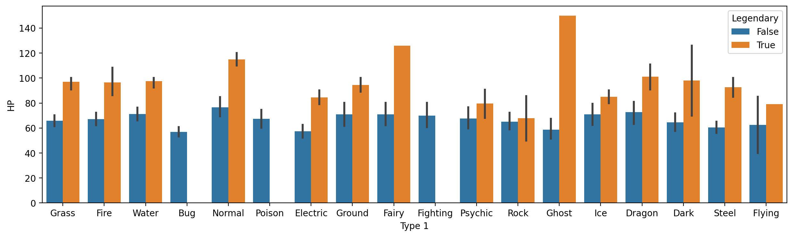
    


### Using `catplot`

> `seaborn.catplot` is a convenient function for plotting bivariate categorical data using a range of plot types (`bar`, `box`, `strip`).


```python
sns.catplot(data = df_pokemon, x = "Legendary", 
             y = "Attack", kind = "bar")
```


    
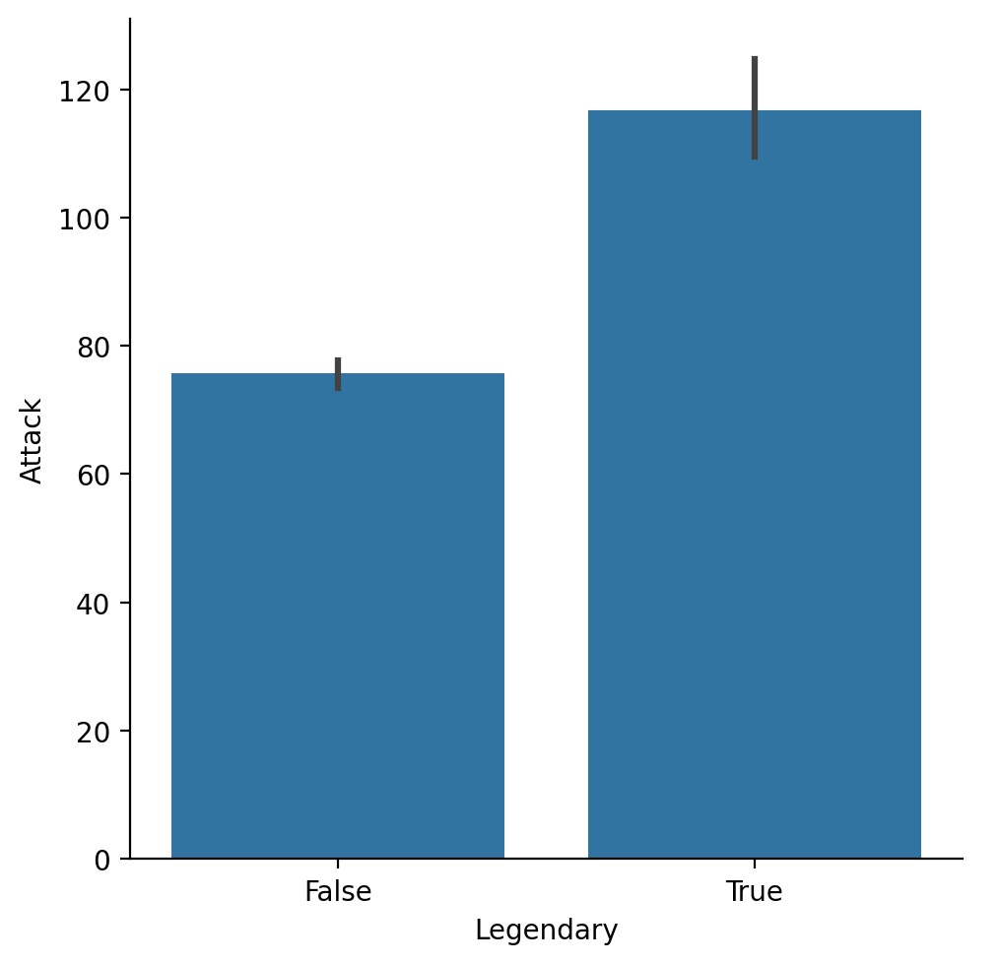
    


#### `strip` plots

> A `strip` plot shows each individual point (like a scatterplot), divided by a **category label**.


```python
sns.catplot(data = df_pokemon, x = "Legendary", 
             y = "Attack", kind = "strip", alpha = .5)
```


    
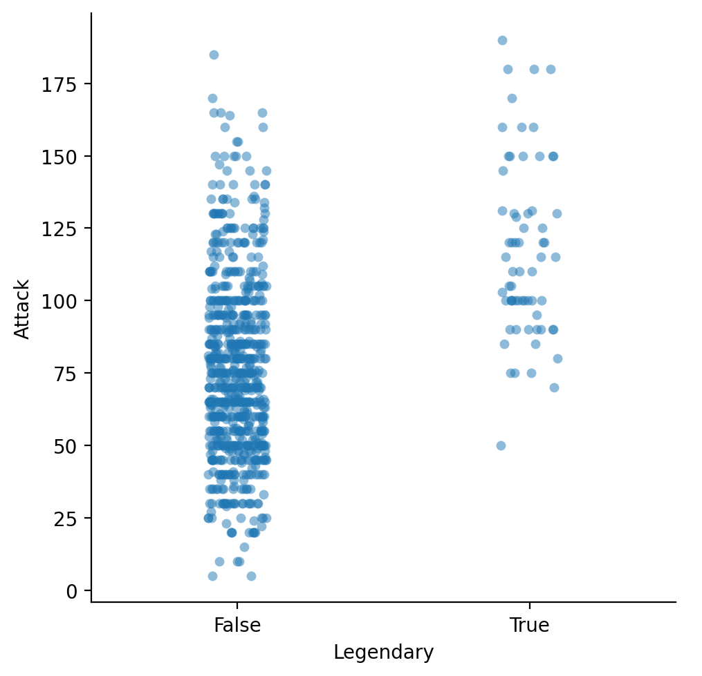
    


#### Adding a `mean` to our `strip` plot

We can plot *two graphs* at the same time, showing both the individual points and the means.


```python
sns.catplot(data = df_pokemon, x = "Legendary", 
             y = "Attack", kind = "strip", alpha = .1)
sns.pointplot(data = df_pokemon, x = "Legendary", 
             y = "Attack", hue = "Legendary")
```


    
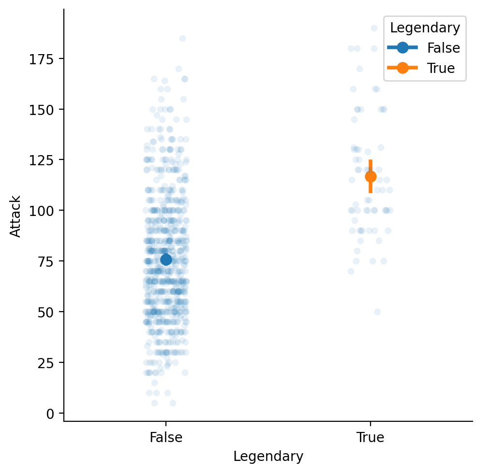
    


#### `box` plots

> A `box` plot shows the interquartile range (the middle 50% of the data), along with the minimum and maximum.


```python
sns.catplot(data = df_pokemon, x = "Legendary", 
             y = "Attack", kind = "box")
```


    
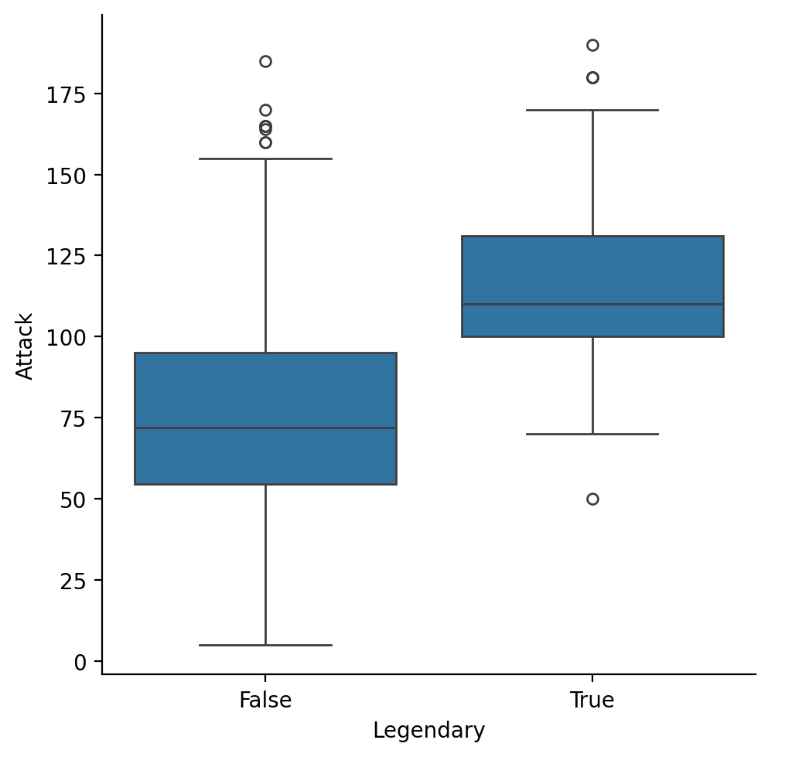
    


Try to consider converting the boxplots into violin plots.


```python
sns.catplot(data=df_pokemon, x="Legendary", y="Attack", kind="violin")
```


    <seaborn.axisgrid.FacetGrid at 0x24303aab890>


    
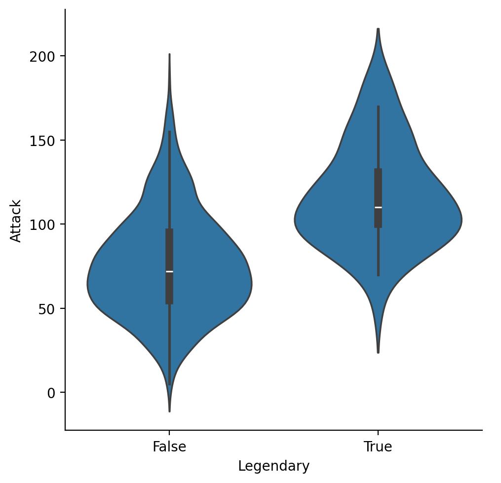
    


Violin plots are a better choice when we want to visualize the distribution.

## Conclusion

As with our lecture on `pyplot`, this just scratches the surface.

But now, you've had an introduction to:

- The `seaborn` package.
- Plotting both **univariate** and **bivariate** data.
- Creating plots with multiple layers.
